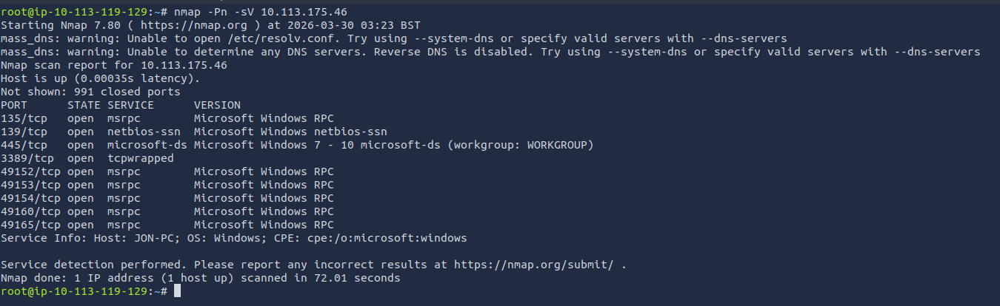
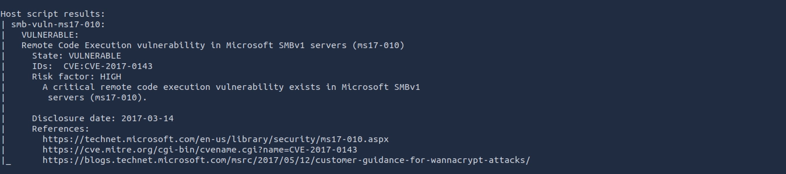
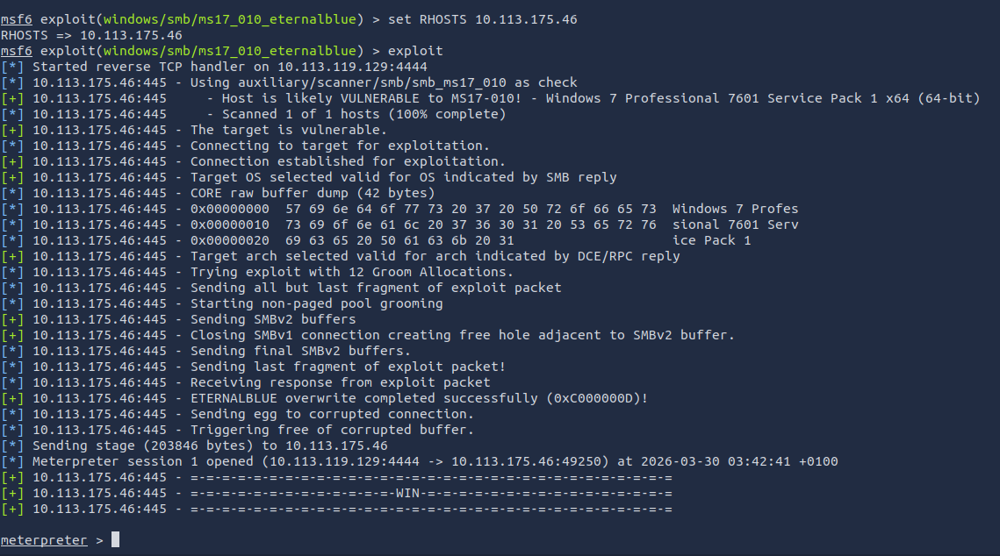
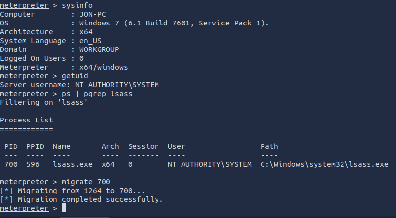
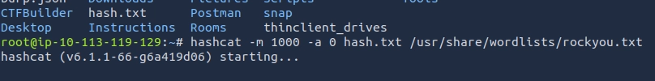

---

# **Penetration Test Report: Blue**

---

### **TL;DR**

This penetration test resulted in full SYSTEM compromise through exploitation of the EternalBlue vulnerability (MS17-010) in the SMBv1 service. The initial breach leveraged unauthenticated remote code execution to gain a reverse shell with SYSTEM privileges. Post-exploitation involved migrating to a stable system process (lsass.exe) to dump NTLM password hashes, one of which was successfully cracked to reveal plaintext credentials. This attack chain demonstrates how a single unpatched legacy service can lead to complete system takeover, credential exposure, and the potential for lateral movement within a network.

---

### **Target Information**

- **Target IP:** 10.113.175.46
- **Hostname:** JON-PC
- **Operating System:** Windows 7 SP1 x64
- **Open Ports:**
    - 135/tcp – msrpc (Microsoft Windows RPC)
    - 139/tcp – netbios-ssn (Microsoft Windows netbios-ssn)
    - 445/tcp – microsoft-ds (Microsoft Windows 7 - 10)
    - 3389/tcp – tcpwrapped (Remote Desktop Protocol)
    - 49152-49165/tcp – msrpc (Microsoft Windows RPC)
- **Assessment Type:** Authorized lab environment

---

### **Executive Summary**

A penetration test was performed against the target machine 10.113.175.46. The assessment confirmed the presence of critical vulnerabilities allowing unauthenticated remote code execution via the SMBv1 protocol, specifically the MS17-010 vulnerability (EternalBlue). Exploitation of this vulnerability enabled full SYSTEM-level access and the extraction of password hashes, which were successfully cracked to reveal plaintext credentials.

**Key Findings:**

| **Finding** | **Severity** | **Impact** |
| --- | --- | --- |
| MS17-010 EternalBlue SMBv1 Vulnerability | Critical | Remote, unauthenticated code execution leading to full SYSTEM compromise |
| Weak Password (Jon account) | High | Credential exposure, allowing lateral movement and persistence |

The combined effect of these vulnerabilities results in complete compromise of the target machine, demonstrating high-risk security misconfigurations and an outdated Windows environment.

**Overall Risk Rating: Critical**

This assessment demonstrates how a single unpatched legacy service can be exploited to achieve full system takeover. The findings underscore the importance of timely patch management, disabling legacy protocols, and enforcing strong password policies.

---

### **Scope and Methodology**

**Scope:**

- **Target:** 10.113.175.46
- **Hostname:** JON-PC
- **Ports/Protocols in Scope:**
    - 135/tcp – msrpc (Microsoft Windows RPC)
    - 139/tcp – netbios-ssn (SMB over NetBIOS)
    - 445/tcp – microsoft-ds (SMBv1)
    - 3389/tcp – Remote Desktop Protocol
    - 49152-49165/tcp – msrpc (Dynamic RPC ports)

**Methodology:**

The assessment followed a structured penetration testing methodology:

1. **Reconnaissance & Enumeration:** Verified target host up, performed TCP port enumeration using Nmap with service/version detection.
2. **Vulnerability Analysis:** Confirmed SMBv1 exposure and MS17-010 vulnerability using Nmap NSE script smb-vuln-ms17-010.nse.
3. **Exploitation:** Deployed Metasploit module exploit/windows/smb/ms17_010_eternalblue to gain unauthenticated SYSTEM-level access.
4. **Post-Exploitation & Privilege Escalation:** Migrated to a stable SYSTEM process (lsass.exe) to dump password hashes. Cracked user password hashes using hashcat.
5. **Documentation:** Documented findings, impact, and remediations.

This approach ensures both technical depth and clarity in risk assessment.

---

### **Findings and Exploitation**

### **Initial Access: External Compromise via SMBv1 Exploitation**

**Vulnerability Summary**

The initial foothold was established through exploitation of the MS17-010 (EternalBlue) vulnerability in the SMBv1 service. This critical vulnerability allows unauthenticated remote code execution with SYSTEM-level privileges, bypassing all authentication mechanisms.

**Technical Walkthrough**

1. **Port Scanning & Service Discovery:** Initial reconnaissance identified multiple open ports, with SMB-related ports presenting a significant attack surface. A comprehensive scan revealed service versions, including SMBv1 exposed on port 445.
    
    
    
    **Observation:** Host is up and responding on multiple SMB-related ports. Ping (ICMP) is blocked, as per lab configuration.
    
2. **Vulnerability Confirmation:** The Nmap NSE script smb-vuln-ms17-010.nse confirmed the presence of the MS17-010 vulnerability.
    
    
    
3. **Technical Understanding:** EternalBlue exploits a buffer overflow in the SMBv1 protocol handling. By sending specially crafted SMB packets, an attacker can overwrite memory in the Windows kernel. This enables unauthenticated remote code execution, granting SYSTEM privileges. Used in real-world malware campaigns (e.g., WannaCry ransomware, NotPetya malware), demonstrating high potential for disruption.
4. **Exploit Execution:** The Metasploit module exploit/windows/smb/ms17_010_eternalblue was deployed with the payload windows/x64/meterpreter/reverse_tcp.
    
    
    
    **Observations:**
    
    - Target OS: Windows 7 SP1 x64
    - SYSTEM privileges confirmed: NT AUTHORITY\SYSTEM
    - Exploit fully bypassed authentication, allowing arbitrary code execution.

---

### **Post-Exploitation & Credential Harvesting**

**Vulnerability Summary**

Following initial access, SYSTEM-level privileges enabled the extraction of NTLM password hashes from LSASS memory. One hash was successfully cracked, revealing a weak plaintext password that could be used for lateral movement or persistence.

**Technical Walkthrough**

1. **Process Migration for Stability:** The Meterpreter session was migrated to lsass.exe for stability and access to credentials.
    
    
    
2. **Credential Harvesting:** NTLM hashes were dumped from LSASS memory.
    
    ```
    Administrator:31d6cfe0d16ae931b73c59d7e0c089c0
    Guest:31d6cfe0d16ae931b73c59d7e0c089c0
    Jon:ffb43f0de35be4d9917ac0cc8ad57f8d
    ```
    
3. **Password Cracking:** Jon's password was cracked using hashcat.
    
    
    
    - **Cracked Credential:** Jon: al****22
4. **Impact Confirmation:** Full SYSTEM access combined with known plaintext credentials confirmed complete system compromise with potential for lateral movement, persistence, and sensitive data exfiltration.

---

### **Risk Assessment**

| **Finding** | **Description** | **Likelihood** | **Impact** | **Risk Rating** |
| --- | --- | --- | --- | --- |
| **MS17-010 EternalBlue** | SMBv1 vulnerability allowing unauthenticated remote code execution with SYSTEM privileges. | High | Critical | **Critical** |
| **Weak Password** | Local user account with easily crackable password (al****22), exposing credentials post-compromise. | High | High | **High** |

**Risk Factor Analysis:**

| **Risk Factor** | **Analysis** |
| --- | --- |
| Confidentiality | All local files accessible, user credentials exposed |
| Integrity | SYSTEM-level access allows arbitrary changes to system files and services |
| Availability | SYSTEM-level access allows malware deployment or denial-of-service |
| Exploitability | Easy via public Metasploit module; no authentication required |
| Detectability | Can be detected via network IDS / SMB anomaly alerts, but lab environment likely unmonitored |

---

### **Conclusion**

The Blue machine is critically vulnerable due to:

- Outdated Windows 7 SP1 installation
- SMBv1 enabled and unpatched (MS17-010)
- Weak local account password

Exploitation demonstrated full SYSTEM-level compromise and the ability to recover plaintext passwords. The risk in a production environment would be severe, potentially allowing ransomware deployment, data theft, and full network compromise.

This assessment highlights the importance of timely patch management, disabling legacy protocols, and enforcing strong password policies.

---

### **Recommendations**

1. **Patch SMBv1 / Apply MS17-010 Security Update:**
    - **Reference:** Microsoft Security Bulletin MS17-010: [https://technet.microsoft.com/en-us/library/security/ms17-010.aspx](https://technet.microsoft.com/en-us/library/security/ms17-010.aspx)
    - **Action:** Install the security update on all affected Windows systems immediately.
2. **Disable SMBv1 Protocol:**
    - As a defense-in-depth measure, disable the legacy and insecure SMBv1 protocol entirely.
    - **PowerShell Command:** `Disable-WindowsOptionalFeature -Online -FeatureName smb1protocol`
3. **Update Operating System:**
    - Upgrade from Windows 7 SP1 to a supported version (Windows 10/11) if possible. Windows 7 reached its End of Life (EoL) in January 2020 and no longer receives security updates for new vulnerabilities.
4. **Enforce Strong Password Policies:**
    - Implement a password policy that requires minimum length (e.g., 14 characters), complexity (uppercase, lowercase, numbers, symbols), and regular rotation for all local accounts.
    - The password `al****22` is weak and should be considered compromised.
5. **Network Monitoring:**
    - Monitor network for anomalous SMB traffic.
    - Deploy intrusion detection systems with signatures for EternalBlue exploitation attempts.
6. **Endpoint Security:**
    - Deploy endpoint detection and response (EDR) tools.
    - Conduct regular vulnerability scans and penetration tests.
7. **Principle of Least Privilege:**
    - Implement principle of least privilege and reduce RDP exposure.