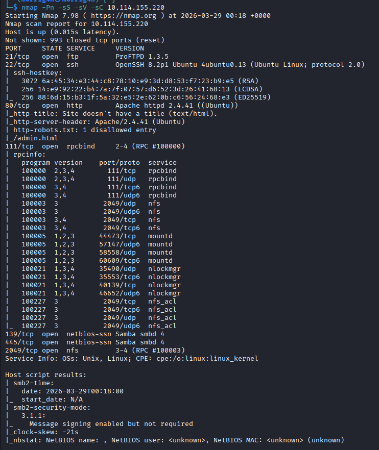
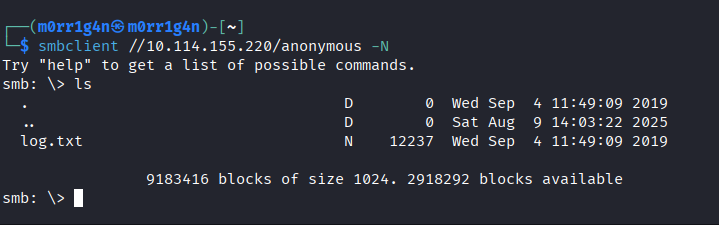
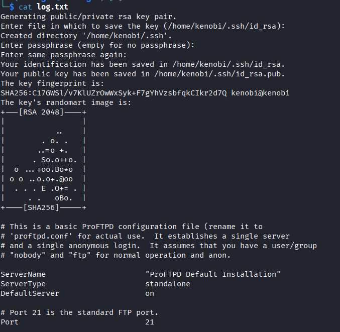
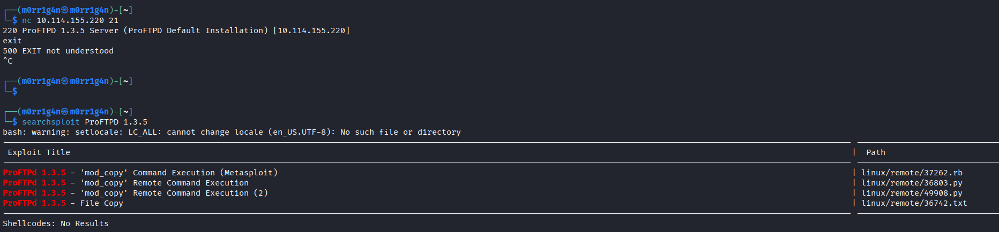
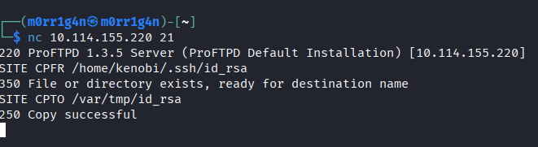
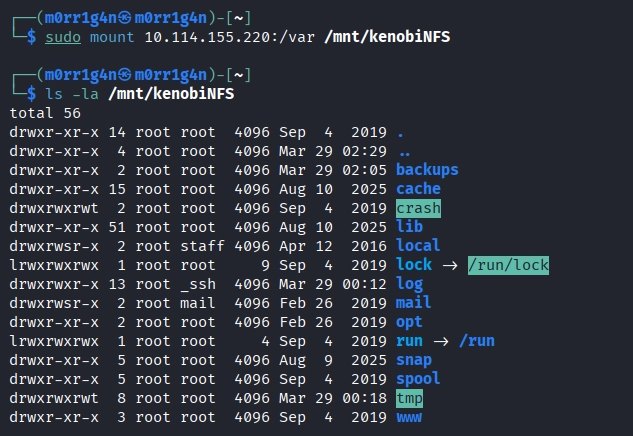
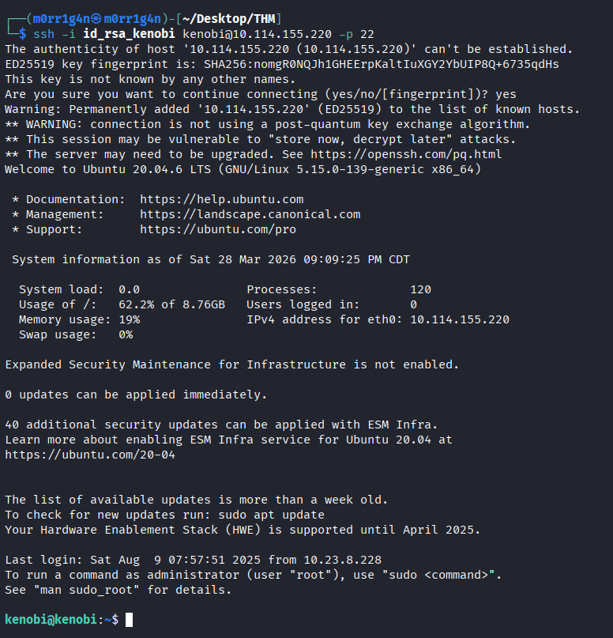
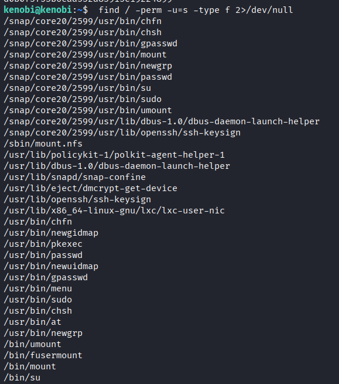
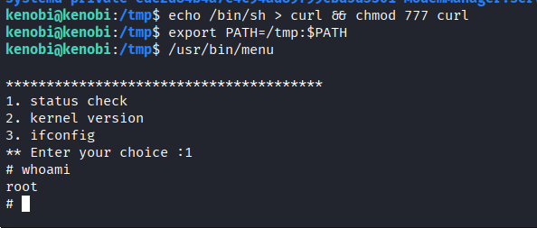

---

# **Penetration Test Report: Kenobi**

---

### **TL;DR**

This penetration test resulted in full root compromise through a multi-stage attack chain. The initial breach leveraged unauthenticated SMB access to extract sensitive reconnaissance data, which revealed the path to a user's private SSH credential.

A critical vulnerability in the FTP service (ProFTPD 1.3.5) enabled unauthorized file operations, allowing the SSH key to be relocated to an NFS-exported directory for retrieval. After establishing a foothold via SSH, privilege escalation was accomplished by exploiting a SUID binary that executed external commands without full path specifications, enabling a PATH manipulation attack.

---

**Target Information**

- **Target IP:** 10.114.155.220
- **Operating System:** Linux (Ubuntu-based distribution)
- **Open Ports:**
    - 21/tcp – FTP (ProFTPD 1.3.5)
    - 22/tcp – SSH (OpenSSH)
    - 80/tcp – HTTP (Apache httpd)
    - 111/tcp – RPC (NFS-related services)
    - 139/tcp, 445/tcp – SMB (Samba)
    - 2049/tcp – NFS
- **Assessment Type:** Authorized lab environment

---

### **Executive Summary**

A methodical external penetration test was performed against the Kenobi target system. The objective was to identify security weaknesses, assess their exploitability, and demonstrate the potential impact of a successful attack.

The assessment uncovered a critical path from initial external reconnaissance to complete system takeover. The attacker was able to:

- Enumerate SMB shares without authentication and retrieve a file containing sensitive system information
- Exploit an outdated FTP service to perform unauthorized file copy operations
- Access an NFS export with no access restrictions to retrieve stolen credentials
- Gain SSH access to the system as a standard user
- Escalate privileges to root using a SUID binary with unsafe command execution patterns

**Overall Risk Rating: Critical**

This assessment demonstrates how seemingly low-severity misconfigurations can be chained together to achieve full system compromise. The findings underscore the importance of defense-in-depth strategies and the cascading impact of insecure defaults.

---

### **Scope and Methodology**

**Scope:**

- **Target:** `10.114.155.220`
- **Hostnames:** Target identified solely by IP address
- **Ports/Protocols in Scope:**
    - `21/tcp` (FTP)
    - `22/tcp` (SSH)
    - `80/tcp` (HTTP)
    - `111/tcp` (RPC)
    - `139/tcp`, `445/tcp` (SMB)
    - `2049/tcp` (NFS)

**Methodology:**

1. **Reconnaissance & Enumeration:** Discovery of open ports, service fingerprinting, and identification of potential attack vectors.
2. **Vulnerability Analysis:** Research and verification of identified vulnerabilities and misconfigurations.
3. **Exploitation:** Development and execution of attack chains to gain unauthorized access.
4. **Post-Exploitation & Privilege Escalation:** Lateral movement, privilege escalation, and demonstration of impact.
5. **Documentation:** Documentation of findings, risk assessment, and remediation guidance.

---

### **Findings and Exploitation**

### **Initial Access: External Compromise via Service Misconfiguration Chain**

**Vulnerability Summary**

The initial foothold was established through a coordinated exploitation of three separate service misconfigurations. First, reconnaissance data were extracted from an unprotected SMB share, then a vulnerable FTP service was leveraged to reposition sensitive files, ultimately leading to those files being retrieved via an unrestricted NFS export.

**Technical Walkthrough**

1. **Port Scanning & Service Discovery:** Initial reconnaissance identified multiple open ports, with SMB, FTP, and NFS services presenting potential attack surfaces. A comprehensive scan revealed service versions, including ProFTPD 1.3.5 and Samba file sharing services. 

    

2. **SMB Share Enumeration:** The SMB service was tested for anonymous access. The configuration permitted null session connections, allowing enumeration of available shares.
    
    The `anonymous` share was accessible without credentials and contained a single file of interest.
    
    
    
3. **Intelligence Extraction:** The file `log.txt` was retrieved and analyzed. The contents revealed system activity logs that included the generation path for an SSH key pair belonging to user `kenobi`.
    
    
    
    This information provided a clear target path for subsequent exploitation steps.
    
4. **NFS Export Discovery:** The NFS service was queried to identify exported directories and their access restrictions.
    
    The `/var` directory was exported to all clients with no IP restrictions, creating an accessible storage location.
    
    
    
5. **FTP Vulnerability Exploitation:** The FTP service banner identified ProFTPD version 1.3.5. Research confirmed that this version includes the `mod_copy` module, which provides `SITE CPFR` and `SITE CPTO` commands that allow unauthenticated users to copy files within the server's filesystem.
    
    Using these commands, the SSH private key from `kenobi`'s home directory was copied to `/var/tmp/`, a location within the NFS-exported directory.
    
    
    
6. **Credential Retrieval via NFS:** The NFS export was mounted locally, providing direct access to the `/var` filesystem. The copied SSH key was then extracted from `/var/tmp/` .
    
    
    
7. **SSH Authentication:** The recovered private key was used to authenticate to the target system as the `kenobi` user, establishing the first interactive shell.
    
    
    
    This represented successful initial access to the target system.
    

---

### **Internal Reconnaissance & Privilege Escalation to `root`**

**Vulnerability Summary**

Following initial access, internal enumeration revealed a SUID binary that executed system commands without absolute path references. This programming oversight allowed for a PATH environment variable attack, enabling arbitrary command execution with elevated privileges.

**Technical Walkthrough**

1. **SUID Binary Discovery:** A systematic search was conducted to identify files with the SUID bit set, which execute with the owner's privileges rather than the user who invoked them.
    
    
    
    The `/usr/bin/menu` binary stood out as a non-standard executable that warranted further investigation.
    
2. **Binary Behavior Analysis:** Executing the binary revealed an interactive menu with three options, each appearing to perform system information retrieval functions.
    
    ```
    kenobi@kenobi:~$ /usr/bin/menu
    
    ***************************************
    1. status check
    2. kernel version
    3. ifconfig
    ** Enter your choice :
    ```
    
    Testing each option revealed that the binary invoked external commands (`curl`, `uname`, `ifconfig`) using their names rather than absolute paths. This pattern indicated the binary relied on the system PATH variable to locate executables.
    
3. **Exploitation Strategy:** A writable directory was identified as a staging area for a malicious executable. A  custom binary named `curl` that would launch a shell rather than performing legitimate network operations was created. 
    
    The PATH environment variable was modified to prioritize the `/tmp` directory over system paths.
    
    ```
    kenobi@kenobi:~$ export PATH=/tmp:$PATH
    ```
    
4. **Privilege Escalation Execution:** The `/usr/bin/menu` binary was executed, and the first menu option was selected. Because the binary runs with SUID privileges (owned by root) and invoked `curl` without an absolute path, the malicious version in `/tmp` was executed with root-level permissions.
    
    
    
    This resulted in a root shell, representing complete system compromise.
    
5. **Impact Confirmation:** Full administrative access was verified through additional system enumeration.

---

### **Risk Assessment**

| **Finding** | **Description** | **Likelihood** | **Impact** | **Risk Rating** |
| --- | --- | --- | --- | --- |
| **SMB Null Session** | SMB configured to permit unauthenticated connections, allowing share enumeration and file access. | High | Medium | **High** |
| **Information Leakage** | Sensitive system logs exposed via SMB reveal SSH key storage locations. | High | Medium | **High** |
| **Unrestricted NFS Export** | NFS exports the `/var` directory to any client with no authentication or IP restrictions. | High | High | **Critical** |
| **Outdated FTP Service** | ProFTPD 1.3.5 includes `mod_copy` module, enabling unauthenticated file copying. | High | High | **Critical** |
| **Private Key Exposure** | SSH private key obtained through chained exploits, allowing unauthorized system access. | High | High | **Critical** |
| **SUID PATH Hijacking** | SUID binary executes commands via PATH lookup, enabling arbitrary code execution with root privileges. | Medium | Critical | **Critical** |

---

### **Conclusion**

The Kenobi security assessment successfully demonstrated a complete attack chain from initial external reconnaissance to full root compromise. The assessment revealed that the target system suffers from multiple critical misconfigurations and outdated software components that collectively enable an attacker to achieve system takeover.

The attack progression highlights several security principles:

- **Defense in Depth:** Individual misconfigurations may appear low-risk in isolation, but when chained together they create a critical vulnerability path.
- **Service Hardening:** Default configurations for services like SMB, NFS, and FTP often prioritize functionality over security, creating unnecessary exposure.
- **Privilege Management:** SUID binaries represent a significant security boundary that requires careful implementation and regular auditing.

The root compromise was ultimately enabled by a combination of exposed services, insufficient access controls, and unsafe programming practices in privileged executables. Each stage of the attack chain could have been disrupted by appropriate security controls, demonstrating the value of comprehensive security hardening.

---

### **Recommendations**

1. **Network Service Hardening:**
    - **SMB Configuration:** Disable anonymous access to SMB shares. Configure authentication requirements for all shares and review share permissions to ensure least privilege. Remove or restrict the `anonymous` share if not required for business operations.
    - **NFS Access Controls:** Restrict NFS exports to specific trusted IP addresses or subnets using the `/etc/exports` configuration. Avoid exporting sensitive directories such as `/var`, `/home`, or `/etc`.
    - **FTP Service Remediation:** Upgrade ProFTPD to the latest stable version. If the `mod_copy` module is not required for legitimate functionality, remove or disable it. Consider replacing FTP with more secure alternatives such as SFTP.
2. **Credential Protection:**
    - Implement SSH key passphrase requirements for all users to add an additional authentication layer.
    - Never store private keys in locations accessible via network shares or exported filesystems.
    - Conduct regular audits of file permissions to ensure sensitive credentials are not world-readable.
3. **SUID Binary Management:**
    - Review all SUID binaries on the system and remove the SUID bit from those that do not absolutely require elevated privileges.
    - For essential SUID binaries, rewrite them to use absolute paths for all external command invocations (e.g., `/usr/bin/curl` instead of `curl`).
    - Implement input validation and environment sanitization in privileged executables.
4. **Patch Management:**
    - Establish a regular patching cadence for all software, with particular focus on externally-facing services.
    - Subscribe to security advisories for software in use to ensure timely awareness of vulnerabilities.
5. **Configuration Auditing:**
    - Implement automated configuration auditing tools to detect insecure service configurations (e.g., open NFS exports, SMB null sessions).
    - Conduct regular penetration testing to identify and remediate vulnerabilities before they can be exploited.
6. **Monitoring & Detection:**
    - Deploy host-based intrusion detection to alert on suspicious SUID binary executions or PATH manipulation attempts.
    - Monitor for anomalous FTP commands such as `SITE CPFR` and `SITE CPTO` that may indicate exploitation attempts.

---

**Complete Attack Chain Visualization:**

```
┌─────────────────────────────────────────────────────────────────┐
│  Phase 1: External Reconnaissance                              │
│  ┌──────────┐    ┌──────────────┐    ┌────────────────────┐   │
│  │ Port Scan│───▶│ SMB Enum     │───▶│ Retrieve log.txt  │   │
│  │ 21,445   │    │ Null Session │    │ SSH key path found│   │
│  └──────────┘    └──────────────┘    └────────────────────┘   │
└─────────────────────────────────────────────────────────────────┘
                              │
                              ▼
┌─────────────────────────────────────────────────────────────────┐
│  Phase 2: Service Exploitation                                 │
│  ┌──────────────┐    ┌──────────────┐    ┌──────────────────┐ │
│  │ NFS Enum     │    │ FTP Exploit  │    │ Copy SSH Key    │ │
│  │ /var export  │    │ mod_copy     │───▶│ to /var/tmp     │ │
│  └──────────────┘    └──────────────┘    └──────────────────┘ │
└─────────────────────────────────────────────────────────────────┘
                              │
                              ▼
┌─────────────────────────────────────────────────────────────────┐
│  Phase 3: Access & Privilege Escalation                        │
│  ┌──────────────┐    ┌──────────────┐    ┌──────────────────┐ │
│  │ Mount NFS    │───▶│ SSH Login    │───▶│ SUID Exploit    │ │
│  │ Retrieve Key │    │ as kenobi    │    │ PATH Hijacking  │ │
│  └──────────────┘    └──────────────┘    └──────────────────┘ │
└─────────────────────────────────────────────────────────────────┘
                              │
                              ▼
                    ┌─────────────────┐
                    │   ROOT ACCESS   │
                    │  Full Compromise│
                    └─────────────────┘
```

**Key Exploitation Commands :**

| **Phase** | **Command / Action** |
| --- | --- |
| SMB Enumeration | `smbclient -N -L //10.114.155.220` |
| SMB File Extraction | `smbclient -N //10.114.155.220/anonymous -c "get log.txt"` |
| NFS Export Discovery | `showmount -e 10.114.155.220` |
| FTP Copy Operation | `SITE CPFR /home/kenobi/.ssh/id_rsaSITE CPTO /var/tmp/id_rsa` |
| NFS Mount | `mount -o rw,vers=2 10.114.155.220:/var /mnt/target_nfs` |
| SSH Access | `ssh -i id_rsa kenobi@10.114.155.220` |
| SUID Search | `find / -perm -u=s -type f 2>/dev/null` |
| PATH Hijack | `echo "/bin/bash" > /tmp/curlchmod +x /tmp/curlexport PATH=/tmp:$PATH/usr/bin/menu` |

---