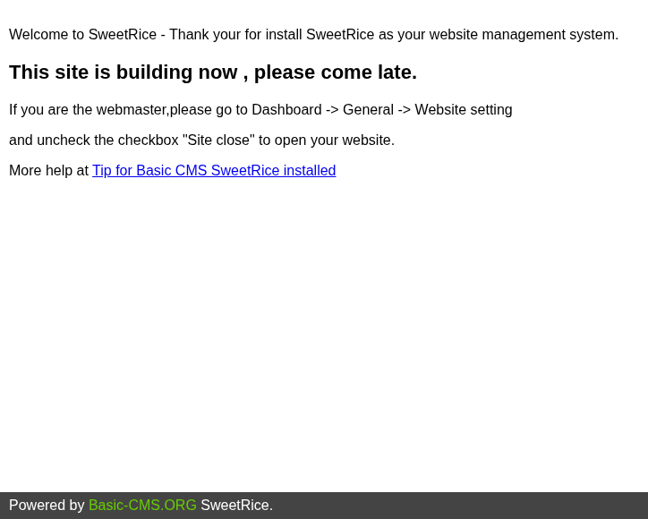
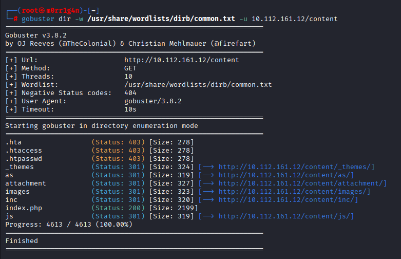
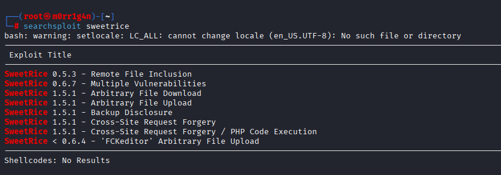
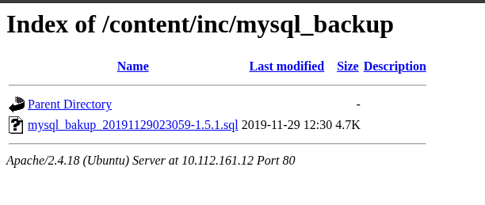
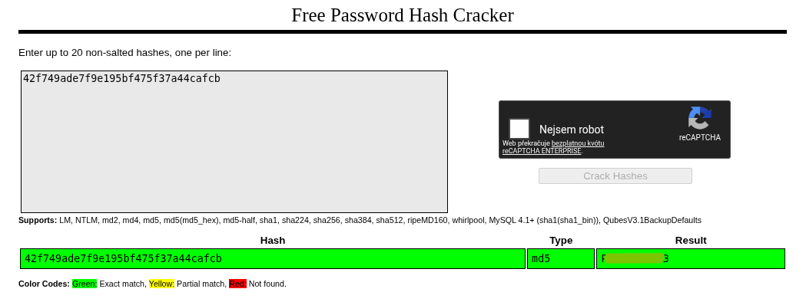
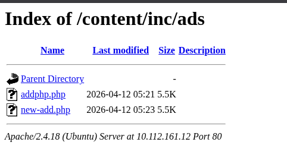
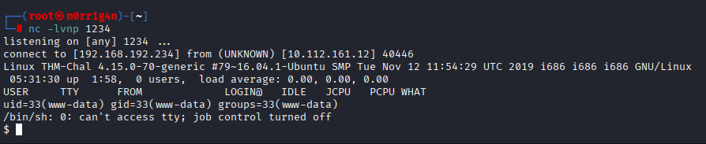
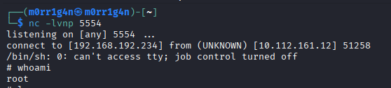

---

# **Zpráva z penetračního testu: Lazy Admin**

---

### **Shrnutí**

Tento penetrační test vyústil v úplné získání root přístupu prostřednictvím vícefázového útoku na webovou aplikaci. Pro počáteční přístup bylo využito vystaveného záložního adresáře obsahujícího výpis databáze se slabě hashovanými přihlašovacími údaji (MD5), které byly prolomeny za účelem získání přístupu do administrátorského rozhraní. Zranitelnost CSRF v modulu Reklamy v CMS systému SweetRice umožnila spuštění vzdáleného kódu a chybně nakonfigurované oprávnění sudo u Perl skriptu umožnilo eskalaci privilegií na root pomocí útoku přepisu zapisovatelného souboru.

---

### **Informace o cíli**

- **IP adresa cíle:** 10.112.161.12
- **Operační systém:** Linux (distribuce založená na Ubuntu)
- **Otevřené porty:**
    - 80/tcp – HTTP (Apache httpd)
    - 22/tcp – SSH (OpenSSH)
- **Typ hodnocení:** Autorizované laboratorní prostředí

---

### **Souhrnné závěry**

Proti cílovému systému 10.112.161.12 byl proveden penetrační test simulující externího útočníka bez předchozího přístupu.

Hodnocení vyústilo v úplné narušení systému, čehož bylo dosaženo prostřednictvím řetězce zranitelností webových aplikací, nezabezpečené konfigurace CMS, odhalení přihlašovacích údajů a chybné konfigurace eskalace privilegií.

Oprávnění byla úspěšně eskalována – od počátečního průzkumu až po přístup na úrovni root, což umožnilo plnou kontrolu nad systémem.

**Klíčová zjištění:**

| Zjištění | Závažnost | Dopad |
| --- | --- | --- |
| Zveřejnění zálohy vedoucí k odhalení přihlašovacích údajů | Kritická | Zveřejnění databázových záloh obsahujících citlivou konfiguraci a uživatelské přihlašovací údaje |
| Slabé hashování hesel (MD5) | Kritická | Umožňuje triviální obnovení hesel pomocí online nástrojů pro prolomení hashů |
| CSRF vedoucí ke spuštění vzdáleného kódu | Vysoká | Autentizovaní útočníci mohou na serveru spouštět libovolný PHP kód |
| Eskalace privilegií prostřednictvím nezabezpečené konfigurace sudo | Kritická | Dosaženo spuštění vzdálených příkazů na úrovni root |

Kombinovaný účinek těchto zranitelností vedl k úplnému narušení cílového systému, což prokazuje vysoce rizikové bezpečnostní chyby v konfiguraci a zastaralé CMS prostředí.

---

### **Rozsah a metodika**

**Rozsah:**

- **Cíl:** 10.112.161.12
- **Aplikace:** SweetRice
- **Porty/protokoly v rozsahu:**
    - 80/tcp – HTTP (Apache httpd)
    - 22/tcp – SSH (OpenSSH)

**Metodika:**

Hodnocení probíhalo podle strukturované metodiky penetračního testu:

1. **Průzkum a mapování:** 
    - Ověření dostupnosti cílového hostitele, provedení enumerace TCP portů pomocí Nmapu s detekcí služeb/verzí
    - Provedení enumerace webových adresářů pomocí Gobusteru.
2. **Analýza zranitelností:** 
    - Identifikace CMS SweetRice
    - Objevení vystaveného záložního adresáře obsahujícího výpis databáze
    - Identifikace slabého MD5 hashování hesel.
3. **Zneužití:** 
    - Stažení SQL zálohy, extrakce přihlašovacích údajů, prolomení MD5 hashe pomocí CrackStation,
    - Získání přístupu do administrátorského rozhraní,
    - Uplatnění CSRF exploitu (Searchsploit ID: 40700) k dosažení spuštění vzdáleného kódu prostřednictvím reverzního shellu.
4. **Eskalace privilegií:** 
    - Identifikace chybně nakonfigurovaného oprávnění sudo umožňujícího spuštění Perl skriptu
    - Přepsání souboru `/etc/copy.sh` pomocí payloadu reverzního shellu a jeho spuštění přes sudo k dosažení přístupu na úrovni root.
5. **Dokumentace:** 
    - Zdokumentování zjištění, dopadů a doporučených náprav.

Tento přístup zajišťuje jak technickou hloubku, tak srozumitelnost v hodnocení rizik.

---

### **Zjištění a zneužití**

### **Počáteční přístup: Externí narušení prostřednictvím řetězce zneužití webové aplikace**

**Souhrn zranitelnosti**

Počáteční pozice byla získána prostřednictvím řetězce zranitelností webové aplikace v CMS SweetRice. To zahrnovalo záložní adresář umožňující extrakci přihlašovacích údajů, slabé MD5 hashování hesel umožňující triviální obnovení hesel a zranitelnost umožňující spuštění PHP kódu vedoucí k exekuci vzdáleného kódu.

**Technický postup** 

1. **Skenování portů a zjišťování služeb:** Úvodní průzkum byl proveden pomocí standardního Nmap skenu k identifikaci otevřených portů a dostupných služeb. Porty 22 a 80 byly identifikovány jako otevřené, na kterých běží služby SSH a HTTP.

    

2. **Enumerace webu:** Apache webserver na portu 80 zobrazoval výchozí úvodní stránku, což naznačovalo, že pod kořenovým adresářem webu může existovat další obsah. K enumeraci skrytých adresářů byl využit Gobuster. Adresář `/content` byl identifikován jako potenciálně zajímavý.
    
    
    
3. **Identifikace CMS:** Přejitím na `/content` se zobrazila stránka "Down for maintenance" (Údržba), která naznačovala, že na webserveru běží CMS nazvané SweetRice.
    
    
    
4. **Enumerace adresářů:** Proti adresáři `/content` byl spuštěn podrobnější sken Gobuster.
    
    
    
    **Výsledky:** V rámci `/content` byl objeven adresář `/inc`.
    
5. **Objevení zveřejněné zálohy:** Vyhledáváním pomocí Searchsploit byla identifikována **zranitelnost zveřejnění zálohy** (Backup Disclosure) postihující CMS SweetRice. Poskytnutý důkaz konceptu naznačoval, že databázové zálohy mohou být přístupné přes adresář `/inc/mysql_backup/`.
    
    Následná enumerace adresářů pomocí Gobuster potvrdila přítomnost cesty `/content/inc/` na cílovém systému. Propojením těchto zjištění byl úspěšně lokalizován a zpřístupněn soubor databázové zálohy na adrese: `/content/inc/mysql_backup/`

    

    

    

6. **Extrakce přihlašovacích údajů:** Soubor SQL zálohy byl stažen a prozkoumán. V souboru byla identifikována sekce obsahující uživatelské jméno a MD5 hash hesla.

    **Extrahovaný hash:** `42f749ade7f9e195bf475f37a44cafcb`

7. **Prolomení slabého hesla:** MD5 hash byl prolomen pomocí online nástroje - Crackstation. 

    

8. **Přístup do administrátorského rozhraní:** Výsledky Gobusteru pro podadresář `/content` odhalily adresář `/as`, který poskytoval přístup k přihlašovací stránce administrátorského rozhraní CMS SweetRice. Pro úspěšné přihlášení byly použity prolomené přihlašovací údaje.

    

9. **Zneužití pro spuštění PHP kódu:** Vyhledáváním pomocí Searchsploit byla identifikována zranitelnost umožňující spuštění PHP kódu (Exploit ID: 40700), která umožňuje autentizovanému útočníkovi přidat PHP kód jako reklamu a aktivovat jej prostřednictvím složky `/inc`.

    **Kroky zneužití:**

    - Byl stažen a nakonfigurován PHP reverzní shell (PentestMonkey) s IP adresou VPN a zvoleným portem.
    - Obsah reverzního shellu byl zkopírován.
    - V rámci administrátorského rozhraní SweetRice bylo přejito na **Dashboard → Ads** (Reklamy).
    - Byla vytvořena nová reklama s názvem "new-add.php" a kód PHP reverzního shellu byl vložen do pole Ads Code (Kód reklamy).
    - Reklama byla odeslána.

    

10. **Aktivace reverzního shellu:** Na stroji útočníka byl spuštěn posluchač netcat.
        `nc -lvnp 1234`

    Reverzní shell byl aktivován přechodem na `http://192.168.192.234/content/inc/ads/reverse_shell`.

    

---

### **Eskalace privilegií**

**Souhrn zranitelnosti**

Po získání počátečního přístupu odhalila enumerace oprávnění sudo chybnou konfiguraci, která umožňovala eskalaci privilegií na root.

**Technický postup**

1. **Lokální enumerace:** Byla provedena enumerace oprávnění sudo pro aktuálního uživatele. Uživatel `www-data` měl povoleno spouštět Perl skript přes sudo bez hesla.
2. **Analýza skriptu:** Byl prozkoumán obsah `/home/itguy/backup.pl` a bylo zjištěno, že spouští externí soubor.
3. **Zneužití:** Soubor `/etc/copy.sh` byl pro uživatele zapisovatelný. Soubor byl přepsán pomocí payloadu reverzního shellu.
4. **Získání přístupu root:** Perl skript byl spuštěn přes sudo, čímž byl spuštěn škodlivý skript `/etc/copy.sh` s právy root.

Bylo dosaženo spuštění vzdálených příkazů na úrovni root, což poskytlo plnou kontrolu nad systémem.

---

### **Vyhodnocení rizik**

| Zjištění | Popis | Pravděpodobnost | Dopad | Stupeň rizika |
| --- | --- | --- | --- | --- |
| **Zveřejnění zálohy** | Neautentizovaný záložní adresář vystavený pod kořenem webu, umožňující stažení výpisů databáze obsahujících přihlašovací údaje. | Vysoká | Vysoký | **Kritické** |
| **Slabé hashování hesel (MD5)** | Uživatelská hesla uložena pomocí slabého MD5 hashování bez soli, umožňující triviální obnovení hesel pomocí nástrojů pro prolomení. | Vysoká | Vysoký | **Kritické** |
| **Spuštění PHP kódu** | Modul Reklamy CMS SweetRice umožňuje vkládání PHP kódu prostřednictvím uloženého obsahu reklamy, což umožňuje spuštění vzdáleného kódu. | Střední | Kritický | **Vysoké** |
| **Nezabezpečená konfigurace sudo** | Uživatel www-data má povoleno spouštět Perl skript přes sudo bez hesla; skript spouští zapisovatelný externí soubor `/etc/copy.sh`. | Střední | Kritický | **Kritické** |

**Analýza rizikových faktorů:**

| Rizikový faktor | Analýza |
| --- | --- |
| Důvěrnost | Úplné narušení důvěrnosti v důsledku zveřejnění databáze a kompromitace přihlašovacích údajů |
| Integrita | Narušení integrity v důsledku možnosti modifikace souborů pomocí RCE a zneužití sudo |
| Dostupnost | Úplné narušení dostupnosti v důsledku přístupu root shellu |
| Zneužitelnost | Střední prostřednictvím řetězce zranitelností webové aplikace |
| Zjistitelnost | Zjistitelné pomocí protokolování webové aplikace, IDS a systémových auditních logů |

---

### **Závěr**

Cílový systém vykazoval několik závažných bezpečnostních chyb v konfiguraci, které ve svém řetězci vedly k úplnému narušení systému. Útok ukazuje, jak zdánlivě málo závažné problémy, jako je zveřejnění záloh a slabé přihlašovací údaje, mohou v kombinaci se špatným oddělením privilegií vyústit v úplný přístup na úrovni root.

Toto hodnocení zdůrazňuje důležitost bezpečného ukládání záloh, používání silných hashovacích algoritmů hesel, ochrany proti CSRF a správné konfigurace sudo.

---

### **Doporučení**

**Bezpečné ukládání záloh**

- Přesunout zálohy mimo kořenový adresář webu
- Omezit výpis adresářů

**Zabezpečení hesel**

- Nahradit MD5 algoritmem bcrypt/Argon2
- Vynucovat zásady silných hesel

**Ochrana proti CSRF**

- Implementovat CSRF tokeny pro všechny akce měnící stav

**Bezpečná konfigurace sudo**

- Vyhnout se spouštění sudo pomocí zástupných znaků nebo skriptů
- Omezit přístup sudo pouze na nezbytné binární soubory
- Odstranit zapisovatelné soubory spouštěné privilegovanými skripty

**Oprávnění souborů**

- Zajistit, aby `/etc` a skripty spouštěné uživatelem root nebyly zapisovatelné pro neprivilegované uživatele

---

    