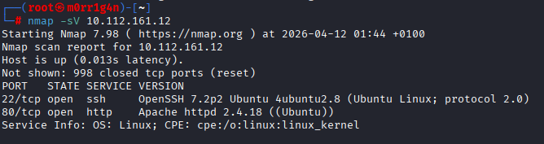
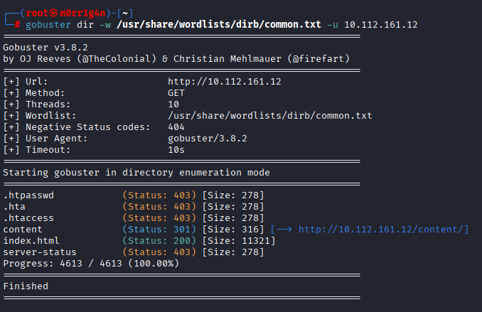
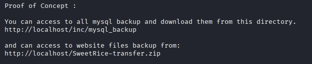
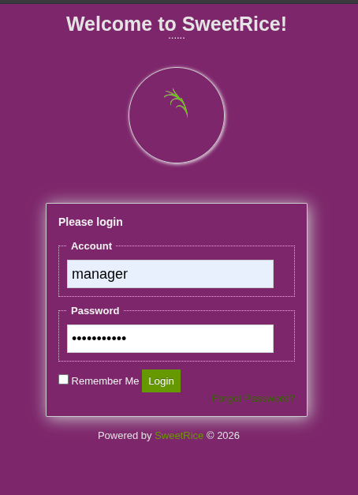
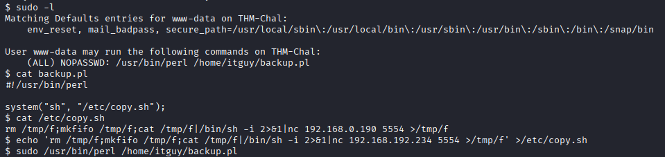

---

# **Penetration Test Report: Lazy Admin**

---

### **TL;DR**

This penetration test resulted in full root compromise through a multi-stage web application attack chain. The initial breach leveraged an exposed backup directory containing a database dump with weakly hashed credentials (MD5), which were cracked to gain admin panel access. A CSRF vulnerability in the SweetRice CMS Ads module enabled remote code execution, and a misconfigured sudo permission on a Perl script allowed privilege escalation to root via a writable file hijack attack.

---

### **Target Information**

- **Target IP:** 10.112.161.12
- **Operating System:** Linux (Ubuntu-based distribution)
- **Open Ports:**
    - 80/tcp – HTTP (Apache httpd)
    - 22/tcp – SSH (OpenSSH)
- **Assessment Type:** Authorized lab environment

---

### **Executive Summary**

A penetration test was conducted against the target system 10.112.161.12, simulating an external attacker with no prior access.

The assessment resulted in complete system compromise, achieved through a chain of web application vulnerabilities, insecure CMS configuration, credential exposure, and privilege escalation misconfiguration.

The privileges were successfully escalated - from initial reconnaissance to root-level access, allowing full control over the system.

**Key Findings:**

| Finding | Severity | Impact |
| --- | --- | --- |
| Backup Disclosure leading to credential exposure | Critical | Exposure of database backups containing sensitive configuration and user credentials |
| Weak password hashing (MD5) | Critical | Allows trivial password recovery using online cracking tools |
| CSRF leading to Remote Code Execution | High | Authenticated attackers can execute arbitrary PHP code on the server |
| Privilege escalation via insecure sudo configuration | Critical | Root-level remote command execution achieved |

The combined effect of these vulnerabilities resulted in complete compromise of the target machine, demonstrating high-risk security misconfigurations and an outdated CMS environment.

---

### **Scope and Methodology**

**Scope:**

- **Target:** 10.112.161.12
- **Application:** SweetRice
- **Ports/Protocols in Scope:**
    - 80/tcp – HTTP (Apache httpd)
    - 22/tcp – SSH (OpenSSH)

**Methodology:**

The assessment followed a structured penetration testing methodology:

1. **Reconnaissance & Enumeration:** 
    - Verified target host up, performed TCP port enumeration using Nmap with service/version detection
    - Conducted web directory enumeration using Gobuster.
2. **Vulnerability Analysis:** 
    - Identified SweetRice CMS
    - Discovered exposed backup directory containing database dump
    - Identified weak MD5 password hashing.
3. **Exploitation:** 
    - Downloaded SQL backup, extracted credentials, cracked MD5 hash using CrackStation,
    - Gained admin panel access,
    - Deployed CSRF exploit (Searchsploit ID: 40700) to achieve remote code execution via reverse shell.
4. **Post-Exploitation & Privilege Escalation:** 
    - Identified misconfigured sudo permission allowing to execute a Perl script
    - Overwrote `/etc/copy.sh` with reverse shell payload, and executed it via sudo to achieve root-level access.
5. **Documentation:** 
    - Documented findings, impact, and remediations.

This approach ensures both technical depth and clarity in risk assessment.

---

### **Findings and Exploitation**

### **Initial Access: External Compromise via Web Application Exploitation Chain**

**Vulnerability Summary**

The initial foothold was established through a chain of web application vulnerabilities in the SweetRice CMS. This included an exposed backup directory allowing credential extraction, weak MD5 password hashing enabling trivial password recovery, and a PHP code execution vulnerability allowing remote code execution.

**Technical Walkthrough** 

1. **Port Scanning & Service Discovery:** Initial reconnaissance was conducted using a standard Nmap scan to identify open ports and available services. Ports 22 and 80 were identified as open, running SSH and HTTP services.

    

2. **Web Enumeration:** The Apache webserver on port 80 displayed the default landing page, indicating additional content may exist under the web root. Gobuster was deployed to enumerate hidden directories. The `/content` directory was identified as a point of interest.
    
    
    
3. **CMS Identification:** Navigating to `/content` revealed a "Down for maintenance" page indicating the webserver was running a CMS called SweetRice.
    
    
    
4. **Directory Enumeration:** A more thorough Gobuster scan was executed against the `/content` directory.
    
    
    
    **Results:** The `/inc` directory was discovered within `/content`.
    
5. **Backup Disclosure Discovery:**  A search conducted using Searchsploit identified a **Backup Disclosure vulnerability** affecting the SweetRice CMS. The provided proof of concept indicated that database backups may be accessible via the `/inc/mysql_backup/` directory.
    
    Subsequent directory enumeration using Gobuster confirmed the presence of the `/content/inc/` path on the target system. By correlating these findings, the database backup file was successfully located and accessed at:
    
    ```
    /content/inc/mysql_backup/
    ```
    
    
    
    
    
    
    
6. **Credential Extraction:** The SQL backup file was downloaded and examined. Within the file, a section containing a username and MD5-hashed password was identified.
    
    **Extracted Hash:** `42f749ade7f9e195bf475f37a44cafcb`
    
7. **Weak Password Cracking:** The MD5 hash was cracked using an online tool - Crackstation. 
    
    
    
8. **Admin Panel Access:** The Gobuster results for the `/content` subdirectory revealed an `/as` directory, which provided access to the SweetRice CMS dashboard login page. The cracked credentials were used to successfully authenticate.
    
    
    
9. **PHP Code Execution Exploitation:** Research using Searchsploit identified a PHP Code Execution vulnerability (Exploit ID: 40700) that allows an authenticated attacker to add PHP code as an advertisement and activate it through the `/inc` folder.
    
    **Exploit Steps:**
    
    - A PHP reverse shell (PentestMonkey) was downloaded and configured with the VPN IP address and a chosen port.
    - The contents of the reverse shell were copied.
    - Within the SweetRice dashboard, navigation was made to **Dashboard → Ads**.
    - A new advertisement named "new-add.php" was created, and the PHP reverse shell code was pasted into the Ads Code box.
    - The advertisement was submitted.


    

10. **Reverse Shell Activation:** A netcat listener was established on the attacker machine.
    
    ```
    nc -lvnp 1234
    ```
    
    The reverse shell was activated by navigating to `http://192.168.192.234/content/inc/ads/reverse_shell`.
    
    
    

---

### **Post-Exploitation & Privilege Escalation**

**Vulnerability Summary**

Following initial access, enumeration of sudo permissions revealed a misconfiguration that allowed privilege escalation to root.

**Technical Walkthrough**

1. **Local Enumeration:** The sudo permissions were enumerated for the current user. The user `www-data` was allowed to execute a Perl script via sudo without a password.
2. **Script Analysis:** The contents of `/home/itguy/backup.pl` were examined and found to execute an external file.
3. **Exploitation:** The `/etc/copy.sh` file was writable by the user. The file was overwritten with a reverse shell payload.
4. **Root Access Obtained:** The Perl script was executed via sudo, triggering the malicious `/etc/copy.sh` script with root privileges.



Root-level remote command execution was achieved, granting full control over the system.


---

### **Risk Assessment**

| Finding | Description | Likelihood | Impact | Risk Rating |
| --- | --- | --- | --- | --- |
| **Backup Disclosure** | Unauthenticated backup directory exposed under web root, allowing download of database dumps containing credentials. | High | High | **Critical** |
| **Weak Password Hashing (MD5)** | User passwords stored using weak MD5 hashing without salt, allowing trivial password recovery using cracking tools. | High | High | **Critical** |
| **PHP Code Execution** | SweetRice CMS Ads module allows PHP code injection via stored advertisement content, enabling remote code execution. | Medium | Critical | **High** |
| **Insecure Sudo Configuration** | User www-data allowed to execute Perl script via sudo without password; script executes writable external file `/etc/copy.sh`. | Medium | Critical | **Critical** |

**Risk Factor Analysis:**

| Risk Factor | Analysis |
| --- | --- |
| Confidentiality | Complete confidentiality breach due to database exposure and credential compromise |
| Integrity | Integrity compromise due to file modification capability via RCE and sudo exploitation |
| Availability | Full availability compromise due to root shell access |
| Exploitability | Moderate via chained web application vulnerabilities |
| Detectability | Can be detected via web application logging, IDS, and system audit logs |

---

### **Conclusion**

The target system exhibited multiple severe security misconfigurations which, when chained together, resulted in full system compromise. The attack demonstrates how low-severity issues such as backup exposure and weak credentials can escalate into total root-level access when combined with poor privilege separation.

This assessment highlights the importance of secure backup storage, strong password hashing algorithms, CSRF protection, and proper sudo configuration.

---

### **Recommendations**

**Secure Backup Storage**

- Move backups outside web root
- Restrict directory listing

**Password Security**

- Replace MD5 with bcrypt/Argon2
- Enforce strong password policies

**CSRF Protection**

- Implement CSRF tokens for all state-changing actions

**Secure Sudo Configuration**

- Avoid wildcard or script-based sudo execution
- Restrict sudo access to necessary binaries only
- Remove writable files executed by privileged scripts

**File Permissions**

- Ensure /etc and scripts executed by root are not writable by non-privileged users

---