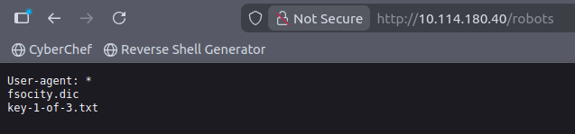
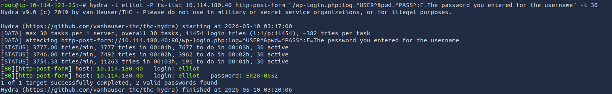
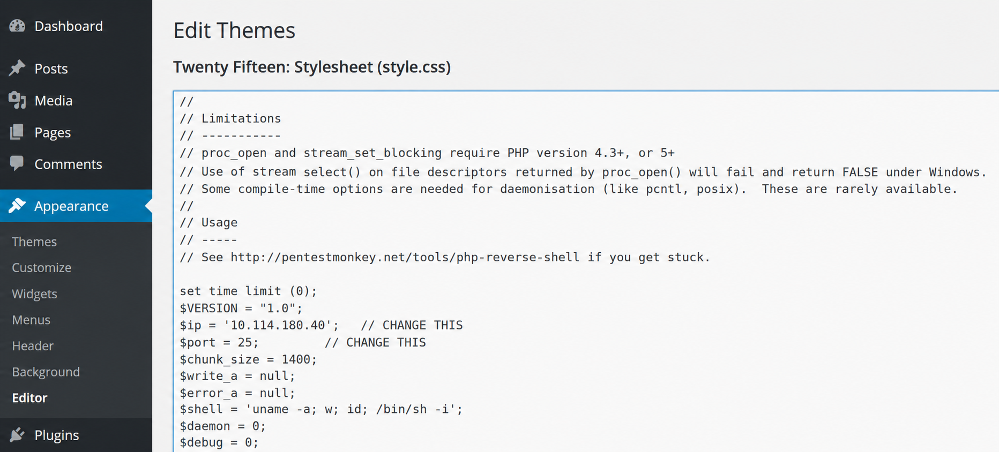
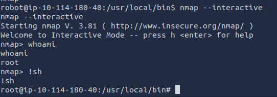

---

# **Zpráva z penetračního testu: Mr. Robot**

---

### **Shrnutí**

Tento penetrační test dosáhl plného kompromisu cílového systému s dosažením root privilegií prostřednictvím kombinace enumerace WordPressu, útoků na přihlašovací údaje, vzdáleného spouštění kódu, prolomení hesel a eskalace privilegií pomocí SUID.

Útok začal průzkumem a enumerací adresářů na instalaci WordPressu, což vedlo k objevení citlivých souborů včetně vlastního souboru potenciálních hesel. Následně byla využita zranitelnost enumerace uživatelských jmen v přihlašovacím portálu WordPress k identifikaci platného administrátorského účtu.

Pomocí Hydry byl proveden úspěšný útok na heslo administrátorského účtu, který umožnil přístup k administrátorskému rozhraní WordPressu. Administrátorská oprávnění byla využita k nahrání PHP reverzního shellu přes editor témat, což vedlo ke vzdálenému spouštění kódu jako uživatel `daemon`.

Následná enumerace odhalila MD5 hash hesla uživatele `robot`. Po prolomení hashe bylo dosaženo laterálního pohybu k účtu `robot`. Nakonec byl zneužit nesprávně nakonfigurovaný SUID binární soubor `nmap` pomocí technik GTFOBins k získání plných root oprávnění.

---

### **Informace o cíli**

- **IP adresa cíle:** `10.114.180.40`
- **Operační systém:** Linux
- **Otevřené porty:**
    - `22/tcp` – SSH (OpenSSH 8.2p1)
    - `80/tcp` – HTTP (Apache httpd)
    - `443/tcp` – HTTPS (Apache httpd)
- **Typ hodnocení:** Autorizované laboratorní prostředí

---

### **Souhrnná zpráva**

Byl proveden komplexní externí penetrační test proti cílové infrastruktuře identifikované jako "Mr. Robot". Cílem bylo identifikovat zranitelnosti, bezpečnostní slabiny a útočné cesty, které by mohly vést k neoprávněnému kompromisu systému.

Byl úspěšně demonstrován kompletní řetězec od neautentizovaného externího přístupu až po plný root kompromis cílového systému.

Útok začal průzkumem a webovou enumerací proti WordPress webu hostovanému na cílovém serveru. Prolomení adresářů odhalilo citlivé soubory, včetně rozsáhlého vlastního slovníku hesel. Slabina enumerace uživatelských jmen v přihlašovacím portálu WordPress umožnila identifikovat platná uživatelská jména prostřednictvím odlišných chybových hlášení při autentizaci.

Pomocí odhaleného slovníku a Hydry byl proveden úspěšný útok na heslo, který kompromitoval administrátorský účet WordPressu `elliot`. Administrátorský přístup k administračnímu rozhraní WordPressu umožnil přímou úpravu PHP souborů, což umožnilo nahrát a spustit payload reverzního shellu.

Po získání počátečního přístupu k shellu místní enumerace identifikovala hash hesla a citlivé soubory patřící jinému uživatelskému účtu (`robot`). Obnovený MD5 hash hesla byl úspěšně prolomen, což umožnilo eskalaci privilegií k účtu `robot`.

Nakonec enumerace SUID binárních souborů odhalila zranitelný spustitelný soubor `nmap` s privilegovanými oprávněními. Pomocí veřejně zdokumentovaných technik GTFOBins byl binární soubor zneužit k vytvoření rootovského shellu a úplnému kompromisu hostitele.

**Celkové hodnocení rizika: Kritické**

Zjištění demonstrují závažný bezpečnostní dopad způsobený slabou správou přihlašovacích údajů, nesprávným oddělením oprávnění, nezabezpečenými administrátorskými postupy WordPressu a nebezpečnými konfiguracemi SUID. Jednotlivě zranitelnosti byly úspěšně navázány k dosažení úplného kompromisu systému.

---

### **Rozsah a metodika**

#### **Rozsah**

- **Cíl:** `10.114.180.40`
- **Porty/protokoly:**
    - `22/tcp` (SSH)
    - `80/tcp` (HTTP)
    - `443/tcp` (HTTPS)

#### **Metodika**

1. **Průzkum a enumerace:** Identifikace otevřených portů, běžících služeb, vystavených adresářů a veřejně přístupných informací.
2. **Enumerace zranitelností:** Identifikace slabin v aplikaci WordPress a autentizačních mechanismech.
3. **Exploitace:** Získání neoprávněného přístupu prostřednictvím útoků na přihlašovací údaje a vzdáleného spouštění kódu.
4. **Post-exploitace a eskalace privilegií:** Enumerace citlivých souborů, prolomení přihlašovacích údajů a využití lokálních vektorů eskalace privilegií.
5. **Dokumentace:** Zdokumentování zjištění, útočných cest, hodnocení rizik a doporučení k nápravě.

---

### **Zjištění a exploitace**

### **Počáteční přístup: Enumerace WordPressu a útok na přihlašovací údaje**

**Shrnutí zranitelnosti**

Počáteční přístup byl dosažen kombinací vystavených citlivých souborů, enumerace uživatelských jmen a slabého zabezpečení přihlašovacích údajů v autentizačním portálu WordPress.

**Technický postup**

### **Průzkum**

**Krok 1 – Objev portů:**

Byl proveden úvodní sken Nmap k identifikaci vystavených služeb na cílovém stroji.

```bash
nmap -sV -T4 10.114.180.40
```

**Výsledky:**


Výsledky potvrdily, že cíl hostoval webovou aplikaci přes HTTP i HTTPS spolu se službou SSH.

---

**Krok 2 – Enumerace adresářů:**

Bylo provedeno hrubé prolomení adresářů pomocí Gobuster.

```bash
gobuster dir -u http://10.114.180.40 -w common.txt
```


Enumerace identifikovala několik zajímavých adresářů:

- `/wp-login`
- `/robots`
- `/login`
- `/phpmyadmin`
- `/wp-admin`
- `/wp-content`



---

**Krok 3 - Enumerace robots:**

Soubor `/robots` odhalil dva další citlivé zdroje:

- `/fsocity.dic`
- `/key-1-of-3.txt`

Soubor `fsocity.dic` obsahoval rozsáhlý vlastní slovník hesel, který obsahoval uživatelská jména a hesla.


**Optimalizace slovníku:**

Poskytnutý slovník obsahoval značné množství duplicitních záznamů. K redukci seznamu pouze na unikátní hodnoty byly použity následující příkazy:

```bash
sort text | uniq -d > fs-list
sort text | uniq -u >> fs-list
wc -w fs-list
```

Optimalizovaný slovník byl redukován z více než 765 000 záznamů na přibližně 11 452 unikátních hodnot.


### **Enumerace zranitelností**

**Enumerace uživatelských jmen pomocí chyb autentizace WordPress:**

Testování neplatných pokusů o přihlášení na `/wp-login.php` odhalilo různé chybové zprávy pro neplatná uživatelská jména oproti platným uživatelským jménům.

Pokus o autentizaci s neplatnými přihlašovacími údaji vrátil:

```
ERROR: Invalid username.
```

Toto chování umožnilo provádět útoky enumerace uživatelských jmen.

Pomocí Burp Suite byly zachyceny parametry HTTP POST požadavku a identifikovány jako:

- `log`
- `pwd`

**Enumerace uživatelských jmen pomocí Hydry:**

Hydra byla použita k identifikaci platných uživatelských jmen pomocí optimalizovaného slovníku. Po zadání získaného uživatelského jména se chybová zpráva změnila:

```bash
hydra -L fs-list -p test 10.114.180.40 http-post-form "/wp-login.php:log=^USER^&pwd=^PASS^:F=Invalid username" -t 30
```


Útok úspěšně identifikoval následující platná uživatelská jména:

- `elliot`
- `Elliot`
- `ELLIOT`


1. **Útok na heslo účtu WordPress:**
    
    Byl proveden druhý útok Hydry s použitím objeveného uživatelského jména `elliot`.
    
    ```bash
    hydra -l elliot -P fs-list 10.114.180.40 http-post-form "/wp-login.php:log=^USER^&pwd=^PASS^:F=The password you entered for the username" -t 30
    ```
    
    Hydra úspěšně obnovila heslo:
    
    
    
    ```
    ER28-0652
    ```
    
2. **Administrativní přístup k WordPressu:**
    
    Obnovené přihlašovací údaje byly úspěšně použity k autentizaci do administrativního portálu WordPress.
    
    Kompromitovaný účet měl administrátorská oprávnění.
    
    
    
---

### **Exploitace: Vzdálené spouštění kódu přes editor témat WordPress**

**Shrnutí zranitelnosti**

Administrativní přístup k administračnímu rozhraní WordPress umožnil spouštění libovolného PHP kódu prostřednictvím přímé úpravy souborů témat.

**Technický postup**

1. **Úprava souboru témat:**
    
    Pomocí editoru témat WordPress (`Vzhled → Editor`) byl upraven soubor `header.php` v rámci tématu `twentyfifteen`.
    
2. **Nasazení reverzního shellu:**
    
    PHP reverzní shell z PentestMonkey byl vložen do souboru šablony.
    
    
    
3. **Nastavení posluchače:**
    
    Na útočícím stroji byl nastaven posluchač Netcat.
    
    ```bash
    nc -lnvp 1234
    ```
    
4. **Vzdálené spouštění kódu:**
    
    Upravený PHP soubor byl spuštěn návštěvou:
    
    ```
    http://10.114.180.40/wp-content/themes/twentyfifteen/header.php
    ```
    
    Byl získán reverzní shell jako uživatel `daemon`.
    
    
    
---

### **Eskalace privilegií**

### **Eskalace privilegií na `robot` pomocí prolomení hashe hesla**

**Shrnutí zranitelnosti**

Citlivé soubory v `/home/robot` ukázaly MD5 hash hesla uživatele `robot`.

**Technický postup**

1. **Objev citlivých souborů:**
    
    Post-exploitační enumerace identifikovala soubor v `/home/robot` - soubor s hashem hesla nazvaný password.raw-md5
    
    
    
2. **Prolomení hashe hesla:**
    
    MD5 hash patřící účtu `robot` byl extrahován a prolomen pomocí CrackStation.
    
    Obnovené heslo bylo:
    
    ```
    ab**********yz
    ```
    
    
    
**Kompromis uživatele:**
    
Přihlašovací údaje byly úspěšně použity k přepnutí uživatele.
    
```bash
su robot
```
    
Tím byl získán přístup k shellu jako uživatel `robot`.
    
### **Eskalace privilegií na `root` pomocí SUID Nmap**

**Shrnutí zranitelnosti**

SUID-enabled binární soubor `nmap` umožňoval spouštění libovolných příkazů s rootovskými oprávněními.

**Technický postup**

1. **Enumerace SUID:**
    
    K enumeraci SUID binárních souborů byl použit následující příkaz:
    
    ```bash
    find / -perm -u=s -type f 2>/dev/null
    ```
    
    Výsledky odhalily neobvyklý SUID-enabled binární soubor `nmap`.
    
    
    
2. **Výzkum GTFOBins:**
    
    Navazující průzkum pomocí GTFOBins identifikoval, že starší interaktivní verze `nmap` mohou být zneužity k vytvoření privilegovaného shellu.
    
3. **Eskalace privilegií:**
    
    V interaktivním režimu:
    
    ```bash
    !sh
    ```
    
    
    
    
    
**Výsledek:**

Rootovský shell byl úspěšně získán.

Cílový systém byl plně kompromitován.

---

### **Hodnocení rizik**

| **Zjištění** | **Popis** | **Pravděpodobnost** | **Dopad** | **Hodnocení rizika** |
| --- | --- | --- | --- | --- |
| **Enumerace uživatelských jmen** | Odpovědi autentizace WordPress odhalovaly platná uživatelská jména. | Vysoká | Střední | **Střední** |
| **Slabé přihlašovací údaje** | Administrátorské heslo prolomeno pomocí slovníkových útoků. | Vysoká | Vysoký | **Kritické** |
| **Vystavení citlivých souborů** | robots vystavil citlivé zdroje a vlastní slovníky hesel. | Střední | Střední | **Střední** |
| **Spouštění libovolného PHP kódu** | Administrátoři WordPress mohli spouštět libovolný PHP kód přes úpravy témat. | Vysoká | Vysoký | **Kritické** |
| **Slabé hashování hesel** | MD5 hashe hesel byly zranitelné vůči prolomení. | Vysoká | Střední | **Vysoké** |
| **Nesprávná konfigurace SUID** | SUID-enabled binární soubor `nmap` umožňoval spouštění rootovských příkazů. | Vysoká | Kritický | **Kritické** |

---

### **Závěr**

Bezpečnostní hodnocení infrastruktury "Mr. Robot" úspěšně dosáhlo plného rootovského kompromisu prostřednictvím zřetězené exploitační cesty zahrnující slabé přihlašovací údaje, vystavené citlivé zdroje, vzdálené spouštění kódu a lokální zranitelnosti eskalace privilegií.

Útok začal enumerací adresářů a únikem informací přes soubor `robots`, který vystavil vlastní slovník hesel použitý při útocích na přihlašovací údaje. Zranitelnosti enumerace uživatelských jmen v odpovědích autentizace WordPress umožnily identifikaci platných uživatelů, zatímco slabé zabezpečení hesel umožnilo kompromis administrátorského účtu.

Administrativní přístup k WordPress byl následně zneužit k dosažení vzdáleného spouštění kódu prostřednictvím škodlivé úpravy PHP souborů témat. Post-exploitační aktivity odhalily citlivé hashe hesel a příležitosti k lokální eskalaci privilegií, což nakonec vedlo k přístupu na úrovni root prostřednictvím zranitelného SUID-enabled binárního souboru `nmap`.

Toto hodnocení zdůrazňuje kritický význam bezpečného správy přihlašovacích údajů, správného oddělení privilegií, bezpečné konfigurace webových aplikací a omezení nebezpečných SUID binárních souborů.

---

### **Doporučení**

1. **Zabezpečení přihlašovacích údajů:** Zavést silné zásady hesel pro všechny administrátorské účty, implementovat zásady uzamčení účtů a omezování rychlosti na autentizačních koncových bodech, používat moderní hashovací algoritmy hesel jako bcrypt nebo Argon2 místo MD5.
2. **Zabezpečení WordPressu:** Zakázat přímé úpravy témat a pluginů z administrátorského rozhraní WordPress, omezit administrátorský přístup pomocí MFA a IP allowlistingu, odstranit nepotřebné pluginy a témata.
3. **Prevence enumerace uživatelských jmen:** Sjednotit chybové zprávy autentizace, aby neodhalovaly platná uživatelská jména, implementovat CAPTCHA nebo další ochrany přihlášení.
4. **Ochrana citlivých souborů:** Zabránit vystavení citlivých souborů přes `robots`, omezit přístup k vlastním slovníkům hesel, záložním souborům a interním zdrojům.
5. **Správa privilegií:** Odstranit nepotřebná SUID oprávnění z binárních souborů jako `nmap`, provádět pravidelné audity privilegovaných spustitelných souborů a oprávnění souborů.
6. **Monitorování a detekce:** Monitorovat podezřelou přihlašovací aktivitu a útoky hrubou silou, detekovat neautorizované úpravy souborů témat WordPress, implementovat nástroje EDR (Endpoint Detection and Response) k identifikaci chování eskalace privilegií.