---

# **Penetration Testing Report: Mr. Robot**

---

### **TL;DR**

This penetration test achieved full root compromise of the target system through a combination of WordPress enumeration, credential attacks, remote code execution, password cracking, and SUID privilege escalation.

The attack began with reconnaissance and directory enumeration against a WordPress installation, leading to the discovery of sensitive files including a custom wordlist. A username enumeration vulnerability within the WordPress login portal was then exploited to identify a valid administrator account.

Using Hydra, a successful password attack was conducted against the administrator account, granting access to the WordPress dashboard. Administrative privileges were leveraged to upload a PHP reverse shell through the theme editor, resulting in remote code execution as the `daemon` user.

Post-exploitation enumeration uncovered an MD5 password hash belonging to the `robot` user. After cracking the hash, lateral movement to the `robot` account was achieved. Finally, a misconfigured SUID-enabled `nmap` binary was exploited using GTFOBins techniques to obtain full root privileges.

---

### **Target Information**

- **Target IP:** `10.114.180.40`
- **Operating System:** Linux
- **Open Ports:**
    - `22/tcp` – SSH (OpenSSH 8.2p1)
    - `80/tcp` – HTTP (Apache httpd)
    - `443/tcp` – HTTPS (Apache httpd)
- **Assessment Type:** Authorized lab environment

---

### **Executive Summary**

A comprehensive external penetration test was conducted against the target infrastructure identified as the “Mr. Robot” machine. The objective of the assessment was to identify vulnerabilities, security weaknesses, and attack paths that could result in unauthorized system compromise.

The assessment successfully demonstrated a complete attack chain from unauthenticated external access to full root compromise of the target system.

The attack began with reconnaissance and web enumeration against a WordPress website hosted on the target server. Directory brute forcing exposed sensitive files, including a large custom wordlist. A username enumeration weakness within the WordPress login portal allowed valid usernames to be identified through differing authentication error messages.

Using the exposed wordlist and Hydra, a successful password attack compromised the WordPress administrator account `elliot`. Administrative access to the WordPress dashboard enabled direct modification of PHP theme files, allowing a reverse shell payload to be uploaded and executed.

After gaining initial shell access, local enumeration identified password hashes and sensitive files belonging to another user account (`robot`). The recovered MD5 password hash was cracked successfully, enabling privilege escalation to the `robot` account.

Finally, enumeration of SUID binaries revealed a vulnerable `nmap` executable with elevated permissions. Using publicly documented GTFOBins techniques, the binary was abused to spawn a root shell and fully compromise the host.

**Overall Risk Rating: Critical**

The findings demonstrate the severe security impact caused by weak credential management, improper privilege separation, insecure WordPress administration practices, and dangerous SUID misconfigurations. Individually moderate vulnerabilities were successfully chained together to achieve complete system compromise.

---

### **Scope and Methodology**

#### **Scope**

- **Target:** `10.114.180.40`
- **Ports/Protocols:**
    - `22/tcp` (SSH)
    - `80/tcp` (HTTP)
    - `443/tcp` (HTTPS)

#### **Methodology**

1. **Reconnaissance & Enumeration:** Identifying open ports, running services, exposed directories, and publicly accessible information.
2. **Vulnerability Enumeration:** Identifying weaknesses within the WordPress application and authentication mechanisms.
3. **Exploitation:** Gaining unauthorized access through credential attacks and remote code execution.
4. **Post-Exploitation & Privilege Escalation:** Enumerating sensitive files, cracking credentials, and exploiting local privilege escalation vectors.
5. **Documentation:** Documenting findings, attack paths, risk ratings, and remediation recommendations.

---

### **Findings and Exploitation**

### **Initial Access: WordPress Enumeration & Credential Attack**

**Vulnerability Summary**

The initial foothold was achieved through a combination of exposed sensitive files, username enumeration, and weak credential security within the WordPress authentication portal.

**Technical Walkthrough**

### **Reconnaissance**

**Step 1 – Port Discovery:**

An initial Nmap scan was conducted to identify exposed services on the target machine.

```bash
nmap -sV -T4 10.114.180.40
```

**Results:**

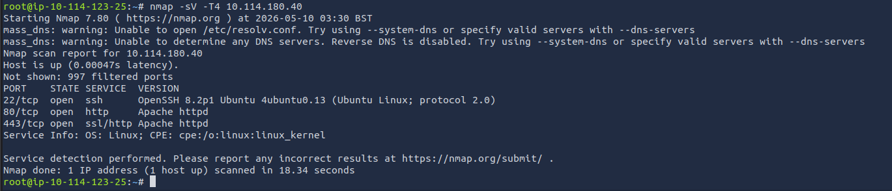

The results confirmed that the target was hosting a web application over both HTTP and HTTPS, alongside an SSH service.

---

**Step 2 – Directory Enumeration:**

Directory brute forcing was performed using Gobuster.

```bash
gobuster dir -u http://10.114.180.40 -w common.txt
```

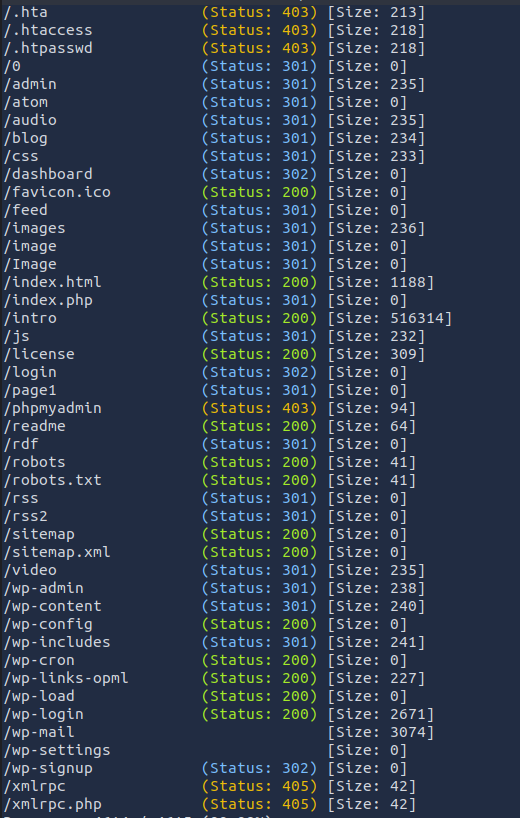

The enumeration identified several interesting directories:

- `/wp-login`
- `/robots`
- `/login`
- `/phpmyadmin`
- `/wp-admin`
- `/wp-content`


---

**Step 3 - robots enumeration:**

The `/robots` file revealed two additional sensitive resources:

- `/fsocity.dic`
- `/key-1-of-3.txt`

The `fsocity.dic` file contained a large custom wordlist that appeared to contain usernames and passwords.

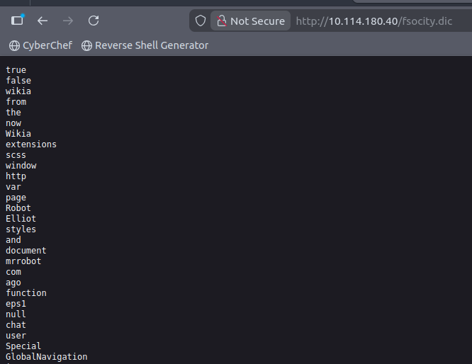

**Wordlist Optimization:**

The provided wordlist contained a significant number of duplicate entries. The following commands were used to reduce the list to unique values only:

```bash
sort text | uniq -d > fs-list
sort text | uniq -u >> fs-list
wc -w fs-list
```

The optimized wordlist was reduced from over 765,000 entries to approximately 11,452 unique values.

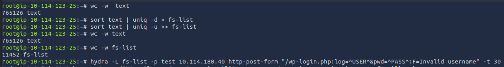

### **Vulnerability Enumeration**

**Username Enumeration via WordPress Authentication Errors:**

Testing invalid login attempts against `/wp-login.php` revealed different error messages for invalid usernames versus valid usernames.

Attempting to authenticate using invalid credentials returned:

```
ERROR: Invalid username.
```

This behavior allowed username enumeration attacks to be performed.

Using Burp Suite, the HTTP POST request parameters were captured and identified as:

- `log`
- `pwd`


**Hydra Username Enumeration:**

Hydra was used to identify valid usernames using the optimized wordlist. Upon entering the obtained username the error message has changed:

```bash
hydra -L fs-list -p test 10.114.180.40 http-post-form "/wp-login.php:log=^USER^&pwd=^PASS^:F=Invalid username" -t 30
```

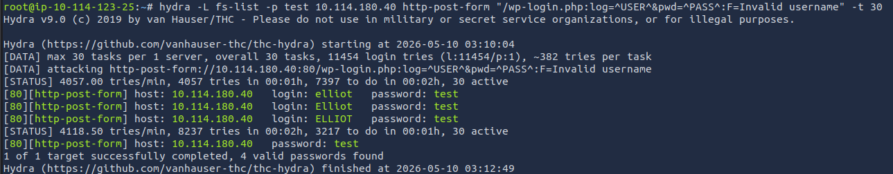

The attack successfully identified the following valid usernames:

- `elliot`
- `Elliot`
- `ELLIOT`

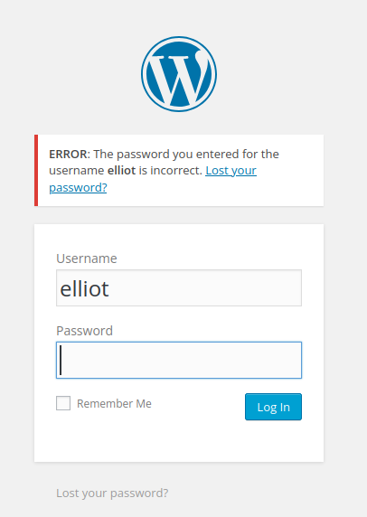

1. **Password Attack Against WordPress Account:**
    
    A second Hydra attack was conducted using the discovered username `elliot`.
    

    ```bash
    hydra -l elliot -P fs-list 10.114.180.40 http-post-form "/wp-login.php:log=^USER^&pwd=^PASS^:F=The password you entered for the username" -t 30
    ```

    Hydra successfully recovered the password:

    

    ```
    ER28-0652
    ```

2. **WordPress Administrative Access:**
    
    The recovered credentials were used to authenticate successfully to the WordPress administrative portal.
    

    The compromised account possessed administrator privileges.

    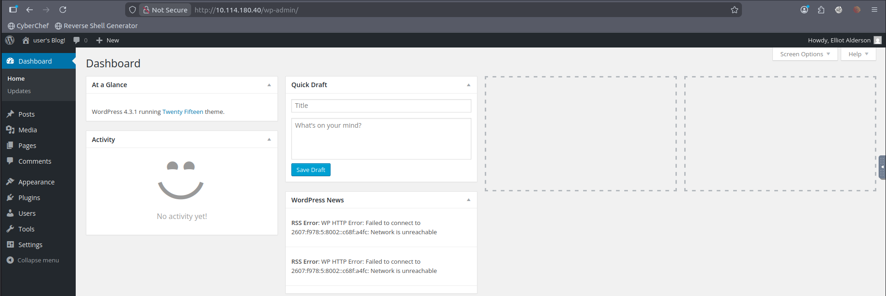

---

### **Exploitation: Remote Code Execution via WordPress Theme Editor**

**Vulnerability Summary**

Administrative access to the WordPress dashboard allowed arbitrary PHP code execution through direct modification of theme files.

**Technical Walkthrough**

1. **Theme File Modification:**
    
    Using the WordPress Theme Editor (`Appearance → Editor`), the `header.php` file within the `twentyfifteen` theme was modified.
    
2. **Reverse Shell Deployment:**
    
    The PHP reverse shell from PentestMonkey was inserted into the template file.
    


1. **Listener Setup:**
    
    A Netcat listener was established on the attacking machine.
    

    ```bash
    nc -lnvp 1234
    ```

2. **Remote Code Execution:**
    
    The modified PHP file was executed by visiting:
    

    ```
    http://10.114.180.40/wp-content/themes/twentyfifteen/header.php
    ```

    A reverse shell was obtained as the `daemon` user.

    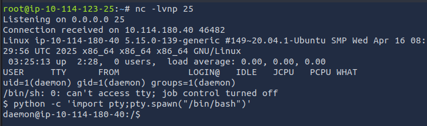

---

### **Privilege Escalation**

### **Privilege escalation to `robot` via Password Hash Cracking**

**Vulnerability Summary**

Sensitive files within the `/home/robot` directory exposed an MD5 password hash belonging to the `robot` user.

**Technical Walkthrough**

1. **Sensitive File Discovery:**
    
    Post-exploitation enumeration identified the a file within `/home/robot` - a password hash file called password.raw-md5
    
    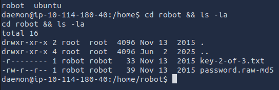
    
2. **Password Hash Cracking:**
    
    The MD5 hash belonging to the `robot` account was extracted and cracked using CrackStation.
    

The recovered password was:

```
ab**********yz
```

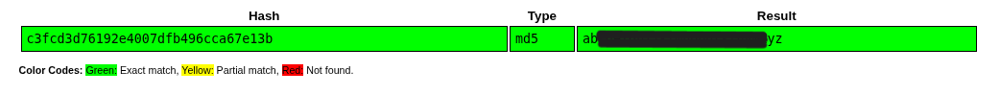

**User Compromise:**
    
The credentials were used to switch users successfully.
    

```bash
su robot
```

This provided shell access as the `robot` user.

### **Privilege Escalation to `root` via SUID Nmap**

**Vulnerability Summary**

A SUID-enabled `nmap` binary allowed arbitrary command execution with root privileges.

**Technical Walkthrough**


1. **SUID Enumeration:**
    
    The following command was used to enumerate SUID binaries:
    

    ```bash
    find / -perm -u=s -type f 2>/dev/null
    ```

    The results revealed an unusual SUID-enabled `nmap` binary.

    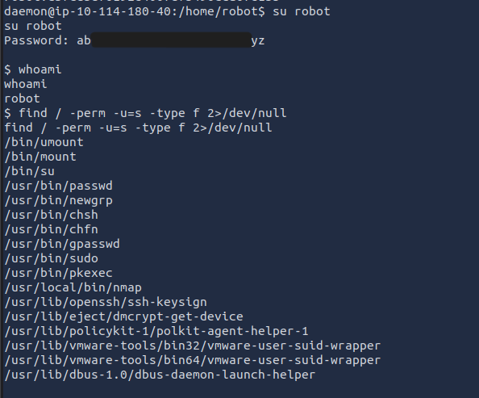

2. **GTFOBins Research:**
    
    Research using GTFOBins identified that older interactive versions of `nmap` could be abused to spawn a privileged shell.
    
3. **Privilege Escalation:**

Inside interactive mode:

```bash
!sh
```


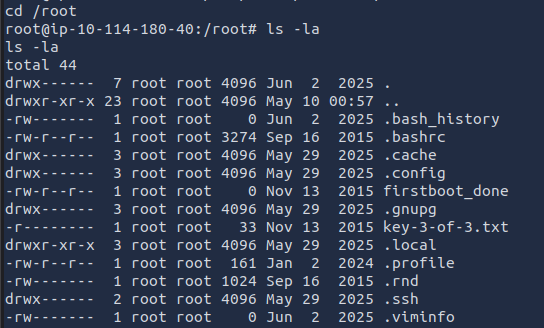

**Result:**

A root shell was successfully obtained.

The target system was fully compromised.

---

### **Risk Assessment**

| **Finding** | **Description** | **Likelihood** | **Impact** | **Risk Rating** |
| --- | --- | --- | --- | --- |
| **Username Enumeration** | WordPress authentication responses disclosed valid usernames. | High | Medium | **Medium** |
| **Weak Credentials** | Administrator password cracked using dictionary attacks. | High | High | **Critical** |
| **Sensitive File Exposure** | robots exposed sensitive resources and custom wordlists. | Medium | Medium | **Medium** |
| **Arbitrary PHP Code Execution** | WordPress administrators could execute arbitrary PHP code through theme editing. | High | High | **Critical** |
| **Weak Password Hashing** | MD5 password hashes were vulnerable to cracking. | High | Medium | **High** |
| **SUID Misconfiguration** | SUID-enabled `nmap` binary allowed root command execution. | High | Critical | **Critical** |

---

### **Conclusion**

The security assessment of the “Mr. Robot” infrastructure successfully achieved full root compromise through a chained exploitation path involving weak credentials, exposed sensitive resources, remote code execution, and local privilege escalation vulnerabilities.

The attack began with directory enumeration and information disclosure through the `robots` file, which exposed a custom wordlist used during credential attacks. Username enumeration vulnerabilities within WordPress authentication responses enabled identification of valid users, while weak password security allowed compromise of the administrator account.

Administrative WordPress access was then abused to achieve remote code execution through malicious modification of PHP theme files. Post-exploitation activities uncovered sensitive password hashes and local privilege escalation opportunities, ultimately resulting in root-level access through a vulnerable SUID-enabled `nmap` binary.

This assessment highlights the critical importance of secure credential management, proper privilege separation, secure web application configuration, and restricting dangerous SUID binaries.

---

### **Recommendations**

1. **Credential Security:** enforce strong password policies for all administrative accounts, implement account lockout policies and rate limiting on authentication endpoints, use modern password hashing algorithms such as bcrypt or Argon2 instead of MD5.
2. **WordPress Hardening:** disable theme and plugin editing directly from the WordPress administrative dashboard, restrict administrative access using MFA and IP allowlisting, remove unnecessary plugins and themes.
3. **Prevent Username Enumeration:** standardize authentication error messages to avoid disclosing valid usernames, implement CAPTCHA or additional login protections.
4. **Sensitive File Protection:** prevent exposure of sensitive files through `robots`, restrict access to custom wordlists, backup files, and internal resources.
5. **Privilege Management:** remove unnecessary SUID permissions from binaries such as `nmap`, conduct regular audits of privileged executables and file permissions.
6. **Monitoring & Detection:** monitor for suspicious login activity and brute-force attacks, detect unauthorized modifications to WordPress theme files, implement endpoint detection and response (EDR) tooling to identify privilege escalation behavior.