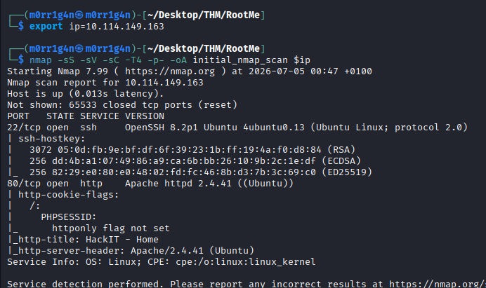
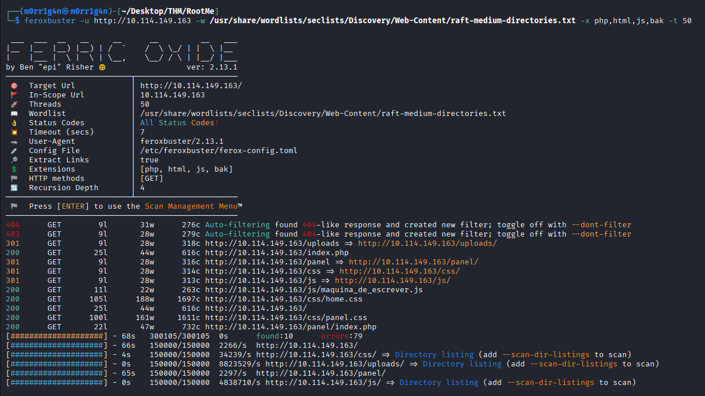
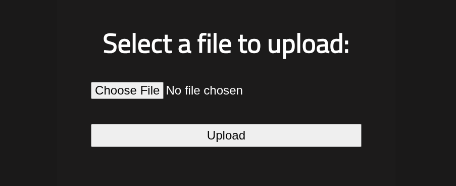
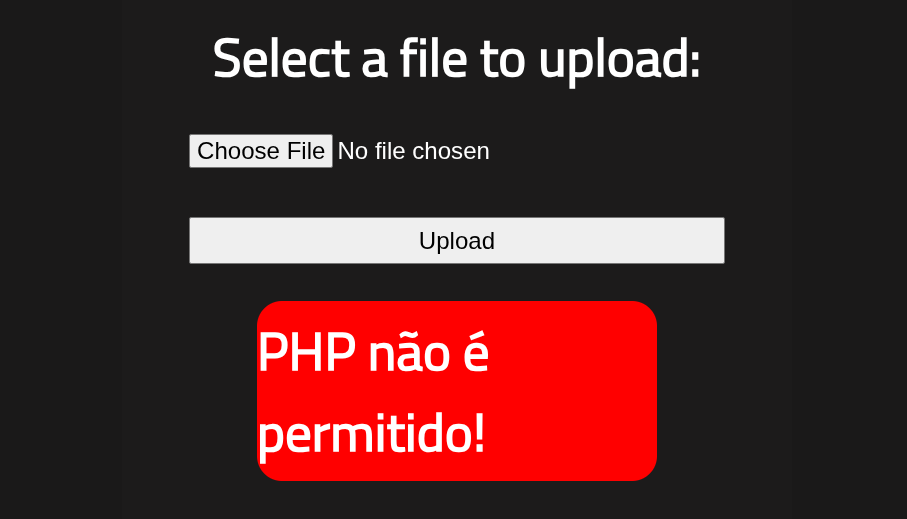
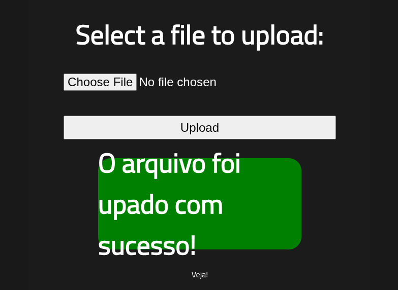
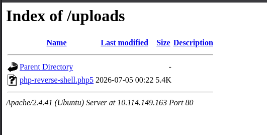
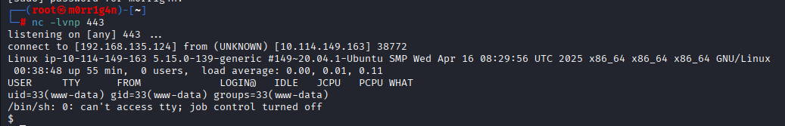
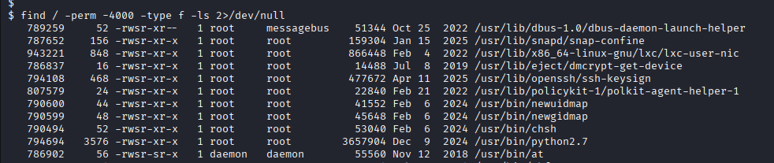
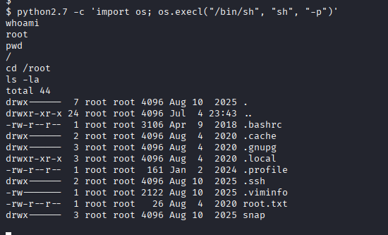
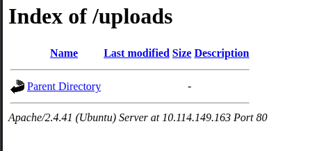

---

# **Penetration Test Report: Root Me**

---

### **TL;DR**

The assessment identified a critical attack path that resulted in complete compromise of the target system.

The engagement began with reconnaissance that identified an Apache web server exposing a file upload functionality and an openly browsable upload directory. Although the application attempted to restrict PHP uploads by blocking the `.php` extension, the filter was bypassed by uploading the payload with the legacy `.php5` extension. Because uploaded files were directly accessible via directory listing, the reverse shell executed immediately, resulting in remote code execution as the `www-data` user.

Post-exploitation enumeration identified a misconfigured SUID-enabled Python 2.7 binary. Since Python retained elevated privileges when executed with the `-p` option, it was leveraged to spawn a privileged shell, resulting in full root access.

**Overall Risk Rating:** **Critical**

---

### **Target Information**

- **Target IP:** 10.114.149.163
- **Operating System:** Ubuntu Linux
- **Open Ports:**
    - 22/tcp – OpenSSH 8.2p1
    - 80/tcp – Apache HTTP Server 2.4.41
- **Assessment Type:** Authorized lab environment (TryHackMe)

---

### **Executive Summary**

The assessment demonstrated how several independent weaknesses combined to allow full system compromise.

Reconnaissance identified an Apache web application exposing a publicly accessible upload panel. Directory enumeration also revealed that the upload directory permitted directory listing, allowing uploaded content to be directly accessed from a browser.

Although the upload functionality blocked standard PHP files, the restriction relied solely on file extension validation. Uploading the identical payload with the legacy `.php5` extension bypassed the restriction, resulting in successful remote code execution.

Following initial access, local privilege escalation was achieved through a SUID-enabled Python 2.7 binary. Since Python executed with elevated privileges and allowed arbitrary command execution, a privileged shell was spawned directly, resulting in complete administrative control of the host.

**Key Findings**

| Finding | Severity | Impact |
| --- | --- | --- |
| Directory Listing Enabled | Medium | Uploaded files publicly accessible |
| Insecure File Upload Validation | Critical | Remote Code Execution |
| Missing HttpOnly Cookie Attribute | Low | Increased client-side attack exposure |
| SUID Python 2.7 Binary | Critical | Local Privilege Escalation to Root |

---

### **Scope and Methodology**

**Scope**

- **Target:** 10.114.149.163
- **Application:** HackIT (RootMe)
- **Ports/Protocols in Scope:**
    - HTTP
    - SSH

**Methodology**

### **1. Reconnaissance & Enumeration**

Host availability was verified before conducting a full TCP port scan.

**Commands Used**

```
ping -c 4 10.114.149.163

export ip=10.114.149.163

nmap -sS -sV -sC -T4 -p- -oA initial_nmap_scan $ip
```



Discovered Services:

- TCP/22 – OpenSSH 8.2p1
- TCP/80 – Apache HTTP Server 2.4.41

Additional observation:

- PHP session cookie lacked the **HttpOnly** attribute.

---

The web application was manually inspected.

No useful metadata disclosure files were discovered:

- robots.txt
- sitemap.xml

Directory enumeration was therefore performed.

**Commands Used**

```
feroxbuster -u http://10.114.149.163 -w /usr/share/wordlists/seclists/Discovery/Web-Content/raft-medium-directories.txt -x php,html,js,bak -t 50
```



Discovered directories included:

```
/panel/
/uploads/
```

Manual inspection revealed:

- `/panel/` exposed a file upload functionality.



- `/uploads/` permitted directory listing, allowing direct access to uploaded files.

---

### **2. Vulnerability Analysis**

Testing confirmed that the upload mechanism rejected files with the standard `.php` extension.



Instead of performing content validation, the application relied solely upon extension filtering.

The same payload renamed with the legacy `.php5` extension successfully bypassed the restriction.



Because uploaded files were immediately accessible through the publicly indexed upload directory, execution only required browsing to the uploaded file.

This resulted in Remote Code Execution as the Apache service account (`www-data`).

---

### **3. Exploitation**

A PHP reverse shell was uploaded using the `.php5` extension.

A Netcat listener was prepared before executing the uploaded payload.

**Commands Used**

```
nc -lvnp 443
```

Visiting the uploaded payload established a reverse shell.



Result:

```
uid=33(www-data)
```



Initial access was successfully obtained.

---

### **4. Post-Exploitation & Privilege Escalation**

After obtaining a shell, local enumeration focused on identifying privileged executables.

**Commands Used**

```
find / -perm-4000 -type f -ls 2>/dev/null
```

Enumeration identified a SUID-enabled Python 2.7 interpreter:

```
/usr/bin/python2.7
```



Because Python was executed with the SUID bit set, arbitrary commands inherited root privileges.

A privileged shell was spawned using:

**Commands Used**

```
python2.7 -c 'import os; os.execl("/bin/sh", "sh", "-p")'
```

Verification:

```
whoami
```

Output:

```
root
```

Root access was successfully obtained.



---

### **Findings**

### **Finding 1 – Directory Listing Enabled**

**Severity:** Medium

**Description:** The `/uploads` directory permitted directory listing, allowing unauthenticated users to enumerate uploaded files.
Once malicious files were uploaded, they could be executed directly through the browser.

**Impact**

- Information disclosure
- Easier discovery of uploaded payloads
- Facilitated remote code execution

**Evidence:**



**Remediation**

- Disable Apache directory indexing (`Options -Indexes`).
- Store uploaded files outside the web root.
- Prevent direct execution of uploaded content.

---

### **Finding 2 – Insecure File Upload Validation**

**Severity:** Critical

**Description:** The upload mechanism attempted to prevent PHP uploads by blocking only the `.php` extension. The restriction was bypassed by uploading the identical payload with the `.php5` extension, which remained executable by the web server. The vulnerability resulted in authenticated Remote Code Execution.

**Impact**

- Arbitrary code execution
- Initial server compromise

**Evidence**

Reverse shell obtained as:

```
www-data
```

**Remediation**

- Validate file contents instead of extensions.
- Use strict allowlists.
- Rename uploaded files.
- Store uploads outside the document root.
- Disable execution within upload directories.

---

### **Finding 3 – Missing HttpOnly Cookie Attribute**

**Severity:** Low

**Description:** The PHP session cookie lacked the HttpOnly flag.

**Impact:** Client-side attacks such as Cross-Site Scripting could expose session cookies.

**Remediation**

Configure session cookies with:

```
HttpOnly
Secure
SameSite
```

---

### **Finding 4 – SUID Python Binary**

**Severity:** Critical

**Description:** The system contained a SUID-enabled Python 2.7 interpreter. Python allows arbitrary operating system command execution. When executed with preserved privileges (`-p`), the spawned shell inherited root permissions. This resulted in complete system compromise.

**Impact:**

- Local Privilege Escalation
- Root shell
- Full administrative control

**Evidence:**

```
/usr/bin/python2.7
```

```
python2.7 -c 'import os; os.execl("/bin/sh","sh","-p")'
```

```
whoami

root
```

**Remediation:**

- Remove unnecessary SUID permissions.
- Audit privileged binaries regularly.
- Apply the principle of least privilege.
- Monitor systems for dangerous SUID executables.

---

### **Risk Assessment**

| Finding | Description | Likelihood | Impact | Risk Rating |
| --- | --- | --- | --- | --- |
| Directory Listing Enabled | Uploaded files exposed | Medium | Medium | Medium |
| File Upload Validation Bypass | Remote Code Execution | High | Critical | Critical |
| Missing HttpOnly Cookie | Session exposure | Low | Low | Low |
| SUID Python Binary | Privilege escalation | High | Critical | Critical |

---

### **Risk Factor Analysis**

| Risk Factor | Analysis |
| --- | --- |
| Attack Complexity | Low |
| Authentication Required | None |
| User Interaction | None |
| Privileges Required | None (Initial Access) |
| Exploit Availability | Publicly documented techniques |
| Overall Business Impact | Complete server compromise |

---

### **Conclusion**

The assessment successfully demonstrated complete compromise of the RootMe server through a straightforward but highly impactful attack chain.

The primary web application exposed a file upload functionality protected only by superficial extension filtering. By leveraging a legacy PHP file extension (`.php5`), the upload restriction was bypassed, allowing execution of a reverse shell. The publicly accessible upload directory further simplified exploitation by providing direct access to the uploaded payload.

Following initial access as the web server user, local enumeration identified a SUID-enabled Python 2.7 interpreter. Exploiting this misconfiguration resulted in immediate privilege escalation to the root account.

The combination of insecure upload validation, directory indexing, and unsafe SUID permissions created a direct path from unauthenticated access to complete system compromise.

---

### **Recommendations**

1. Implement robust server-side file validation using MIME type and content inspection.
2. Restrict uploads to a strict allowlist of permitted file types.
3. Disable execution of uploaded content by storing files outside the web root.
4. Disable directory listing on web-accessible directories (`Options -Indexes`).
5. Configure session cookies with the `HttpOnly`, `Secure`, and `SameSite` attributes.
6. Audit and remove unnecessary SUID permissions, particularly from interpreters such as Python.
7. Apply the principle of least privilege to all system binaries and services.
8. Perform periodic security assessments to identify insecure upload mechanisms, excessive file permissions, and privilege escalation vectors before they can be exploited.