---

# **Penetration Test Report: Smag Grotto**

---

### **TL;DR**

This penetration test resulted in full system compromise through a multi-stage attack chain combining information disclosure, credential harvesting, command injection, and privilege escalation.

The initial access was achieved by identifying a hidden web directory containing a packet capture file. Analysis of the PCAP revealed internal network communications, including plaintext credentials and an internal virtual host (`development.smag.thm`). These credentials were used to authenticate into a restricted web application.

A command injection vulnerability within an authenticated administrative interface allowed execution of system commands and led to a reverse shell. Subsequent privilege escalation was achieved via a misconfigured cron job allowing SSH key injection for lateral movement to user `jake`. Finally, root access was obtained through insecure sudo configuration permitting privilege escalation via `apt-get` APT pre-invoke hooks.

---

### **Target Information**

- **Target IP:** 10.114.132.6
- **Operating System:** Linux (Ubuntu 16.04 LTS)
- **Open Ports:**
    - 22/tcp – SSH (OpenSSH 7.2p2)
    - 80/tcp – HTTP (Apache 2.4.18)
- **Assessment Type:** Authorized lab environment

---

### **Executive Summary**

A penetration test was conducted against the target system `10.114.132.6`, simulating an external attacker with no prior access.

The assessment resulted in full system compromise through a chained exploitation path involving web application misconfigurations, insecure file storage, credential exposure, command injection, and privilege escalation vulnerabilities.

Attackers were able to progress from unauthenticated access to root-level privileges, demonstrating critical security weaknesses in information handling, input validation, and system configuration.


**Key Findings**

| Finding | Severity | Impact |
| --- | --- | --- |
| Exposed PCAP file containing internal network traffic | Critical | Exposure of internal IPs and plaintext credentials |
| Plaintext credential disclosure via network capture | Critical | Allows unauthorized authentication to internal system |
| Virtual host misconfiguration (`development.smag.thm`) | High | Enables access to hidden internal web application |
| Command injection in authenticated admin interface | Critical | Remote code execution as web server user |
| Insecure cron job allowing SSH key injection | Critical | Privilege escalation to user `jake` |
| Misconfigured sudo permissions on apt-get | Critical | Full root compromise via APT hook injection |

---

### **Scope and Methodology**

**Scope**

- Target: `10.114.132.6`
- Web application (HTTP/80)
- SSH service (22/tcp)
- Internal web services discovered during testing


**Methodology**

The assessment followed a structured penetration testing approach:

1. **Reconnaissance & Enumeration:** performed Nmap scanning to identify open services (SSH and HTTP), conducted directory brute-force enumeration using Gobuster, identifying hidden `/mail/` directory.
2. **Information Disclosure:** discovered downloadable `.pcap` file within `/mail/` directory, analyzed PCAP traffic using `tshark`, revealing internal hostnames and plaintext credentials.
3. **Virtual Host Access:** identified internal domain `development.smag.thm`, modified `/etc/hosts` to resolve internal service, successfully authenticated using extracted credentials.
4. **Command Injection & Initial Access:** identified command execution functionality in `/admin.php`, exploited command injection vulnerability to execute system commands, established reverse shell as `www-data`.
5. **Privilege Escalation (User Level):** enumerated system using `linpeas.sh`, identified insecure cron job copying SSH public key backup file, injected attacker-controlled SSH public key, gained SSH access as user `jake`.
6. **Privilege Escalation (Root Level):** identified misconfigured sudo permission allowing execution of `/usr/bin/apt-get` without password, exploited APT `Pre-Invoke` hook to spawn root shell, achieved full system compromise.

---

### **Findings and Exploitation**

#### **Initial Access: External Reconnaissance and Enumeration**

**Vulnerability Summary**

The initial attack surface was identified through external reconnaissance, revealing a minimal set of exposed services. Further web enumeration uncovered hidden directories leading to sensitive information disclosure.

**Technical Walkthrough**

1. **Port Scanning & Service Discovery**

    Initial reconnaissance was conducted using Nmap to identify open ports and running services:

    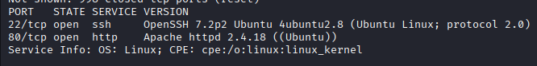

    **Results:**

        - 22/tcp – OpenSSH 7.2p2 (Ubuntu)
        - 80/tcp – Apache 2.4.18 (Ubuntu)

    This indicated a Linux-based web server with a limited exposed surface, directing focus toward the HTTP service.

2. **Web Enumeration**

    Accessing the web server on port 80 revealed a default landing page:

    

    This suggested the presence of hidden or unlinked content.

    Directory brute forcing was performed using Gobuster:

    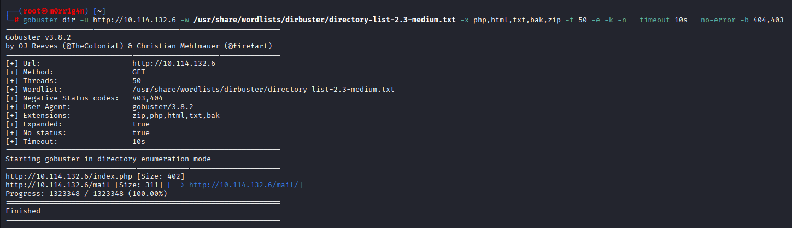

    **Results:**

        - /mail/

3. **Discovery of Sensitive File in /mail/**

    Navigating to `/mail/` revealed internal communication messages, including a reference to a downloadable packet capture file:

    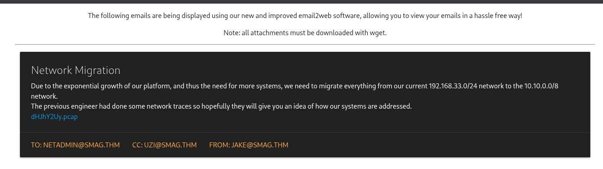

    The page source revealed the actual file path:

    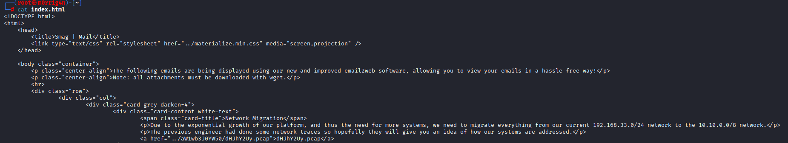

    ```
    /aW1wb3J0YW50/dHJhY2Uy.pcap
    ```

    The file was successfully downloaded using:

    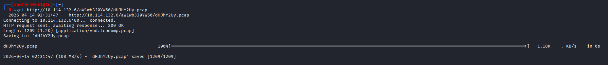

4. **PCAP Analysis & Credential Extraction**

    The downloaded PCAP file was analyzed using `tshark`:

    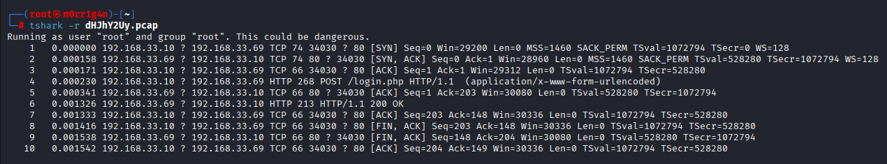

    Analysis revealed an HTTP POST request containing plaintext credentials and an internal hostname:

    ```
    tshark -r dHJhY2Uy.pcap -Y "http.request.method == POST" -V
    ```

    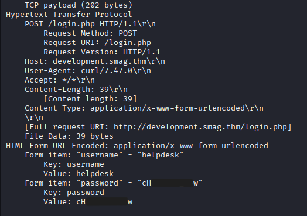

    ```
    Host: development.smag.thm
    username=helpdesk
    password=cH*******w
    ```

5.  **Authenticated Access** 

    The internal hostname was not externally resolvable, requiring manual mapping:

    ```
    echo"10.114.132.6 development.smag.thm" >> /etc/hosts
    ```

    The application was then accessed at:

    ```
    http://development.smag.thm/login.php
    ```

    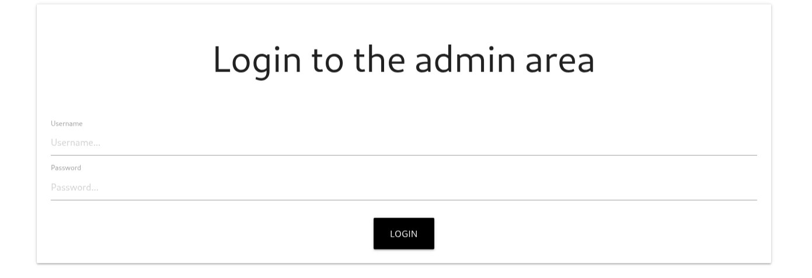

    Using the extracted credentials, authentication was successful, granting access to an administrative interface.

6. **Command Injection & Remote Code Execution**

    **Vulnerability Summary**

    The administrative panel (`admin.php`) contained a command input field vulnerable to OS command injection.

    **Technical Walkthrough**

    - Initial testing showed no visible output, indicating a blind injection scenario.
    - A reverse shell was executed using a FIFO-based payload:
    - A Netcat listener was established on the attacker machine:

    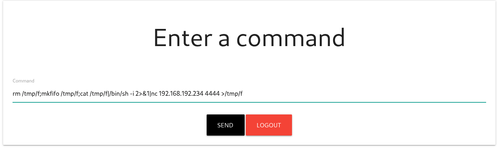

    Upon execution, a reverse shell was successfully obtained as user www-data:

    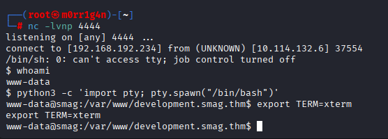

---

#### **Privilege Escalation: User Jake Compromise via Cron Job Abuse**

**Vulnerability Summary**

System enumeration revealed a cron job copying SSH public keys from a backup directory into user’s `jake authorized_keys` file.

**Technical Walkthrough**

- The directory `/opt/.backups/` was identified as containing:

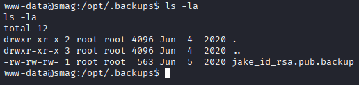

- The file had writable permissions therefore an SSH key pair was generated on the local machine and then placed into the backup file.

```
ssh-keygen -t ed25519
```

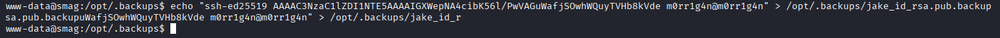

- After the cron job executed, the key was copied into:

```
/home/jake/.ssh/authorized_keys
```

- SSH access was then obtained:
    
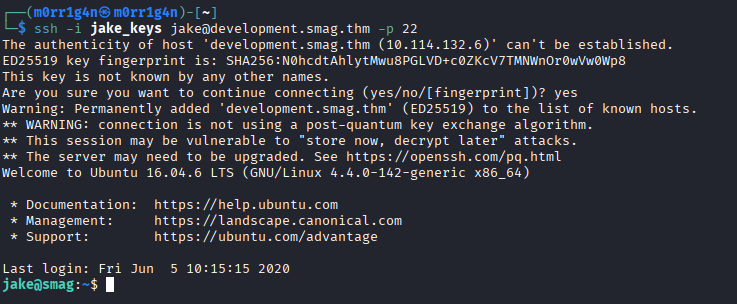
    

---

#### **Privilege Escalation: Root Compromise via sudo Misconfiguration**

**Vulnerability Summary**

The user `jake` was permitted to execute `/usr/bin/apt-get` with root privileges without requiring a password.

**Technical Walkthrough**

- Sudo permissions were enumerated:

```
sudo -l
```

**Result:**

```
(ALL : ALL) NOPASSWD: /usr/bin/apt-get
```

- The APT pre-invoke hook was abused to execute a root shell:

```
sudo apt-get update -o APT::Update::Pre-Invoke::=/bin/sh
```

- This resulted in immediate execution of `/bin/sh` with root privileges.

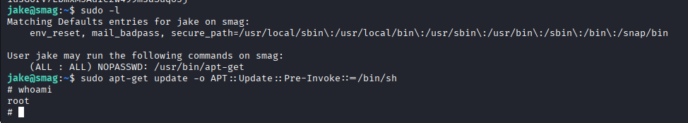

A root shell was successfully obtained.

This confirmed full system compromise, granting complete control over the target system.

---

### **Risk Assessment**

| Finding | Description | Likelihood | Impact | Risk Rating |
| --- | --- | --- | --- | --- |
| Exposed PCAP file | Sensitive network capture publicly accessible via web directory | High | High | Critical |
| Credential leakage | Plaintext credentials exposed via network traffic capture | High | Critical | Critical |
| Command Injection | Unvalidated input allowed OS command execution via web interface | Medium | Critical | Critical |
| Cron job misconfiguration | Writable file used in privileged SSH key propagation | Medium | Critical | Critical |
| sudo misconfiguration (apt-get) | APT pre-invoke hook allowed arbitrary root command execution | Medium | Critical | Critical |

---

### **Conclusion**

The target system exhibited multiple critical security vulnerabilities that, when chained together, resulted in full system compromise from initial external access to root-level control.

The attack demonstrates severe weaknesses in secure file handling, credential management, input validation, and privileged configuration management.

---

### **Recommendations**

#### **Secure File Storage**

- Remove sensitive files (PCAPs, backups) from publicly accessible web directories
- Implement strict access controls for internal artifacts

#### **Credential Protection**

- Avoid transmitting credentials in plaintext
- Enforce HTTPS for all authentication traffic

#### **Input Validation**

- Sanitize all user-supplied input in administrative interfaces
- Disable or restrict system command execution features

#### **Cron Job Security**

- Avoid writable files in privileged cron workflows
- Enforce strict file ownership and integrity checks

#### **Privilege Management**

- Restrict sudo permissions to required binaries only
- Avoid allowing package managers to run with unrestricted configuration hooks