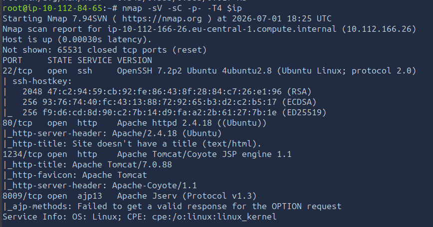
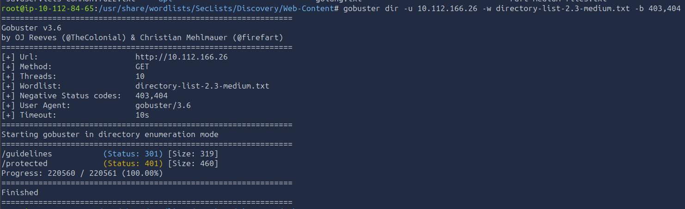
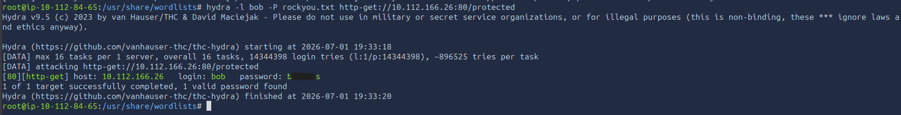
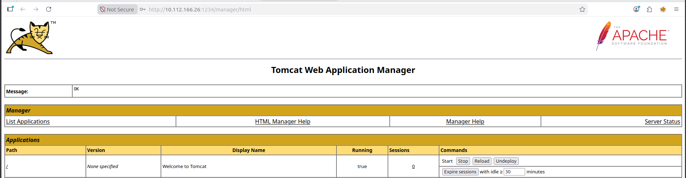
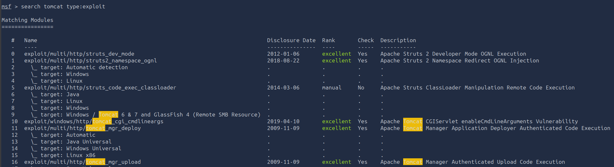
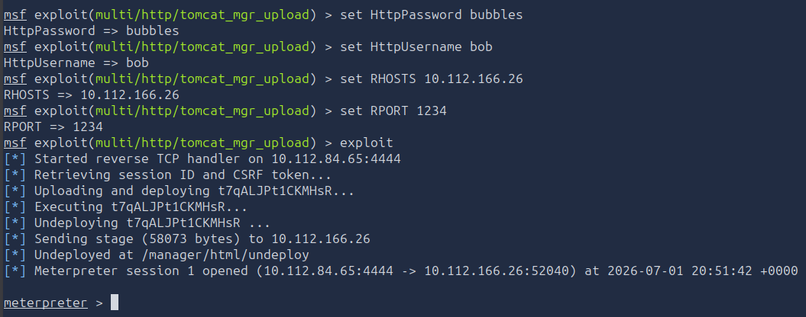
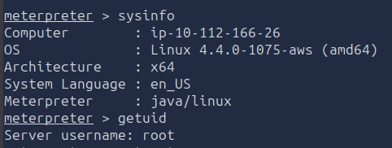

---

# **Penetration Test Report: ToolsRus**

---

### **TL;DR**

This penetration test resulted in full system compromise through a chain of authentication weaknesses and exposed administrative services. Initial reconnaissance revealed an exposed Apache Tomcat Manager interface. Information disclosure identified a valid username, while weak HTTP Basic Authentication credentials were successfully brute forced.

Authenticated access to the Tomcat Manager interface enabled deployment of a malicious WAR file, resulting in remote code execution. Since the Tomcat service was running as the **root** user, the payload executed with full administrative privileges immediately, resulting in complete system compromise.

---

### **Target Information**

- **Target IP:** 10.112.166.26
- **Operating System:** Ubuntu Linux
- **Open Ports:**
    - 22/tcp – SSH
    - 80/tcp – Apache HTTP Server 2.4.18
    - 1234/tcp – Apache Tomcat 7.0.88
    - 8009/tcp – AJP13
- **Assessment Type:** Authorized lab environment

---

### **Executive Summary**

A penetration test was conducted against the target system **10.112.166.26**, simulating an external attacker with no prior access.

The assessment resulted in full system compromise through chained vulnerabilities involving information disclosure, weak authentication, and misconfigured administrative services.

The attack began with enumeration of web services that revealed a valid username. This enabled targeted brute forcing of HTTP Basic Authentication credentials. The recovered credentials granted access to the Apache Tomcat Manager interface, which exposed deployment functionality.

A malicious WAR file was uploaded via the manager interface, resulting in remote code execution. Because the Tomcat service was running as the **root** user, no privilege escalation was required.


**Key Findings**

| Finding | Severity | Impact |
| --- | --- | --- |
| Username Disclosure | Low | Facilitates credential attacks |
| Weak HTTP Basic Authentication | High | Unauthorized access via brute force |
| Exposed Apache Tomcat Manager | Critical | Remote Code Execution |
| Tomcat Running as Root | Critical | Full system compromise |

---

### **Scope and Methodology**

**Scope:**

- Target: 10.112.166.26
- Application: ToolsRus
- Services: HTTP, SSH, Tomcat, AJP

**Methodology**

The assessment followed a structured penetration testing methodology:

1. Reconnaissance & Enumeration

    - Verified target availability.
    - Conducted full TCP port scan.
    - Identified exposed services.
    - Enumerated hidden web directories.
    - Investigated HTTP authentication mechanisms.

2. Vulnerability Analysis

    - Analyzed directory enumeration results.
    - Identified information disclosure.
    - Tested authentication mechanisms.
    - Evaluated exposed Tomcat services.

3. Exploitation

    - Brute-forced HTTP Basic Authentication.
    - Authenticated to Apache Tomcat Manager.
    - Uploaded a malicious WAR archive.
    - Achieved Remote Code Execution.

4. Post-Exploitation

    - Verified privileges.
    - Confirmed root-level access.
    - Validated complete compromise.

5. Documentation

    - Recorded attack path.
    - Documented affected services.
    - Produced remediation recommendations.
---

### **Findings and Exploitation**

### **Initial Access: Apache Tomcat Manager Compromise**

**Vulnerability Summary**

The initial compromise was achieved through a chain of weaknesses involving information disclosure and weak authentication. A valid username was discovered through web enumeration, which enabled successful brute force of HTTP Basic Authentication. The recovered credentials provided access to the Apache Tomcat Manager interface, which allowed deployment of a malicious WAR file resulting in remote code execution.

**Technical Walkthrough**

1. **Port Scanning & Service Discovery**

    Initial reconnaissance identified four exposed services on the target system.

    **Commands Used:**
    ```bash
    export ip=10.112.166.26
    ping -c 4 $ip
    nmap -sV -sC -p- -T4 $ip
    ```

    

2. **Web Enumeration**

    Directory enumeration identified two interesting endpoints:

    - `/guidelines`
    - `/protected`

    **Command Used:**
    ```bash
    gobuster dir -u http://10.112.166.26 -w /usr/share/wordlists/SecLists/Discovery/Web-Content/directory-list-2.3-medium.txt -b 403,404
    ```

    


3. **Username Disclosure**

    The `/guidelines` page revealed a valid username:

    ```
    bob
    ```

    

4. **Credential Bruteforce**

    HTTP Basic Authentication was identified on `/protected`. Credentials were successfully recovered using Hydra.

    **Command Used:**
    ```bash
    hydra -l bob -P /usr/share/wordlists/rockyou.txt http-get://10.112.166.26/protected
    ```

    Recovered credentials:

    ```
    bob:b****es
    ```

    

5. **Tomcat Manager Access**

    The recovered credentials granted access to the Apache Tomcat Manager interface.

    

6. **Remote Code Execution**

    A malicious WAR file was uploaded via the Tomcat Manager deployment functionality, resulting in remote code execution.

    

    

---

### **Post-Exploitation & Privilege Escalation**

**System Access Verification**

A Meterpreter session was obtained and verified.

**Commands Used:**
```bash
sysinfo
getuid
```

Result:

```
root
```



---

## **Risk Assessment**

| Finding | Description | Likelihood | Impact | Risk Rating |
| --- | --- | --- | --- | --- |
| Username Disclosure | Exposed via web content | Medium | Low | Low |
| Weak HTTP Authentication | Brute force possible | High | High | High |
| Exposed Tomcat Manager | Administrative interface exposed | High | Critical | Critical |
| WAR Deployment RCE | Remote code execution via upload | High | Critical | Critical |
| Tomcat Running as Root | Immediate full compromise | High | Critical | Critical |

---

## **Conclusion**

The assessment demonstrates a full compromise of the target system through chained vulnerabilities including information disclosure, weak authentication, and exposed administrative services.

The combination of these issues allowed an attacker to progress from unauthenticated access to full root-level compromise without requiring privilege escalation.

---

## **Recommendations**

- Restrict access to Apache Tomcat Manager to trusted IP addresses
- Disable WAR deployment if not required
- Enforce strong password policies and MFA
- Implement rate limiting and account lockout mechanisms
- Remove sensitive information from publicly accessible pages
- Run Tomcat under a dedicated non-privileged user
- Regularly audit exposed services and administrative interfaces
- Monitor for unauthorized deployments