---

# **Breaching AD TryHackMe Room Walkthrough** 

---

### **Overview**

This lab focused on common techniques used to breach and enumerate a Microsoft Active Directory (AD) environment. The exercises demonstrated how attackers can abuse weak configurations, insecure authentication mechanisms, and deployment infrastructure to gain credentials and move laterally within a Windows domain network.

Since Active Directory is used by the vast majority of enterprise environments, understanding these attack paths is critical for both offensive security professionals and defenders.

For a more in-depth understanding of Active Directory and how it works, it is recommended to complete the  [AD basics first.](https://tryhackme.com/jr/winadbasics)

---

### **Task 1 — Introduction to Active Directory Breaches**

Microsoft Active Directory is the primary identity and access management solution used in Windows enterprise environments. Approximately 90% of Fortune 1000 companies rely on AD for centralized authentication, authorization, and policy management meaning that if there is an organization using Microsoft Windows, it is almost guaranteed to find Active Directory present.

This room introduced some common attack vectors used during Active Directory compromise scenarios including: 

- NTLM Authenticated Services
- LDAP Bind Credentials
- Authentication Relays
- Microsoft Deployment Toolkit
- Configuration Files

Connecting to the Network via the Attack Box: 

```bash
**[thm@thm]$ sed -i '1s|^|nameserver THMDCIP\n|' /etc/resolv-dnsmasq**
```

The THMDCIP should be replaced with the IP of THMDC in the provided network diagram. Once done the DNS service needs to be restarted using `systemctl restart dnsmasq` . Afterwards the functionality of DNS can be tested by running `nslookup thmdc.za.tryhackme.com`

---

### **Task 2 — OSINT and Phishing**

Two popular methods of gaining initial access techniques used against Active Directory environments are:

- Open Source Intelligence (OSINT)
- Phishing

**Open Source Intelligence (OSINT)**

OSINT involves gathering publicly available information about a target organization. Examples include:

- Employee names
- Email addresses
- Corporate infrastructure
- Credentials leaks disclosed in past breaches - HaveIBeenPwned and DeHashed are great platforms to determine if someone’s information was ever involved in publicly known data breach.
- Publicly exposed services

This information can later be leveraged during password attacks or social engineering campaigns.

**Phishing**

Phishing attacks attempt to trick users into:

- Entering credentials into malicious websites
- Downloading malware
- Executing Remote Access Trojans (RATs)

These attacks are frequently used to obtain an initial foothold inside enterprise environments.

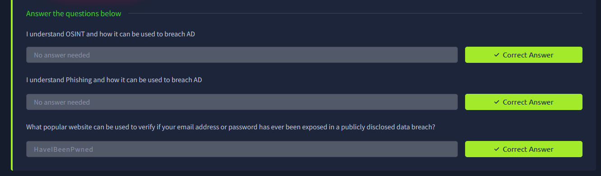

---

### **Task 3 — NTLM and NetNTLM**

This task focused on NTLM authentication mechanisms used within Active Directory environments.

**NTLM Authentication**

NTLM (New Technology LAN Manager) is a suite of authentication protocols used by Microsoft systems.

NetNTLM authentication operates using a challenge-response mechanism where:

1. A client attempts authentication
2. The server forwards authentication data to the Domain Controller
3. The Domain Controller validates the response
4. Access is granted if authentication succeeds

This mechanism is heavily used by services such as SMB, LDAP, and HTTP authentication.

**Password Spraying Against Exposed NTLM Authentication**

This task focused on identifying valid Active Directory credentials through password spraying against an externally exposed NTLM authentication service that can be accessed at: [http://ntlmauth.za.tryhackme.com](http://ntlmauth.za.tryhackme.com/).

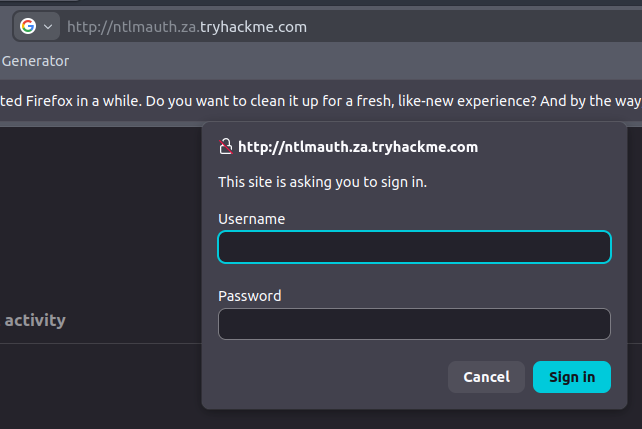

Password spraying is a technique where a single password is tested against multiple usernames in order to reduce the likelihood of triggering account lockout policies. Unlike traditional brute-force attacks that repeatedly target a single account, password spraying distributes authentication attempts across many users. 

We have been provided with a valid onboarding password “Changeme123”, list of usernames, a python script and are basing our password spraying attack on a pressumption that even though new employees are prompted to change their password, not everyone does it. 

The provided Python script automated this process by:

- Attempting authentication against the exposed NTLM-enabled web service
- Monitoring HTTP response codes
- Identifying successful logins based on server responses

The script interpreted responses as follows:

- `HTTP 200` → Successful authentication
- `HTTP 401` → Failed authentication attempt

Failed attempts produced output similar to:

```
Failed Login with Username: <username>
```

Successful authentication attempts revealed valid credential pairs. 

Using the AttackBox, the password spraying script and usernames textfile is provided under the `/root/Rooms/BreachingAD/task3/` directory. We can run the script using the following command:

```
python ntlm_passwordspray.py -u <userfile> -f <fqdn> -p <password> -a <attackurl>
```

We provide the following values for each of the parameters:

- **<userfile>** - Textfile containing our usernames - *"usernames.txt"*
- **<fqdn>** - Fully qualified domain name associated with the organisation that we are attacking - *"za.tryhackme.com"*
- **<password>** - The password we want to use for our spraying attack - *"Changeme123"*
- **<attackurl>** - The URL of the application that supports Windows Authentication - *"http://ntlmauth.za.tryhackme.com"*

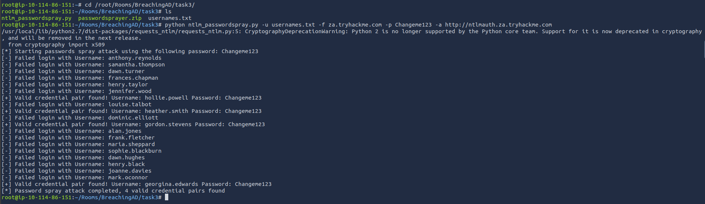

---

#### **Questions:**

What is the name of the challenge-response authentication mechanism that uses NTLM?

- NetNTLM

What is the username of the third valid credential pair found by the password spraying script?

- gordon.stevens

How many valid credential pairs were identified?

- 4

What message is displayed by the application after successful authentication?

- Hello World

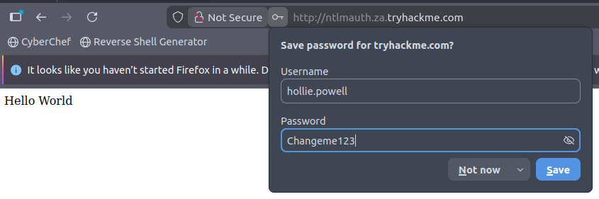

---

#### **Security Impact**

This exercise demonstrated how exposed NTLM authentication services can be vulnerable to password spraying attacks, particularly when:

- Weak passwords are used
- Account lockout policies are insufficient
- Internet-facing authentication portals are exposed

#### **Recommended Mitigations**

- Enforce strong password policies
- Implement multi-factor authentication (MFA)
- Restrict external exposure of NTLM authentication services
- Configure account lockout thresholds
- Monitor for password spraying behavior in authentication logs

---

### **Task 4 — LDAP Bind Credentials**

This task demonstrated an LDAP Pass-Back attack against a network printer.

The objective was to redirect LDAP authentication traffic from the printer to a rogue LDAP server controlled by the attacker in order to capture credentials in cleartext. 

LDAP authentication is a popular mechanism with third-party (non-Microsoft) applications that integrate with AD. These include applications and systems such as:

- Gitlab
- Jenkins
- Custom-developed web applications
- Printers
- VPNs

#### **Performing an LDAP Pass-back**

There is a network printer in this network where the administration website does not even require credentials and is accessible at [http://printer.za.tryhackme.com/settings.aspx](http://printer.za.tryhackme.com/settings.aspx)

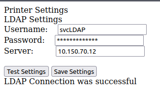

Using browser inspection, we can also verify that the printer website was at least secure enough to not just send the LDAP password back to the browser:

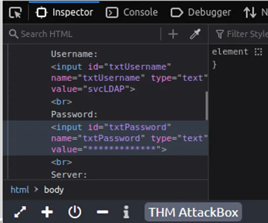

The username was already known, but the password had not yet been identified. When the **“Test Settings”** option was selected on the printer’s web interface, the device sent an LDAP authentication request to the Domain Controller to validate the credentials.

By redirecting this request to an attacker-controlled system, it was possible to intercept the authentication attempt and potentially capture the credentials.

The attack box contained multiple interfaces. The correct interface connected to the lab environment was identified using `ip a` . The `breachad` interface contained the internal lab IP address.

Before listening on port 389, the existing LDAP service had to be stopped `service slapd stop`. Afterwards we can set up the listener `nc -lvp 389` .

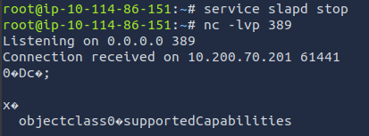

The Netcat listener successfully received a connection from the printer, confirming that LDAP traffic was being redirected to the attacker-controlled host. However, the response also showed that the printer was attempting to negotiate a supported LDAP authentication mechanism before transmitting credentials.

Because secure authentication methods prevent credentials from being sent in cleartext, a simple Netcat listener was insufficient for capturing them. To force the printer to use an insecure authentication method, a rogue LDAP server needed to be configured with weak security settings.

The LDAP service on the AttackBox was reconfigured using:

```bash
sudo dpkg-reconfigure -p low slapd
```

The LDAP service was then reconfigured to prepare a rogue server capable of capturing credentials.

During setup, the following configuration steps were applied:

- Server configuration: **No** (initial setup not skipped)
- DNS domain name: **za.tryhackme.com**
- Organization name: **za.tryhackme.com**
- Administrator password: user-defined
- Database backend: **MDB**
- Remove database on purge: **No**
- Move old database: **Yes**

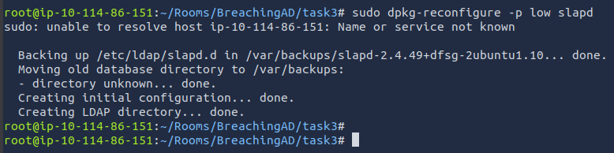

After initial configuration, the LDAP server was hardened to force insecure authentication methods (PLAIN and LOGIN only). This was done by creating an LDIF configuration file:

```bash
subl olcSaslSecProps.ldif
```

The following configuration was added:

```
dn: cn=config
changetype: modify
replace: olcSaslSecProps
olcSaslSecProps: noanonymous,minssf=0
```

#### **Configuration Explanation**

- `noanonymous` disables anonymous authentication
- `minssf=0` removes minimum security requirements

This forced the LDAP server to accept insecure authentication methods.

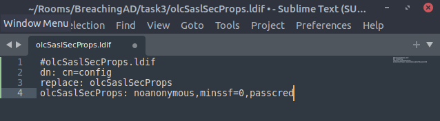

**Applying the Configuration**

```bash
sudo ldapmodify -Y EXTERNAL -H ldapi:// -f ./olcSaslSecProps.ldif
sudo service slapd restart
```

**Verifying LDAP Authentication Mechanisms**

```bash
ldapsearch -H ldap:// -x -LLL -s base -b "" supportedSASLMechanisms
```

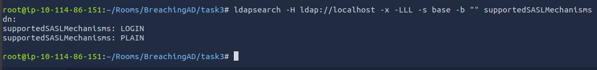

The output confirmed that insecure authentication methods were enabled.

**Capturing Credentials**

Traffic was captured using `tcpdump`:

```bash
sudo tcpdump -SX -i breachad tcp port 389
```

Once the printer’s “Test Settings” button was clicked, LDAP credentials were transmitted in cleartext and recovered from the packet capture.

#### **Questions:**

What type of attack can be performed against LDAP Authentication systems not commonly found against Windows Authentication systems?

- LDAP Pass-back Attack

What two authentication mechanisms do we allow on our rogue LDAP server to downgrade the authentication and make it clear text?

- LOGIN,PLAIN

What is the password associated with the svcLDAP account?

- tryhackmeldappass1@

---

### **Task 5 — Authentication Relays**

This task focused on understanding how NetNTLM authentication operates over the SMB protocol from a network perspective.

**SMB and Active Directory Environments**

The Server Message Block (SMB) protocol is widely used in Windows networks for communication between clients and servers. In Active Directory environments, SMB is responsible for a range of functions including file sharing, printer access, and remote administration tasks. Even routine events, such as printer status notifications, are handled via SMB.

Older SMB implementations contained multiple security vulnerabilities that could be exploited for credential recovery or remote code execution. Although modern versions have improved security, legacy compatibility requirements often prevent organizations from enforcing the latest protocol versions.

---

**NetNTLM Attacks Over SMB**

Two primary attack paths exist when targeting NetNTLM authentication over SMB:

- **Offline cracking of captured NTLM challenges**
    
    Intercepted challenge-response pairs can be brute-forced offline to recover passwords. However, this process is significantly slower compared to cracking raw NTLM hashes.
    
- **NTLM relay attacks (Man-in-the-Middle)**
    
    Authentication traffic can be relayed between a client and server, allowing an attacker to authenticate in real time and gain access to the target system without needing to crack the password.
    

---

**LLMNR, NBT-NS, and WPAD Poisoning**

NetNTLM authentication attempts often rely on name resolution protocols such as:

- LLMNR (Link-Local Multicast Name Resolution)
- NBT-NS (NetBIOS Name Service)
- WPAD (Web Proxy Auto-Discovery)

These protocols are used when DNS resolution fails, allowing hosts to broadcast requests across the local network to locate services.

Responder can exploit this behavior by poisoning these broadcast requests and responding with the attacker’s IP address. As a result, clients are tricked into authenticating against the attacker-controlled system instead of the legitimate server.

---

**Responder Attack Flow**

Responder performs a man-in-the-middle attack by:

- Listening for broadcast name resolution requests
- Responding with spoofed answers pointing to the attacker’s IP
- Hosting fake SMB/HTTP/SQL services to capture authentication attempts
- Intercepting NetNTLM challenge-response exchanges

Because these attacks rely on race conditions, Responder attempts to respond faster than legitimate infrastructure, effectively redirecting authentication traffic.

---

#### **Practical Considerations**

In real-world environments, Responder is typically limited to local network segments, as it relies on broadcast-based protocols. In this lab scenario, authentication attempts were simulated to occur periodically, meaning interception may require waiting for scheduled traffic.

While powerful, this technique is highly disruptive in production environments, as it can interfere with legitimate authentication processes and cause service failures if misused. For this reason, it must be used carefully during authorized security assessments.

**Launching Responder**

```bash
sudo responder -I breachad
```

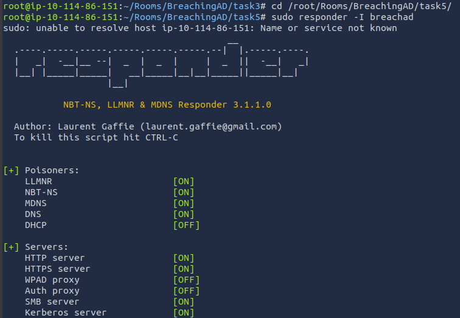

Responder poisoned authentication requests and intercepted NTLMv2 challenge-response hashes from systems attempting SMB authentication.

The captured NTLMv2 hash was saved into a text file for offline cracking.

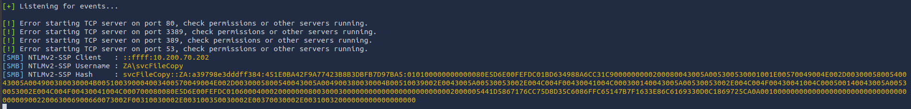

**Cracking the NTLMv2 Hash**

Hashcat was used to recover the password:

```bash
hashcat -m 5600 hash.txt passwordlist.txt --force
```

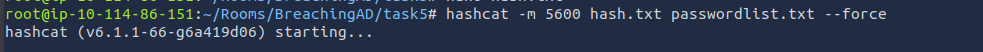

**Explanation**

- `m 5600` specifies NTLMv2 hash mode
- `hash.txt` contains the captured hash
- `passwordlist.txt` contains the supplied wordlist

Successful cracking revealed the user password.

#### **Questions:**

What is the name of the tool we can use to poison and capture authentication requests on the network?

- Responder

What is the username associated with the challenge that was captured?

- svcFileCopy

What is the value of the cracked password associated with the challenge that was captured?

- FPassword1!

---

### **Task 6 — Microsoft Deployment Toolkit (MDT)**

This task focused on abusing Microsoft Deployment Toolkit (MDT) infrastructure.

MDT and SCCM are commonly used to deploy operating systems and manage enterprise systems. Misconfigurations within these systems can expose sensitive deployment credentials.

**PXE Boot Attack Overview**

Large organizations commonly use PXE (Preboot Execution Environment) booting to deploy operating systems over the network. In Microsoft environments, this functionality is often managed through MDT (Microsoft Deployment Toolkit), which handles the creation and distribution of boot images.

PXE boot is typically integrated with DHCP. When a device receives an IP address, it can request a network boot image from the PXE server and begin an automated OS installation process.

**Attack Surface**

PXE boot environments can be abused in multiple ways:

- Injecting malicious configuration or privilege escalation payloads (e.g., local admin accounts)
- Extracting sensitive credentials used during automated deployments

This task focuses on credential extraction from PXE deployment images.

---

**PXE Boot Enumeration**

In a real-world scenario, PXE boot information is typically discovered via DHCP. In this lab, the required details are manually provided. 

The first piece of information regarding the PXE Boot preconfigure you would have received via DHCP is the IP of the MDT server. In our case, you can recover that information from the TryHackMe network diagram.

The second piece of information you would have received was the names of the BCD files. These files store the information relevant to PXE Boots for the different types of architecture. To retrieve this information, you will need to connect to this website: [http://pxeboot.za.tryhackme.com](http://pxeboot.za.tryhackme.com/). It will list various BCD files:

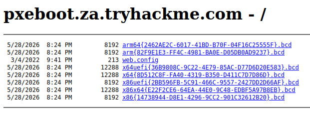

We are focusing on the **x64{8D512...86D}.bcd file.** 

With this initial information now recovered from DHCP, we can enumerate and retrieve the PXE Boot image. We will be using our SSH connection on THMJMP1.

```bash
ssh thm@THMJMP1.za.tryhackme.com
```

and the password of `Password1@` We start by creating a folder with our username and copying the powerpxe repository into that folder:

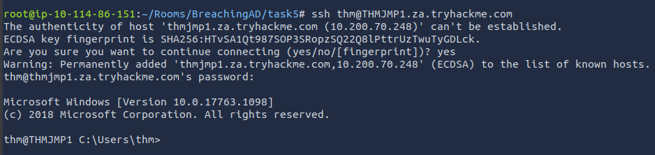

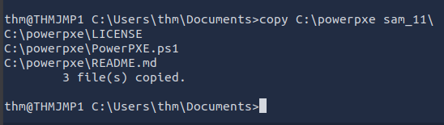

**Retrieving the BCD File**

Using TFTP, the PXE boot configuration file is downloaded from the MDT server:

```bash
tftp -i <THMMDT_IP> GET "\Tmp\x64{GUID}.bcd" conf.bcd
```

BCD files contain boot configuration data used to locate the Windows deployment image.

**Extracting PXE Boot Configuration**

Once downloaded, the BCD file is analyzed using PowerPXE to extract the location of the Windows Imaging Format (WIM) file:

```powershell
powershell -executionpolicy bypass
Import-Module .\PowerPXE.ps1

$BCDFile = "conf.bcd"
Get-WimFile -bcdFile $BCDFile
```

This reveals the network path to the boot image required for system deployment.

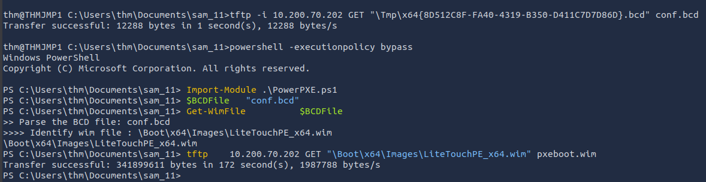

**Downloading the PXE Boot Image**

The WIM image is then retrieved via TFTP:

```bash
tftp -i <THMMDT_IP> GET "<WIM_IMAGE_PATH>" pxeboot.wim
```

This file is significantly larger as it contains a full Windows deployment environment.

**Credential Extraction**

After obtaining the PXE boot image, it can be analyzed for sensitive deployment data such as credentials stored in configuration files (e.g., `bootstrap.ini`).

Using PowerPXE, credentials can be extracted automatically:

```powershell
Get-FindCredentials -WimFile pxeboot.wim
```

Typical output includes:

- Deployment share path
- Domain information
- Service account username
- Plaintext or recoverable password

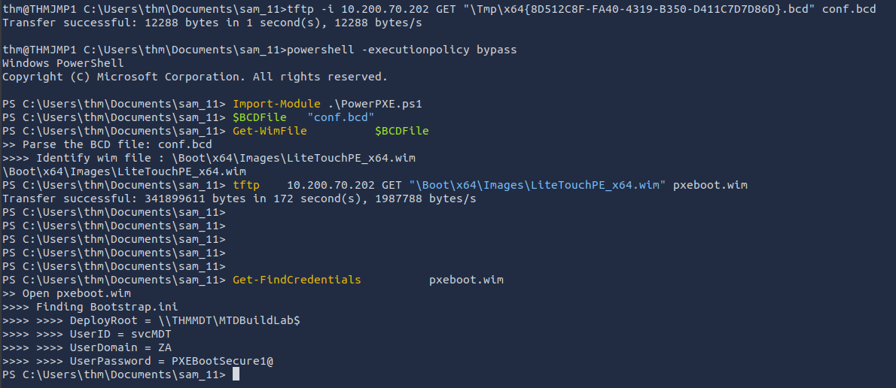

**Security Impact**

Exploitation of PXE boot infrastructure can lead to serious compromise in enterprise environments, including:

- Exposure of domain service account credentials
- Unauthorized OS deployment manipulation
- Potential domain-level access depending on account privileges

Properly securing MDT and PXE environments is critical to preventing credential leakage during automated deployments.

#### **Questions:**

What Microsoft tool is used to create and host PXE Boot images in organisations?

- Microsoft Deployment Toolkit

What network protocol is used for recovery of files from the MDT server?

- TFTP

What is the username associated with the account that was stored in the PXE Boot image?

- svcMDT

What is the password associated with the account that was stored in the PXE Boot image?

- PXEBootSecure1@

---

### **Task 7 — Configuration File Enumeration**

Depending on the host that was breached, various configuration files may be of value for enumeration:

- Web application config files
- Service configuration files
- Registry keys
- Centrally deployed applications

Several enumeration scripts, such as [Seatbelt](https://github.com/GhostPack/Seatbelt), can be used to automate this process.

This task focused on extracting credentials from configuration databases.

**Locating the McAfee Agent Database**

The target database was located in:

```
C:\ProgramData\McAfee\Agent\DB
```

**Copying the Database via SCP**

```bash
scp thm@THMJMP1.za.tryhackme.com:C:/ProgramData/McAfee/Agent/DB/ma.db ma.db
```

Password:

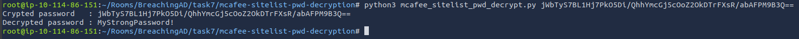

```
Password1@
```

**Viewing the Database**

The SQLite database was opened using:

```bash
sqlitebrowser ma.db
```

The `Agent_Repositories` table contained encrypted credentials.

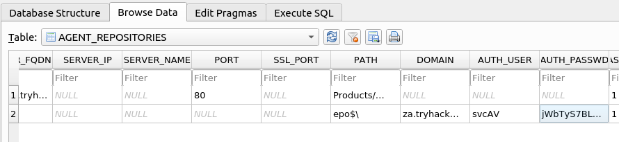

**Extracting and Decrypting Credentials**

The McAfee SiteList password decryption tool was extracted:

```bash
unzip mcafeesitelistpwddecryption.zip
```

Navigate into the extracted directory:

```bash
cd mcafee-sitelist-pwd-decryption-master
```

Run the decryption script:

```bash
python2 mcafee_sitelist_pwd_decrypt.py <password_hash>
```


This successfully decrypted the stored credentials.

#### **Questions:**

What type of files often contain stored credentials on hosts?

- Configuration Files

What is the name of the McAfee database that stores configuration including credentials used to connect to the orchestrator?

- ma.db

What table in this database stores the credentials of the orchestrator?

- AGENT_REPOSITORIES

What is the username of the AD account associated with the McAfee service?

- svcAV

What is the password of the AD account associated with the McAfee service?

- MyStrongPassword!

**Key Security Lessons**

This lab demonstrated several common weaknesses found in Active Directory environments:

#### **Security Recommendations**

**User Awareness Training**

Employees should be trained to:

- Identify phishing attempts
- Avoid credential disclosure
- Recognize suspicious emails and attachments

---

**Restrict Exposure of AD Services**

Services supporting NTLM and LDAP should not be publicly exposed. Access should instead be restricted through:

- VPNs
- Firewalls
- Multi-factor authentication

---

**Implement Network Access Control (NAC)**

NAC can help prevent unauthorized devices from joining the network.

---

**Enforce SMB Signing**

SMB signing mitigates SMB relay attacks by preventing tampering with SMB authentication traffic.

---

**Apply Least Privilege Principles**

Service accounts and users should only have the permissions required for their roles. This significantly limits the impact of credential compromise.

---

**Conclusion**

This room provided hands-on exposure to several realistic Active Directory attack techniques, including:

- LDAP credential interception
- NTLM relay attacks
- PXE deployment abuse
- Configuration file credential extraction

The exercises reinforced the importance of secure authentication configurations, network segmentation, least privilege enforcement, and hardened deployment infrastructure in enterprise environments.