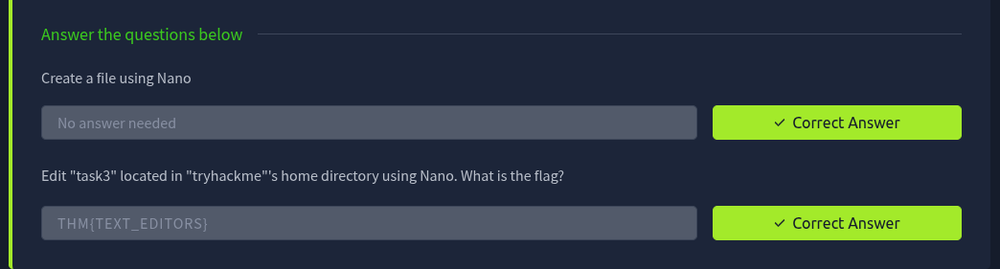

---

# **Linux Fundamentals Part 3 TryHackMe Room Walkthrough**

---

### **Task 3: Terminal Text Editors**

**Overview**

Text editors are essential tools in Linux, allowing users to create, view, and modify files directly from the terminal. There are many terminal-based text editors available, each offering different levels of functionality and complexity.

This task introduces two common editors:

- **Nano** – beginner-friendly and easy to use
- **Vim** – advanced and highly customizable

---

#### **Nano**

Nano is a simple and user-friendly terminal text editor that is commonly installed on Linux systems by default.

To create or edit a file, use:

```
nano filename
```

**Example**

```
nano myfile
```

This opens the file in Nano, allowing text to be added or modified directly within the terminal.

**Common Nano Features**

Nano includes several useful functions:

- Searching for text
- Copying and pasting content
- Jumping to specific line numbers
- Viewing the current cursor position
- Undoing and redoing changes

Most commands are accessed using the **Ctrl** key, represented by the `^` symbol within Nano.

**Useful Nano Shortcuts**

| Shortcut | Function |
| --- | --- |
| Ctrl + X | Exit Nano |
| Ctrl + O | Save (Write Out) |
| Ctrl + W | Search |
| Ctrl + K | Cut Text |
| Ctrl + U | Paste Text |
| Ctrl + G | Help |

**Example Text**

```
Hello TryHackMe
I can write things into "myfile"
```

---

#### **Vim**

Vim is a more advanced terminal text editor widely used by system administrators, developers, and cybersecurity professionals.

Although it has a steeper learning curve than Nano, Vim provides powerful editing capabilities and extensive customization options.

**Key Advantages of Vim**

- Highly customizable
- Efficient keyboard-driven workflow
- Syntax highlighting for programming languages
- Available on most Linux and Unix systems
- Popular among developers and power users

**Common Uses**

Vim is frequently used for:

- Editing configuration files
- Writing scripts
- Software development
- Remote system administration

---

#### **Summary**

Both Nano and Vim allow users to edit files directly from the terminal:

- **Nano** is ideal for beginners due to its simplicity and intuitive shortcuts.
- **Vim** offers significantly more functionality and efficiency but requires additional learning.

Developing familiarity with both editors is valuable for Linux administration and cybersecurity tasks.

**Key Commands**

```
# Create or edit a file with Nano
nano filename

# Example
nano myfile
```

This task introduced the fundamentals of terminal-based text editing and highlighted the differences between beginner-friendly and advanced text editors in Linux.



### **Task 4: General / Useful Utilities**

Linux provides a variety of built-in utilities that simplify file transfers and sharing between systems. These tools are commonly used by system administrators, developers, and cybersecurity professionals to download files, securely transfer data between hosts, and quickly host files for others to access.

This task introduces three essential utilities:

- **wget** – Download files from the web
- **scp** – Securely transfer files between systems
- **Python HTTP Server** – Quickly host files from a local machine

---

#### **Downloading Files with Wget**

`wget` is a command-line utility used to download files from web servers using HTTP, HTTPS, and FTP protocols.

It allows files to be retrieved directly from a URL without requiring a web browser.

---

**Syntax**

```bash
wget <url>
```

**Example**

```bash
wget https://assets.tryhackme.com/additional/linux-fundamentals/part3/myfile.txt
```

This command downloads `myfile.txt` from the specified web address and saves it to the current directory.

---

#### **Secure File Transfers with SCP**

**Overview**

**SCP (Secure Copy Protocol)** enables secure file transfers between systems using SSH.

Unlike the standard `cp` command, SCP provides:

- Authentication
- Encryption
- Remote file transfer capabilities

SCP operates using a **source → destination** model.

---

**Copying a Local File to a Remote System**

**Scenario**

| Variable | Value |
| --- | --- |
| Remote IP | 192.168.1.30 |
| Remote User | ubuntu |
| Local File | important.txt |
| Remote File Name | transferred.txt |

**Command**

```bash
scp important.txt ubuntu@192.168.1.30:/home/ubuntu/transferred.txt
```

This transfers `important.txt` from the local machine to the remote host.

---

**Copying a File from a Remote System**

**Scenario**

| Variable | Value |
| --- | --- |
| Remote IP | 192.168.1.30 |
| Remote User | ubuntu |
| Remote File | documents.txt |
| Local File Name | notes.txt |

**Command**

```bash
scp ubuntu@192.168.1.30:/home/ubuntu/documents.txt notes.txt
```

This copies the remote file to the current directory on the local machine.

---

#### **Hosting Files with Python HTTP Server**

Python 3 includes a lightweight web server module called **HTTP Server** that can quickly share files over HTTP.

This is particularly useful during penetration tests, CTFs, and system administration tasks when files need to be transferred between systems.

The server hosts all files located in the directory from which it is launched.

---

**Starting a Web Server**

Navigate to the directory containing the files you want to share and run:

```bash
python3 -m http.server
```

**Example**

```bash
cd /webserver
python3 -m http.server
```

Example output:

```
Serving HTTP on 0.0.0.0 port 8000
```

By default, the server listens on port **8000**.

---

**Downloading Files from the Web Server**

Once the server is running, files can be downloaded from another machine using `wget`.

**Syntax**

```bash
wget http://<IP-ADDRESS>:8000/<filename>
```

**Example**

```bash
wget http://MACHINE_IP:8000/file
```

**Example output:**

```
Connecting to http://MACHINE_IP:8000... connected.
HTTP request sent, awaiting response... 200 OK
Saving to: 'file'
```

The file is downloaded and saved to the current directory.

---

**Important Notes**

- The HTTP server continues running until manually stopped.
- A second terminal window is required to download files while the server is active.
- Files must be referenced using their exact filename and path.
- The default listening port is **8000** unless otherwise specified.

---

#### **Summary**

This task introduced several essential Linux utilities used for file transfer and sharing:

**Wget**

Used for downloading files from web servers.

```bash
wget <url>
```

**SCP**

Used for securely transferring files between systems via SSH.

```bash
scp source destination
```

**Python HTTP Server**

Used for quickly hosting files over HTTP.

```bash
python3 -m http.server
```

These tools are frequently used in Linux administration, penetration testing, CTF environments, and day-to-day system management.


### **Task 5 – Processes 101**

**Understanding Processes**

A **process** is simply a program that is currently running on a system. Processes are managed by the Linux kernel, and each process is assigned a unique **Process ID (PID)**.

- Every process has a PID.
- PIDs are assigned sequentially as processes start.
- Example: if a process is the 60th to start, it will typically receive PID 60.

---

**Viewing Processes**

**View processes for the current user**

The `ps` command displays running processes associated with the current user session.

```
ps
```

Displays information such as:

- PID
- Status
- Terminal session
- CPU usage
- Running command/program

---

**View all system processes**

To display processes running for all users, including system services:

```
ps aux
```

This provides:

- User account running the process
- PID
- CPU and memory usage
- Process status
- Command being executed

---

**Real-Time Process Monitoring**

The `top` command provides a live view of system activity.

```
top
```

Features:

- Real-time CPU usage
- Memory consumption
- Running processes
- Process priorities
- System load statistics

The display refreshes automatically every few seconds.

---

#### **Managing Processes**

Processes can be terminated or controlled using signals.

**Kill a process**

```
kill <PID>
```

Example:

```
kill 1337
```

---

**Common Signals**

| Signal | Purpose |
| --- | --- |
| SIGTERM | Gracefully terminate a process and allow cleanup |
| SIGKILL | Forcefully terminate a process immediately |
| SIGSTOP | Pause or suspend a process |

---

**How Processes Start**

Linux uses **namespaces** to isolate and manage system resources such as:

- CPU
- Memory (RAM)
- Priorities
- Network resources

Namespaces help improve both:

- Security
- Resource management

Only processes within the same namespace can easily interact with each other.

---

**The Init Process**

The first process started during system boot has **PID 0**, which leads to the initialization of the system's process manager.

On modern Ubuntu systems, this is:

```
systemd
```

`systemd` is responsible for:

- Starting services
- Managing processes
- Controlling system resources

Most applications launched after boot become **child processes** of `systemd`.

---

**Starting Services at Boot**

Critical services such as:

- Web servers
- Database servers
- File transfer services

are often configured to start automatically when the system boots.

Linux uses `systemctl` to interact with `systemd`.

---

**Basic Syntax**

```
systemctl [option] [service]
```

---

**Start a Service**

```
systemctl start apache2
```

---

**Stop a Service**

```
systemctl stop apache2
```

---

**Check Service Status**

```
systemctl status apache2
```

---

**Enable a Service at Boot**

```
systemctl enable apache2
```

---

**Disable a Service at Boot**

```
systemctl disable apache2
```

---

**Common systemctl Options**

| Option | Function |
| --- | --- |
| start | Start a service |
| stop | Stop a service |
| enable | Start service automatically on boot |
| disable | Prevent service from starting on boot |
| status | Display service status |

---

**Background and Foreground Processes**

Processes can run in either:

- **Foreground** – attached to the terminal
- **Background** – runs independently of the terminal prompt

---

**Running a Command in the Background**

Append `&` to the command:

```
echo "Hi THM" &
```

Instead of displaying output immediately, Linux returns a process ID and runs the command in the background.

This is useful for:

- File transfers
- Long-running scripts
- Resource-intensive commands

---

**Suspending a Running Process**

While a process is running in the foreground, press:

```
Ctrl + Z
```

This:

- Suspends the process
- Moves it to the background
- Returns control of the terminal

---

**Example**

Running a script:

```
./background.sh
```

Suspend it with:

```
Ctrl + Z
```

The process is now paused in the background.

---

**Bringing a Process Back to the Foreground**

To resume a backgrounded process:

```
fg
```

This restores the process to the active terminal session.

Example:

```
fg
```

Useful when:

- You need to interact with the process again.
- You accidentally suspended it.
- You want to monitor its output.

---

#### **Key Commands Summary**

**Process Management**

```
ps
ps aux
top
kill <PID>
```

**Service Management**

```
systemctl start apache2
systemctl stop apache2
systemctl status apache2
systemctl enable apache2
systemctl disable apache2
```

**Background & Foreground Control**

```
command &
fg
```

Keyboard shortcut:

```
Ctrl + Z
```

---

#### **Key Takeaways**

- A **process** is a running program.
- Every process has a unique **PID**.
- Use `ps` and `top` to monitor running processes.
- Use `kill` to terminate processes.
- Linux uses **systemd** to manage services and processes.
- `systemctl` is used to start, stop, enable, and monitor services.
- Processes can run in the **foreground** or **background**.
- Use `&` to background a command and `fg` to bring it back to the foreground.
- Use **Ctrl + Z** to suspend a running process.


### **Task 6 – Maintaining Your System: Automation (Cron Jobs)**

**Introduction to Automation**

Many administrative tasks need to be performed automatically without user interaction. Common examples include:

- Backing up files
- Running maintenance scripts
- Updating applications
- Starting programs after boot
- Performing scheduled system checks

Linux handles scheduled tasks using the **cron** service.

---

**What is Cron?**

**Cron** is a background service (daemon) that runs automatically when the system starts.

Its job is to:

- Schedule tasks
- Execute commands automatically
- Run scripts at specified times and dates

The tasks managed by cron are called **cron jobs**.

---

**What is a Crontab?**

A **crontab** (cron table) is a configuration file used by cron.

It contains instructions that tell the cron service:

- When a task should run
- What command should be executed

Each line in a crontab represents a scheduled task.

---

**Crontab Structure**

A cron job consists of **6 fields**:

| Field | Description |
| --- | --- |
| MIN | Minute to execute |
| HOUR | Hour to execute |
| DOM | Day of Month |
| MON | Month |
| DOW | Day of Week |
| CMD | Command to execute |

General format:

```
MIN HOUR DOM MON DOW CMD
```

---

**Example: Backup Every 12 Hours**

Suppose we want to back up the Documents folder every 12 hours:

```
0 */12 * * *cp-R /home/cmnatic/Documents /var/backups/
```

**Breakdown**

| Value | Meaning |
| --- | --- |
| 0 | Run at minute 0 |
| */12 | Every 12 hours |
| * | Every day of the month |
| * | Every month |
| * | Every day of the week |
| cp -R ... | Command being executed |

---

**Understanding the Wildcard (*)**

The asterisk (`*`) acts as a **wildcard**.

It means:

```
Any value
```

For example:

```
* * * * * command
```

This would execute the command:

- Every minute
- Every hour
- Every day
- Every month
- Every day of the week

---

#### **Common Cron Examples**

**Run Every Minute**

```
* * * * * command
```

---

**Run Every Hour**

```
0 * * * * command
```

---

**Run Every Day at Midnight**

```
00 * * * command
```

---

**Run Every Sunday**

```
00 * *0 command
```

---

**Run Every 12 Hours**

```
0 */12 * * * command
```

---

**Editing Crontabs**

To create or edit your personal crontab:

```
crontab -e
```

When running this command for the first time, Linux may ask which editor you want to use.

Common choices include:

- Nano (beginner-friendly)
- Vim (advanced)

After saving the file, cron automatically applies the new schedule.

---

#### **Useful Resources**

Cron syntax can be difficult to remember. These tools help generate and validate cron schedules:

**Crontab Generator**

Creates cron expressions through a user-friendly interface.

**Cron Guru**

Explains what a cron expression means and verifies correctness.

---

#### **Key Commands Summary**

**Edit Current User's Crontab**

```
crontab -e
```

---

**Example Backup Job**

```
0 */12 * * *cp-R /home/cmnatic/Documents /var/backups/
```

---

#### **Key Takeaways**

- **Cron** is Linux's task scheduler.
- A scheduled task is called a **cron job**.
- Cron jobs are stored in a **crontab**.
- Every cron job contains 6 fields:
    - Minute
    - Hour
    - Day of Month
    - Month
    - Day of Week
    - Command
- The wildcard  means "any value".
- Use `crontab -e` to create or modify scheduled tasks.
- Cron is commonly used for backups, maintenance scripts, updates, and automation.


### **Task 7 – Maintaining Your System: Package Management**

**Introduction to Package Management**

Linux distributions use **package managers** to install, update, and remove software.

On Ubuntu and Debian-based systems, the primary package manager is:

```
apt
```

Package management makes it easy to:

- Install software
- Update software
- Remove software
- Manage software repositories
- Verify software authenticity

---

**What are Packages?**

A **package** is a bundled piece of software that contains:

- Program files
- Libraries
- Dependencies
- Configuration files

Instead of downloading and compiling software manually, packages allow software to be installed with a single command.

---

**What are Repositories?**

A **repository (repo)** is an online storage location that contains software packages.

Software developers submit their applications to repositories, where users can download and install them.

Ubuntu maintains official repositories, but you can also add:

- Community repositories
- Third-party repositories
- Vendor-specific repositories

This extends the software available to your system.

---

**APT (Advanced Package Tool)**

APT is Ubuntu's package management system.

It provides tools for:

- Installing packages
- Updating packages
- Removing packages
- Managing repositories
- Handling dependencies automatically

Common APT commands:

```
apt update
apt install
apt remove
```

---

#### **Managing Repositories**

**Why Add Additional Repositories?**

Sometimes software is not included in Ubuntu's default repositories.

Examples include:

- Sublime Text
- Google Chrome
- Visual Studio Code
- Docker

In these cases, you can add the software vendor's repository.

---

**GPG Keys**

Before installing software from a third-party repository, Ubuntu verifies its authenticity using:

```
GPG (GNU Privacy Guard) Keys
```

GPG keys help ensure:

- The software comes from a trusted source
- The package has not been modified
- Package integrity is maintained

If the key does not match, the software will not be trusted or installed.

---

#### **Example: Adding the Sublime Text Repository**

**Step 1 – Import the GPG Key**

Download and trust the developer's key:

```
wget-qO- https://download.sublimetext.com/sublimehq-pub.gpg |sudo apt-key add-
```

**Breakdown**

| Option | Purpose |
| --- | --- |
| wget | Downloads the key |
| -qO - | Quiet output to stdout |
| apt-key add - | Adds the key to trusted keys |

---

**Step 2 – Create a Repository File**

Create a dedicated repository file:

```
sudo nano /etc/apt/sources.list.d/sublime-text.list
```

---

**Step 3 – Add Repository Information**

Add the repository entry:

```
deb https://download.sublimetext.com/ apt/stable/
```

Save and exit the editor.

---

**Step 4 – Update Package Lists**

Refresh APT's package database:

```
sudo apt update
```

This tells Ubuntu to retrieve package information from the newly added repository.

---

**Step 5 – Install the Software**

Install Sublime Text:

```
sudo apt install sublime-text
```

APT will:

- Download the package
- Install dependencies
- Configure the software

---

#### **Removing Repositories**

Repositories can be removed in two ways.

**Method 1 – Using add-apt-repository**

```
sudo add-apt-repository--remove ppa:PPA_Name/ppa
```

---

**Method 2 – Delete the Repository File**

Remove the repository configuration manually:

```
sudorm /etc/apt/sources.list.d/sublime-text.list
```

Then refresh package information:

```
sudo apt update
```

---

**Removing Installed Software**

Once a repository is removed, the software itself can also be uninstalled.

Example:

```
sudo apt remove sublime-text
```

APT will remove the package while leaving user data and configuration files intact.

---

#### **Useful APT Commands**

**Update Package Lists**

```
sudo apt update
```

---

**Upgrade Installed Packages**

```
sudo apt upgrade
```

---

**Install Software**

```
sudo apt install <package-name>
```

Example:

```
sudo apt install sublime-text
```

---

**Remove Software**

```
sudo apt remove <package-name>
```

Example:

```
sudo apt remove sublime-text
```

---

**Search for Packages**

```
apt search <package-name>
```

Example:

```
apt search nmap
```

---

#### **Important Directories**

**Repository List Files**

```
/etc/apt/sources.list.d/
```

Contains additional repository definitions.

---

**Main Repository Configuration**

```
/etc/apt/sources.list
```

Contains Ubuntu's primary repository entries.

---

#### **Key Takeaways**

- Ubuntu uses **APT (Advanced Package Tool)** for package management.
- Software is distributed through **repositories**.
- Repositories can be official, community-maintained, or third-party.
- **GPG keys** verify software authenticity and integrity.
- Use `apt update` after adding or removing repositories.
- Install software with:

```
sudo apt install <package>
```

- Remove software with:

```
sudo apt remove <package>
```

- Additional repositories are commonly stored in:

```
/etc/apt/sources.list.d/
```

### **Task 8 – Maintaining Your System: Logs**

**Introduction to Logs**

In Linux systems, **logs** are files that record events, activities, and messages generated by the operating system and applications.

They are primarily stored in:

```
 /var/log
```

This directory contains logs from both system services and installed applications.

---

**Why Logs are Important**

Logs are essential for:

- Monitoring system health
- Debugging application issues
- Detecting security incidents
- Investigating user activity
- Auditing system behavior

They provide a detailed timeline of what has happened on the system.

---

**Log Rotation**

Over time, log files can grow very large.

To manage this, Linux uses a process called:

```
log rotation
```

Log rotation:

- Archives old logs
- Creates new log files
- Prevents disk space exhaustion
- Keeps logs organized and manageable

---

#### **Common Log Sources**

**Web Servers (Apache2)**

Apache logs are commonly used for:

- Tracking incoming web requests
- Monitoring traffic
- Debugging website errors

Two important Apache log types:

- **Access log** – records all requests made to the server
- **Error log** – records server errors and issues

---

**Fail2Ban Logs**

Fail2Ban is a security tool that monitors:

- Failed login attempts
- Brute-force attacks
- Suspicious activity

It automatically updates firewall rules to block malicious IPs.

Its logs help administrators identify attack attempts.

---

**UFW (Uncomplicated Firewall) Logs**

UFW is a firewall management tool used to:

- Allow or block network traffic
- Monitor incoming/outgoing connections

Its logs help track:

- Blocked connections
- Allowed traffic
- Firewall activity

---

**System Logs**

In addition to application logs, Linux also maintains **system-level logs**, which include:

- User authentication attempts
- System boot messages
- Kernel events
- Service status changes

These logs are critical for auditing and security analysis.

---

#### **Key Log Locations**

**Main Log Directory**

```
/var/log
```

---

**Example Log Files**

| Log File | Purpose |
| --- | --- |
| auth.log | Authentication attempts |
| syslog | General system messages |
| kern.log | Kernel-related messages |
| apache2/access.log | Web server requests |
| apache2/error.log | Web server errors |

---

**Key Takeaways**

- Logs are stored mainly in `/var/log`.
- They record system, service, and user activity.
- Log rotation prevents logs from growing too large.
- Important services like Apache2, Fail2Ban, and UFW all generate logs.
- Logs are essential for troubleshooting and security monitoring.
- Two key Apache logs are:
    - access log
    - error log

