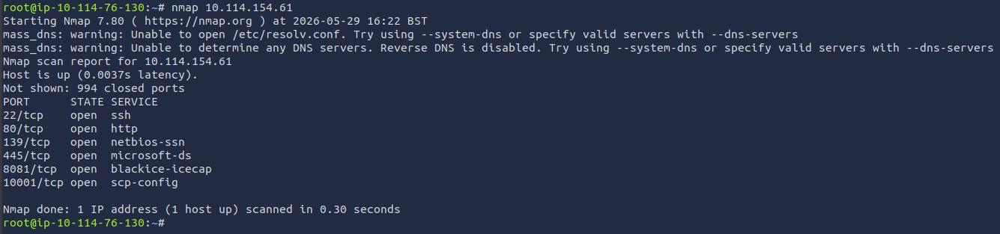
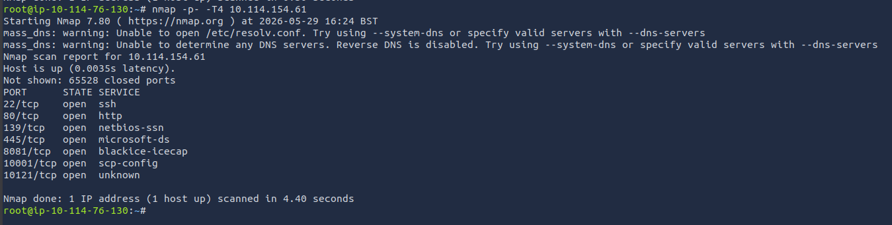
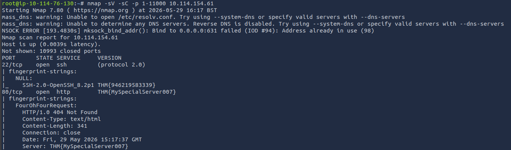
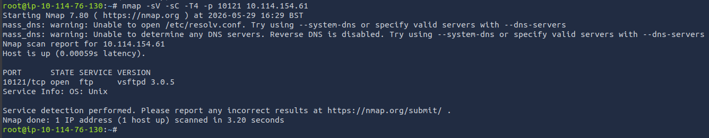
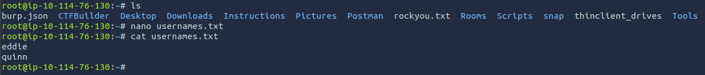
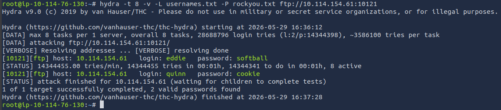
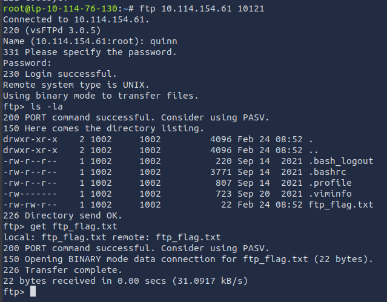
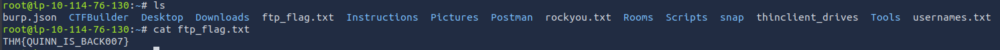
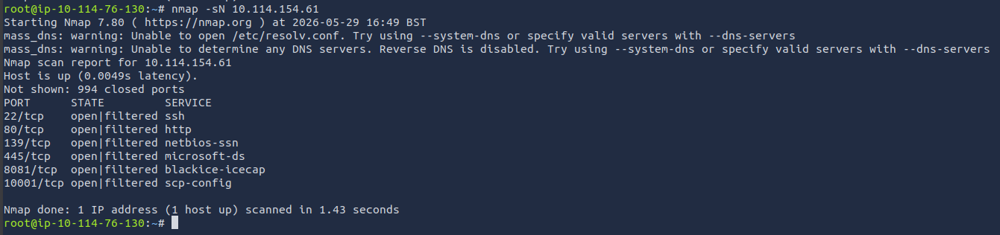
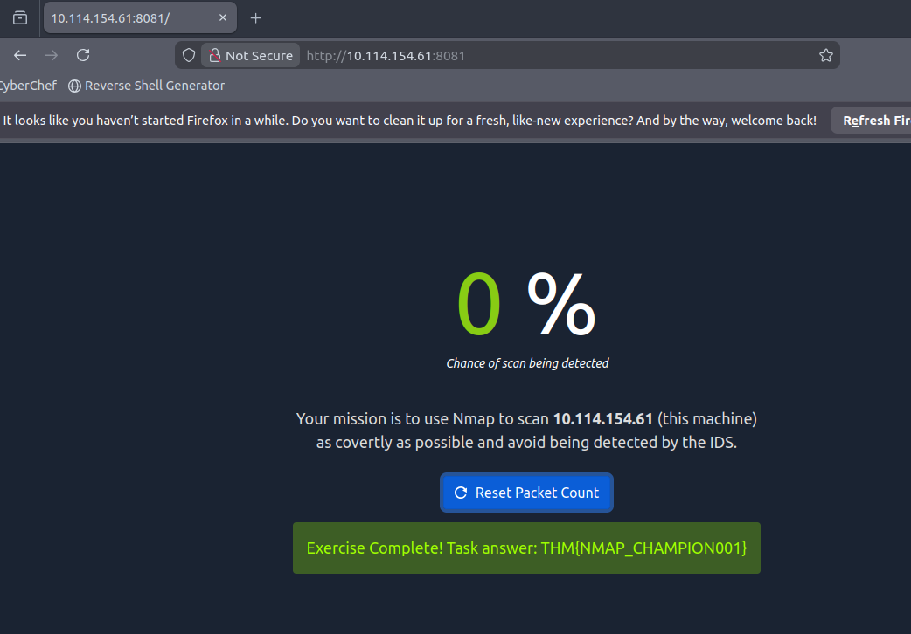

---

# **Net Sec Challenge TryHackMe Room Walkthrough** 

---

### **Overview**

This writeup focuses on network enumeration techniques and basic service exploitation using common penetration testing tools. The objective is to identify open ports, enumerate services, and leverage misconfigurations to extract sensitive information.

The primary tools used include:

- **Nmap** for network discovery and service enumeration
- **FTP** for file transfer and remote file access
- **Telnet** for manual service interaction
- **Hydra** for credential brute-force attacks

---

### **Tools & Concepts**

#### **Nmap (Network Mapper)**

Nmap is an open-source network scanning tool used to discover hosts, services, and vulnerabilities within a network. It is widely used in penetration testing for initial reconnaissance.

**Common Scan Options**

- `sC`  - Runs default NSE (Nmap Scripting Engine) scripts against discovered services. These scripts help identify vulnerabilities and gather additional service information.
- `sV` - Enables version detection, allowing Nmap to identify the exact software and version running on open ports.
- `sN` - Performs a NULL scan by sending packets with no TCP flags set. This technique is often used for stealth scanning.
- `-p-` - Scans all 65,535 TCP ports instead of the default top 1,000.
- `-p80, p10121` - Targets specific ports for focused enumeration.
- `-T4` - Sets aggressive timing for faster scanning at the cost of increased detectability.

---

#### FTP (File Transfer Protocol)

FTP is a standard network protocol used to transfer files between a client and server. It operates in a client-server model and is commonly used for file sharing and remote file access.

A key characteristic of FTP is its use of separate control and data channels. In some configurations, the server may initiate a connection back to the client for data transfer.

---

#### Telnet

Telnet is a legacy network protocol that provides bidirectional communication with remote systems via a virtual terminal.

Although largely replaced by SSH due to security concerns, Telnet is still useful in penetration testing for:

- Manual service interaction
- Banner grabbing
- Identifying service responses on open ports

---

#### Hydra

Hydra is a parallelized brute-force password cracking tool used to test login credentials against network services.

It supports multiple protocols such as FTP, SSH, HTTP, and Telnet. Hydra automates password guessing by testing combinations of usernames and passwords against a target service.

> Note: Hydra should only be used in authorized environments.
> 

---

### **Task 2**

#### **What is the highest port number that is open and less than 10,000?**

A standard Nmap scan was performed to identify the most commonly used 1,000 TCP ports:

```bash
nmap your_target_IP
```



The `port 8081` is the highest opened port under 10 000.

---

#### **There is an open port outside the common 1000 ports; it is above 10,100. What is it?**

To discover additional services running on non-standard ports, a full TCP port scan was performed, scanning all 65,535 ports:

```bash
nmap -p- -T4 your_target_IP
```



An additional open port above 10,000 was discovered: `port 10121`

---

#### **How many TCP ports are open?**

Previously conducted full TCP port scan answers this question: `7 TCP ports were open`

---

#### **On port 80, what is the service version value?**

To identify hidden information in HTTP headers, version detection and script scanning were used:

```bash
nmap -sV -sC -p 1-11000 -T4 target_ip
```

**Explanation**

- `sV` identifies the web server version
- `sC` runs default vulnerability and enumeration scripts



**Result**

```
THM{MySpecialServer007}
```

---

#### **What is the flag hidden in the SSH server header?**

The previously conducted scan answers this question

**Result**

```
THM{946219583339}
```

---

#### **We have an FTP server listening on a nonstandard port. What is the version of the FTP server?**

The FTP service was discovered running on port 10121. Version detection and script scanning were used:

```bash
nmap -sV -sC -T4 -p 10121 target_ip
```

This identified the FTP server as vsftpd version 3.0.5.



---

#### **We learned two usernames using social engineering: eddie and quinn. What is the flag hidden in one of these two account files and accessible via FTP?**

Two potential usernames were identified through reconnaissance:

- eddie
- quinn

The goal was to brute-force valid FTP credentials using Hydra.

A file containing the obtained usernames was created using a text editor, afterwards a dictionary attack was performed using Hydra against the FTP service:



```bash
hydra -t 8 -v -L usernames.txt -P rockyou.txt ftp://target_IP:10121
```

**Explanation**

- `t 8` → number of parallel threads
- `v` → verbose output
- `L` → file containing usernames
- `P` → password wordlist (rockyou.txt)
- `ftp://target:port` → target service



**Result**

Valid credentials were discovered for both eddie and quinn. A file was then successfully retrieved from the FTP server containing the flag.





---

#### **Browsing to `http://10.114.154.61:8081` displays a small challenge that will give you a flag once you solve it. What is the flag?**

The service running on port 8081 presented a challenge requiring stealthy enumeration to avoid detection by intrusion detection systems (IDS).

A NULL scan sends packets with no TCP flags, making it harder for some intrusion detection systems to classify.





**Result**

```
THM{NMAP_CHAMPION001}
```

---

### **Key Takeaways**

- Nmap is essential for structured network reconnaissance
- Service version detection often reveals vulnerable software
- Legacy protocols like Telnet and FTP can expose sensitive data
- Brute-force attacks remain effective against weak authentication
- Stealth scanning techniques can help evade basic detection systems