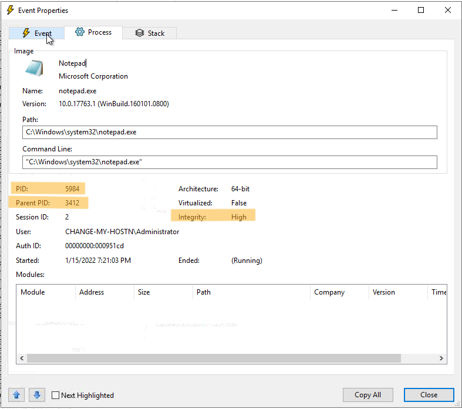
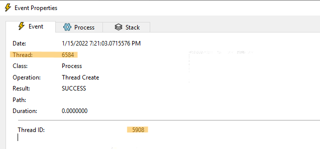
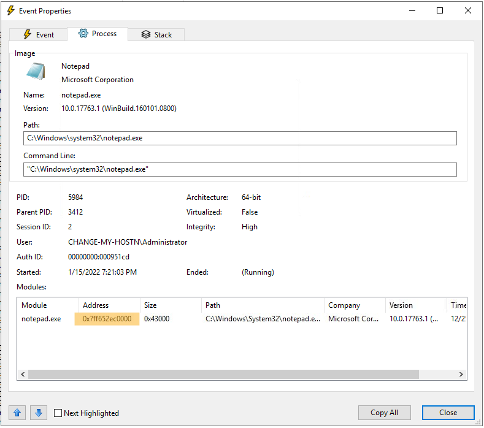
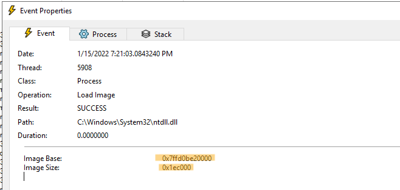

---

# **Windows Internals TryHackMe Room Walkthrough**

---

### **Task 1: Learning Objectives**

This room introduces the core concepts of Windows internals and their relevance to offensive security. The objectives included:

- Understanding Windows processes and their underlying technologies.
- Learning about important Windows file formats.
- Exploring how the Windows kernel operates.
- Identifying how attackers can abuse Windows internals for evasion and exploitation.

Since Windows systems make up a large portion of enterprise environments, knowledge of Windows internals is essential for red team operations and malware analysis.

### **Task 2: Processes**

A process is a running instance of a program that contains the resources needed for execution, such as memory, code, security information, and threads.

Many Windows components run as processes, including:

- **MsMpEng.exe** – Microsoft Defender Antivirus.
- **wininit.exe** – Starts critical system services.
- **lsass.exe** – Handles authentication and credential management.

Processes are frequently targeted by attackers to hide malicious activity, inject code into legitimate applications, and evade security controls.



#### **Questions:**

- What is the process ID of "notepad.exe"?
    - 5984
- What is the parent process ID of the previous process?
    - 3412
- What is the integrity level of the process?
    - High

### **Task 3: Threads**

A thread is the smallest unit of execution within a process and is responsible for carrying out program instructions. While multiple threads can exist within a single process, they share the same resources, such as memory, code, and global variables.

Each thread also maintains its own execution context, including registers, stack, and scheduling information. The operating system schedules threads for execution based on factors such as CPU availability and priority.

From a security perspective, threads are a common target for attackers. Malicious actors can abuse threads to execute code, inject payloads into legitimate processes, and support various evasion and post-exploitation techniques.



#### **Questions:**

- What is the thread ID of the first thread created by notepad.exe?
    - 5908
- What is the stack argument of the previous thread?
    - 6584

### **Task 4: Virtual Memory**

Virtual memory is a core Windows feature that allows processes to use memory safely and efficiently. Each process is assigned its own private virtual address space, preventing conflicts and reducing the risk of one process affecting another.

A memory manager translates virtual addresses into physical memory addresses, allowing applications to operate without directly accessing physical RAM.

When a process requires more memory than is physically available, the memory manager uses paging to temporarily move data between RAM and disk storage. This enables the system to run multiple applications efficiently while maintaining process isolation and stability.



#### **Questions:**

- What is the total theoretical maximum virtual address space of a 32-bit x86 system?
    - 4 GB
- What default setting flag can be used to reallocate user process address space?
    - increaseuserva
- What is the base address of "notepad.exe"?
    - 0x7ff652ec0000

### **Task 5: Dynamic Link Libraries (DLLs)**

Dynamic Link Libraries (DLLs) are files that contain reusable code and data that can be shared by multiple applications. They play a key role in Windows by promoting code reuse, reducing memory consumption, and improving application performance.

Applications often rely on DLLs as dependencies to provide specific functionality. When a program starts, the required DLLs are loaded into memory and used during execution.

Because many applications depend on DLLs, attackers frequently target them to manipulate program behavior or execute malicious code. Common techniques include:

- **DLL Hijacking** – Loading a malicious DLL instead of the legitimate one.
- **DLL Side-Loading** – Exploiting application search paths to load a malicious DLL.
- **DLL Injection** – Injecting a DLL into a running process to execute code within its context.

Understanding DLLs is important for both system administration and offensive security, as they are commonly abused for persistence, privilege escalation, and defense evasion.



#### Questions:

- What is the base address of "ntdll.dll" loaded from "notepad.exe"?
    - 0x7ffd0be20000
- What is the size of "ntdll.dll" loaded from "notepad.exe"?
    - 0x1ec000
- How many DLLs were loaded by "notepad.exe"?
    - 51

### **Task 6: Portable Executable (PE) Format**

The Portable Executable (PE) format defines how executable files are structured in Windows. It provides a standardized layout for binaries, including both executable code and associated data.

PE files are commonly made up of both PE (Portable Executable) and COFF (Common Object File Format) structures, which together define how the operating system loads and interprets an executable.

A PE file is composed of several key sections:

- **DOS Header** – Identifies the file type as an executable (MZ format).
- **DOS Stub** – Displays a compatibility message such as “This program cannot be run in DOS mode.”
- **PE File Header** – Contains metadata about the binary, including the PE signature and image information.
- **Optional Header** – Despite its name, it is a critical component that includes important execution details.
- **Data Directories** – Pointers to important tables used by the loader.
- **Section Table** – Defines the sections of the file, such as code, imports, and data.

These structures can be observed in a hex dump of executable files like `calc.exe`.

Understanding the PE format is important in security analysis because attackers often manipulate or analyze PE structures for reverse engineering, malware development, and evasion techniques.

#### **Questions:**

- What PE component prints the message "This program cannot be run in DOS mode"?
    - DOS Stub
- What is the entry point reported by DiE?
    - 000000014001acd0
- What is the value of "*NumberOfSections*"?
    - 0006
- What is the virtual address of "*.data*"?
    - 00024000
- What string is located at the offset "0001f99c"?
    - Microsoft.Notepad

### **Task 7: Interacting with Windows Internals**

Windows internals can be accessed and controlled through the Windows API, which provides native functionality for interacting with the operating system. The most commonly used interfaces are the Win32 API and, less frequently, the Win64 API.

At the core of Windows internals is the kernel, which manages system resources and mediates communication between software and hardware. To maintain system stability and security, Windows enforces two execution modes:

- **User mode** – Limited access; applications run in isolated virtual address spaces without direct hardware access.
- **Kernel mode** – Full system access, including memory and hardware control.

Applications typically run in user mode and must use system calls or API functions to request access to kernel-level operations. When a system call is made, the processor switches from user mode to kernel mode, allowing the operation to be executed safely.

Common Windows API functions used in memory manipulation include:

- **OpenProcess** – Obtains a handle to a target process.
- **VirtualAllocEx** – Allocates memory in a remote process.
- **WriteProcessMemory** – Writes data into allocated memory.
- **CreateRemoteThread** – Executes code within another process.

These functions demonstrate how memory can be allocated, written to, and executed within a target process.

At step one, we can use `OpenProcess` to obtain the handle of the specified process.

```cpp
HANDLE hProcess = OpenProcess(
	PROCESS_ALL_ACCESS, // Defines access rights
	FALSE, // Target handle will not be inhereted
	DWORD(atoi(argv[1])) // Local process supplied by command-line arguments
);
```

At step two, we can use `VirtualAllocEx` to allocate a region of memory with the payload buffer.

```cpp
remoteBuffer = VirtualAllocEx(
	hProcess, // Opened target process
	NULL,
	sizeof payload, // Region size of memory allocation
	(MEM_RESERVE | MEM_COMMIT), // Reserves and commits pages
	PAGE_EXECUTE_READWRITE // Enables execution and read/write access to the commited pages
);
```

At step three, we can use `WriteProcessMemory` to write the payload to the allocated region of memory.

```cpp
WriteProcessMemory(
	hProcess, // Opened target process
	remoteBuffer, // Allocated memory region
	payload, // Data to write
	sizeof payload, // byte size of data
	NULL
);
```

At step four, we can use `CreateRemoteThread` to execute our payload from memory.

```cpp
remoteThread = CreateRemoteThread(
	hProcess, // Opened target process
	NULL,
	0, // Default size of the stack
	(LPTHREAD_START_ROUTINE)remoteBuffer, // Pointer to the starting address of the thread
	NULL,
	0, // Ran immediately after creation
	NULL
);
```

#### **Questions:**

- Enter the flag obtained from the executable below.
    - THM{1Nj3c7_4lL_7H3_7h1NG2}